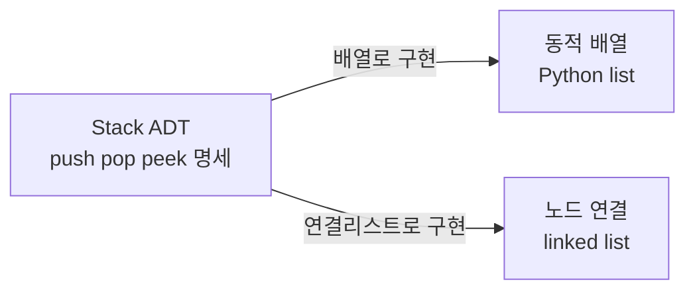

- **ADT(추상 자료형)** → "무엇을 할 수 있나(연산)"만 정의 · "어떻게 동작하나(구현)"는 숨김
- 사용자는 인터페이스(연산 목록)만 알면 됨 → 내부 구현 교체해도 코드 안 바뀜
- Stack·Queue·List·Map 등은 모두 ADT 명세 · 배열·연결리스트는 그 구현

## 리모컨 버튼만 알면 되는 것

- TV 리모컨 → "켜기·끄기·채널+·볼륨-" 버튼만 누르면 됨
- 내부 적외선 회로·신호 방식은 몰라도 사용 가능
- ADT도 동일 → push·pop 버튼(연산)만 알면 됨 · 내부 배열인지 리스트인지 몰라도 됨

<KeyPoint title="이 페이지에서 가져갈 것">
ADT = 리모컨 버튼 목록(인터페이스) · 자료구조 = 버튼 뒤 회로 설계 ·
구현 = 실제 부품(배열·연결리스트) ·
같은 ADT를 여러 자료구조로 구현 가능 → 사용 코드는 그대로
</KeyPoint>

## ADT vs 자료구조 vs 구현

- 세 층위를 헷갈리기 쉬움 · 추상 → 구체 순서로 분리

<Compare>
<CompareCol title="ADT (추상 자료형)" subtitle="무엇 — 연산 명세" color="sky">
- "어떤 연산을 제공하는가"만 정의
- push·pop·peek (동작 계약)
- 구현 방식 언급 없음
- 예: Stack·Queue·List·Map
</CompareCol>
<CompareCol title="자료구조" subtitle="어떻게 — 데이터 조직" color="amber">
- 데이터를 메모리에 배치하는 방식
- 배열·연결리스트·해시테이블·트리
- 하나의 ADT를 여러 방식으로 실현
</CompareCol>
<CompareCol title="구현" subtitle="실제 코드 — 언어별 부품" color="green">
- 자료구조를 코드로 작성
- Python `list`·`collections.deque`
- 성능·메모리 특성 결정
</CompareCol>
</Compare>



## 인터페이스와 구현 분리

- 사용자는 인터페이스(연산 시그니처)에만 의존 → 구현 자유롭게 교체
- 내부를 배열에서 연결리스트로 바꿔도 호출 코드 변경 없음 → 캡슐화
- 파이썬은 `abc.ABC`·`Protocol`로 인터페이스 명세 가능

```python
from abc import ABC, abstractmethod

class StackADT(ABC):                 # 인터페이스 = 연산 계약
    @abstractmethod
    def push(self, x): ...
    @abstractmethod
    def pop(self): ...
    @abstractmethod
    def peek(self): ...
    @abstractmethod
    def is_empty(self) -> bool: ...

class ArrayStack(StackADT):          # 구현 1 — 배열 기반
    def __init__(self): self._data = []
    def push(self, x): self._data.append(x)
    def pop(self): return self._data.pop()
    def peek(self): return self._data[-1]
    def is_empty(self): return not self._data

s: StackADT = ArrayStack()           # 타입은 ADT · 구현은 자유 교체
s.push(1); s.push(2)
print(s.pop(), s.peek())             # 2 1
# 결과: 호출부는 StackADT 인터페이스만 의존 · 구현 바꿔도 동일
```

## 대표 ADT 연산 명세

- 각 ADT는 핵심 연산과 데이터 접근 규칙(순서)으로 정의

| ADT | 핵심 연산 | 접근 규칙 | 대표 구현 |
| --- | --- | --- | --- |
| Stack | push · pop · peek | LIFO 후입선출 | list |
| Queue | enqueue · dequeue | FIFO 선입선출 | deque |
| List | get · insert · remove | 인덱스 순차 접근 | array · linked list |
| Map | put · get · delete | 키 → 값 매핑 | hash table · tree |
| Set | add · contains · remove | 중복 없는 원소 | hash · tree |

## Stack · Queue · List ADT 예시

- 같은 데이터라도 접근 규칙(ADT)이 다르면 결과 순서가 달라짐

<Layers>
<Layer title="Stack — LIFO" sub="마지막에 넣은 게 먼저" color="rose">
실행 취소(undo)·함수 호출 스택·괄호 검사
</Layer>
<Layer title="Queue — FIFO" sub="먼저 넣은 게 먼저" color="sky">
작업 대기열·BFS 탐색·프린터 인쇄 순서
</Layer>
<Layer title="List — 순차 접근" sub="인덱스로 임의 위치" color="green">
순서 유지 컬렉션·삽입·삭제·조회
</Layer>
</Layers>

```python
from collections import deque

stack = []
stack.append("A"); stack.append("B"); stack.append("C")
print(stack.pop())          # C  (LIFO 마지막 것)

queue = deque()
queue.append("A"); queue.append("B"); queue.append("C")
print(queue.popleft())      # A  (FIFO 처음 것)

lst = ["A", "B", "C"]
lst.insert(1, "X")          # 인덱스 1에 삽입
print(lst)                  # ['A', 'X', 'B', 'C']
# 결과: 같은 A·B·C 입력도 ADT 접근 규칙에 따라 꺼내는 순서 다름
```

## 같은 ADT, 다른 구현의 성능 차이

- ADT가 같아도 구현 자료구조에 따라 연산 비용이 달라짐
- Queue를 list로 구현하면 앞 제거가 O(n) · deque는 O(1)

<ProsCons>
<Pros title="ADT로 사고할 때 이점">
- 인터페이스 고정 → 구현 교체 자유 (배열 ↔ 연결리스트)
- 사용 코드 변경 없이 성능 최적화 가능
- 테스트·모킹 쉬움 (계약 기반)
</Pros>
<Cons title="구현 무시 시 함정">
- list를 Queue로 쓰면 `pop(0)` O(n) 성능 저하
- 잘못된 구현 선택 → 같은 ADT라도 느림
- 메모리 특성(연속 vs 분산) 차이 간과
</Cons>
</ProsCons>

```python
import timeit
# list로 Queue 흉내 → 앞 제거 O(n)
slow = timeit.timeit("q.pop(0)", "q=list(range(100000))", number=1000)
# deque → 앞 제거 O(1)
fast = timeit.timeit("q.popleft()", "from collections import deque; q=deque(range(100000))", number=1000)
print(slow > fast)     # True  같은 Queue ADT라도 구현 따라 큰 차이
# 결과: ADT 동일해도 구현 선택이 성능 좌우 → deque 사용
```

<Note type="note" title="실무 컬렉션 인터페이스">
- 파이썬 `collections.abc`·`typing.Protocol`로 ADT 계약 명시 → 의존성 역전
- Java `List`/`ArrayList`·`LinkedList`, C++ STL `stack`/`queue` 모두 ADT-구현 분리 사례
- 함수 인자 타입은 구체 구현(`list`)보다 추상(`Sequence`·`Iterable`)으로 → 유연성
</Note>
