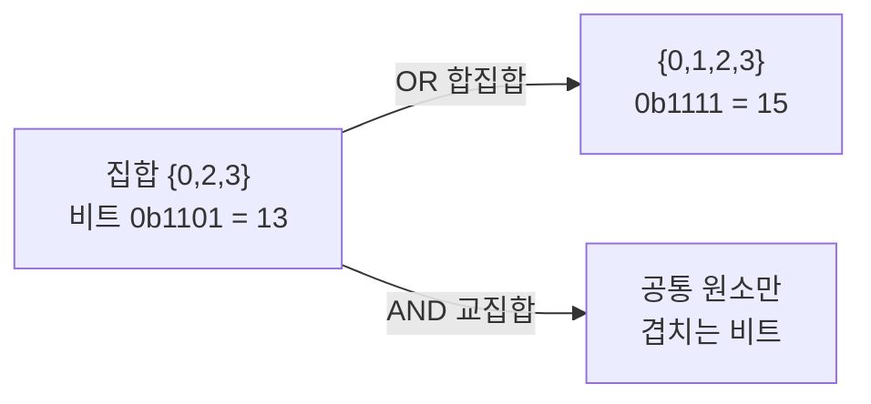

- **비트 연산** → 정수를 0/1 묶음으로 보고 한 자리씩 직접 다루는 기법
- 권한 플래그·중복 제거·집합 표현을 빠르고 메모리 적게 처리
- 곱셈·나눗셈·나머지를 시프트·마스크로 대체 → 상수 시간

## 전등 스위치 여러 개로 보기

- 방에 전등 스위치 8개 한 줄 · 각 스위치 켜짐(1)/꺼짐(0)
- 스위치 묶음 = 1바이트(8비트) · 스위치 하나 = 1비트
- 특정 스위치만 켜기/끄기/뒤집기 → 비트 연산이 하는 일

<KeyPoint title="이 비유에서 가져갈 것">
비트 = 전등 스위치 on/off · 정수 한 개 = 스위치 한 줄 ·
AND/OR/XOR/시프트 = "특정 스위치만 켜고·끄고·뒤집고·옆으로 밀기"
</KeyPoint>

## 네 가지 기본 연산 진리표

- 두 비트 a·b를 짝지어 결과 한 비트 생성 (NOT은 한 비트만)

| a | b | a & b (AND) | a \| b (OR) | a ^ b (XOR) | ~a (NOT) |
| --- | --- | --- | --- | --- | --- |
| 0 | 0 | 0 | 0 | 0 | 1 |
| 0 | 1 | 0 | 1 | 1 | 1 |
| 1 | 0 | 0 | 1 | 1 | 0 |
| 1 | 1 | 1 | 1 | 0 | 0 |

- **AND** → 둘 다 1이어야 1 · "특정 비트만 골라보기(검사)"에 사용
- **OR** → 하나라도 1이면 1 · "특정 비트 켜기"에 사용
- **XOR** → 다르면 1·같으면 0 · "특정 비트 뒤집기"·중복 제거에 사용
- **NOT** → 0↔1 반전 · 파이썬은 부호 포함 `~x = -x-1`

```python
a, b = 0b1100, 0b1010        # 12, 10
print(format(a & b, "04b"))  # 1000  (8)   둘 다 1인 자리
print(format(a | b, "04b"))  # 1110  (14)  하나라도 1
print(format(a ^ b, "04b"))  # 0110  (6)   다른 자리
print(format(a & 0xF, "04b"))# 1100        하위 4비트만 추출
# 결과: AND·OR·XOR가 자리별로 독립 적용
```

<Note type="warning" title="bin() vs format(n, '04b')">
- `bin(n)` → 앞자리 0 생략 · `bin(a ^ b)` 는 `0b0110` 아닌 **`0b110`** 출력 (6 = 0b110)
- 자리수 맞춰 보려면 → `format(n, "04b")` 또는 `f"{n:04b}"` 로 **0 패딩**
- 비트 연산은 자리별 독립 → 정렬해서 봐야 AND/OR/XOR 차이가 한눈에 보임
</Note>

## 시프트 = 스위치 줄을 옆으로 밀기

- `x << n` → 왼쪽으로 n칸 · 빈자리 0 채움 · `x * 2ⁿ`과 같음
- `x >> n` → 오른쪽으로 n칸 · 끝 비트 버림 · `x // 2ⁿ`과 같음

| 식 | 2진수 | 10진수 | 의미 |
| --- | --- | --- | --- |
| `5` | `0b101` | 5 | 원본 |
| `5 << 1` | `0b1010` | 10 | ×2 |
| `5 << 3` | `0b101000` | 40 | ×8 |
| `40 >> 2` | `0b1010` | 10 | ÷4 |

```python
print(5 << 1)   # 10   (5*2)
print(5 << 3)   # 40   (5*8)
print(40 >> 2)  # 10   (40//4)
print(1 << 5)   # 32   "5번 비트 한 개만 켠 마스크"
# 결과: 시프트로 곱셈/나눗셈을 비트 이동으로 대체
```

## 비트마스킹 4대 동작 — 권한 플래그 실무

- 사용자 권한을 READ·WRITE·EXEC 비트로 한 정수에 압축
- 켜기(set) · 끄기(clear) · 뒤집기(toggle) · 검사(check)

<Cards cols={2}>
<Card icon="🟢" title="켜기 set">
`flags |= MASK`
OR로 해당 비트 1로
</Card>
<Card icon="⚪" title="끄기 clear">
`flags &= ~MASK`
반전 마스크 AND로 0으로
</Card>
<Card icon="🔁" title="뒤집기 toggle">
`flags ^= MASK`
XOR로 상태 반전
</Card>
<Card icon="🔍" title="검사 check">
`flags & MASK`
0 아니면 켜진 상태
</Card>
</Cards>

```python
READ, WRITE, EXEC = 1 << 0, 1 << 1, 1 << 2   # 1, 2, 4

perm = 0
perm |= READ | WRITE          # READ·WRITE 켜기 → 0b011 (3)
print(bool(perm & WRITE))     # True   WRITE 켜졌나 검사
perm &= ~WRITE                # WRITE 끄기 → 0b001 (1)
perm ^= EXEC                  # EXEC 뒤집기 → 0b101 (5)
print(bin(perm))              # 0b101  (READ·EXEC)
# 결과: 권한 여러 개를 정수 1개로 저장·조작
```

## 짝홀·2의 거듭제곱 판별

- 짝수/홀수 → 최하위 비트(LSB)만 보면 됨 · `n & 1`
- 2의 거듭제곱 → 켜진 비트가 정확히 1개 · `n & (n-1) == 0`

```python
def is_even(n): return n & 1 == 0
def is_pow2(n): return n > 0 and (n & (n - 1)) == 0

print(is_even(10))   # True
print(is_pow2(16))   # True   0b10000 & 0b01111 == 0
print(is_pow2(24))   # False  0b11000 비트 2개
# n-1은 최하위 1비트 아래를 모두 1로 → AND하면 0이면 거듭제곱
```

<Note type="note" title="n & (n-1) 트릭">
- `n - 1` → 가장 낮은 켜진 비트를 끄고 그 아래를 모두 1로
- `n & (n-1)` → 가장 낮은 켜진 비트 1개 제거
- 반복하면 켜진 비트 개수(popcount) 세기 · 파이썬은 `bin(n).count("1")`
</Note>

## 비트로 집합 표현

- 원소 i 포함 여부를 i번 비트 1/0으로 → 집합을 정수 1개로
- 합집합 OR · 교집합 AND · 차집합 `a & ~b` · 부분집합 검사 `a & b == b`



```python
def make(*items):
    s = 0
    for i in items: s |= 1 << i
    return s

A = make(0, 2, 3)    # 0b1101 = 13
B = make(1, 3)       # 0b1010 = 10
print(bin(A | B))    # 0b1111  합집합 {0,1,2,3}
print(bin(A & B))    # 0b1000  교집합 {3}
print(bool(A & (1 << 2)))  # True  원소 2 포함?
# 결과: N≤20 정도 작은 집합을 정수 비트로 초고속 처리 (비트마스크 DP 기초)
```

<Note type="warning" title="실무 주의">
- 비트마스크 가독성 낮음 → enum·Flag(`from enum import Flag`)로 의미 부여
- 음수 시프트·부호 비트 → 언어마다 산술/논리 시프트 다름 · 파이썬 int는 무한 비트
- 비트 개수 늘면(원소 64개 초과) 집합 비트마스크 한계 → set 자료구조 고려
</Note>
