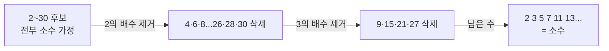

- **알고리즘 수학** → 정수론·조합론 도구로 큰 입력을 빠르게·정확히 계산
- 모듈러로 오버플로 방지 · 빠른 거듭제곱으로 지수 시간 단축 · 체로 소수 대량 생성
- 해시·암호·경우의 수 계산 등 실무 곳곳에 등장하는 핵심 연산

## 시계 나머지로 보는 모듈러

- 13시는 시계에서 1시 → 12로 나눈 나머지 1
- 아무리 큰 시간도 12를 넘으면 한 바퀴 돌아 0~11 범위로 되돌아옴
- 이 "넘치면 처음으로 되돌리기"가 **모듈러 연산** `a % m`

<KeyPoint title="이 페이지에서 가져갈 것">
모듈러 = 시계처럼 일정 범위로 값 가두기 → 해시 버킷·오버플로 방지 ·
유클리드 = 큰 수 GCD를 나머지로 빠르게 ·
빠른 거듭제곱 = 곱셈 횟수를 log로 줄이기 ·
조합·순열 = 경우의 수 세기
</KeyPoint>

## 핵심 도구 한눈에

<Cards cols={2}>
<Card icon="🕐" title="모듈러 연산">
`a % m` 나머지로 범위 고정
해시 버킷 분배·순환 인덱스
</Card>
<Card icon="🔢" title="소수 · 에라토스테네스의 체">
N 이하 소수 한 번에 생성
O(N log log N)
</Card>
<Card icon="➗" title="GCD · LCM 유클리드">
`gcd(a,b) = gcd(b, a%b)`
약분·주기 계산
</Card>
<Card icon="⚡" title="빠른 거듭제곱">
지수를 절반씩 → O(log n)
큰 거듭제곱·모듈러 지수
</Card>
</Cards>

## 모듈러 연산 — 해시 버킷 분배 실무

- 분배 법칙 → `(a + b) % m = ((a%m) + (b%m)) % m` · 곱셈도 동일
- 큰 수 곱셈 누적 시 매 단계 `% m` → 오버플로 방지 (암호·경쟁 프로그래밍)
- 해시 테이블 → `hash(key) % bucket_count` 로 키를 버킷에 균등 분배

```python
def bucket_of(key: str, num_buckets: int) -> int:
    return hash(key) % num_buckets        # 항상 0 ~ num_buckets-1

print(bucket_of("user:42", 8) in range(8))   # True
# 모듈러 분배 법칙
a, b, m = 123456789, 987654321, 1000
print((a * b) % m)                    # 269
print(((a % m) * (b % m)) % m)        # 269  단계별 모듈러로 같은 결과
# 결과: 큰 값도 매 단계 % m 으로 작은 수 유지
```

## 소수 · 에라토스테네스의 체

- 2부터 시작해 각 소수의 배수를 차례로 지움 → 남은 수가 소수
- 단일 판별은 √n 까지 나눠보면 충분 (약수는 √n 기준 대칭)
- 다수 소수 필요하면 매번 판별보다 체가 압도적으로 빠름



```python
def is_prime(n: int) -> bool:
    if n < 2: return False
    i = 2
    while i * i <= n:                 # √n 까지만 검사
        if n % i == 0: return False
        i += 1
    return True

def sieve(n: int) -> list[int]:
    p = [True] * (n + 1)
    p[0] = p[1] = False
    i = 2
    while i * i <= n:
        if p[i]:
            for j in range(i*i, n+1, i):   # i의 배수 제거
                p[j] = False
        i += 1
    return [k for k, v in enumerate(p) if v]

print(is_prime(97))        # True
print(sieve(30))           # [2, 3, 5, 7, 11, 13, 17, 19, 23, 29]
# 결과: 단일 판별 √n · 대량 생성은 체 O(N log log N)
```

## GCD · LCM — 유클리드 호제법

- `gcd(a, b) = gcd(b, a % b)` → 나머지로 계속 줄여 b가 0이면 a가 GCD
- `lcm(a, b) = a * b // gcd(a, b)` → 최소공배수는 GCD로 유도
- 약분·시간표 주기(두 신호가 동시에 만나는 시점) 등에 사용

| 단계 | a | b | a % b |
| --- | --- | --- | --- |
| 1 | 48 | 18 | 12 |
| 2 | 18 | 12 | 6 |
| 3 | 12 | 6 | 0 |
| 끝 | 6 | 0 | → gcd = 6 |

```python
from math import gcd, lcm
print(gcd(48, 18))     # 6
print(lcm(4, 6))       # 12

def my_gcd(a, b):
    while b:
        a, b = b, a % b     # 나머지로 교체 반복
    return a
print(my_gcd(48, 18))  # 6
# 결과: 나눗셈 몇 번 만에 GCD 도출 · O(log min(a,b))
```

## 빠른 거듭제곱 (Exponentiation by Squaring)

- `x^n` 을 단순 반복하면 O(n) · 지수를 절반씩 쪼개면 O(log n)
- 짝수 지수 → 제곱으로 절반 · 홀수 지수 → 한 번 곱하고 절반
- 큰 모듈러 지수(암호 RSA·해시)에서 필수

<Timeline>
<TimelineItem title="x^10 계산 시작">
지수 10 = 1010₂ · 비트 단위로 분해
</TimelineItem>
<TimelineItem title="제곱 누적">
x → x² → x⁴ → x⁸ 순서로 제곱만 반복
</TimelineItem>
<TimelineItem title="켜진 비트만 곱셈">
10 = 8 + 2 → x⁸ × x² = x¹⁰ · 곱셈 4번 (10번 아님)
</TimelineItem>
</Timeline>

```python
def fast_pow(x, n, mod=None):
    result = 1
    while n > 0:
        if n & 1:                       # 지수 최하위 비트 1이면 곱셈
            result = result * x
            if mod: result %= mod
        x = x * x                       # x 제곱
        if mod: x %= mod
        n >>= 1                         # 지수 절반
    return result

print(fast_pow(2, 10))            # 1024
print(fast_pow(2, 1000) % 1000)  # 376  (파이썬 내장 pow(2,1000,1000)과 동일)
print(pow(2, 1000, 1000))        # 376  내장 3인자 pow도 빠른 거듭제곱
# 결과: 곱셈 횟수 O(log n) · 모듈러 지수 효율 계산
```

## 조합 · 순열 — 경우의 수

- **순열 P(n,r)** → 순서 있게 r개 뽑기 · `n! / (n-r)!`
- **조합 C(n,r)** → 순서 없이 r개 뽑기 · `n! / (r!(n-r)!)`
- 추첨·팀 구성·확률 계산 등에 사용

<Compare>
<CompareCol title="순열 Permutation" subtitle="순서 중요" color="sky">
- ABC ≠ ACB → 다른 경우
- 등수·자리 배치·암호 순서
- `P(5,2) = 20`
</CompareCol>
<CompareCol title="조합 Combination" subtitle="순서 무시" color="green">
- {A,B} = {B,A} → 같은 경우
- 팀 구성·메뉴 선택·로또
- `C(5,2) = 10`
</CompareCol>
</Compare>

```python
from math import factorial, perm, comb
print(perm(5, 2))      # 20   순서 있게 2개
print(comb(5, 2))      # 10   순서 없이 2개
print(factorial(5))    # 120

from itertools import permutations, combinations
print(list(permutations("ABC", 2)))  # [('A','B'),('A','C'),('B','A')...]  6개
print(list(combinations("ABC", 2)))  # [('A','B'),('A','C'),('B','C')]      3개
# 결과: 순열은 순서 구분 6개 · 조합은 순서 무시 3개
```

<Note type="warning" title="실무 주의">
- 큰 수 거듭제곱·팩토리얼 → 반드시 모듈러 `pow(a, b, m)` 사용 (오버플로·속도)
- `hash() % n` 분배 → 충돌 줄이려면 버킷 수를 소수로 잡는 관례
- 조합 수는 폭발적 증가 → `comb(n, r)` 직접 계산이 팩토리얼 분할보다 안전
</Note>
