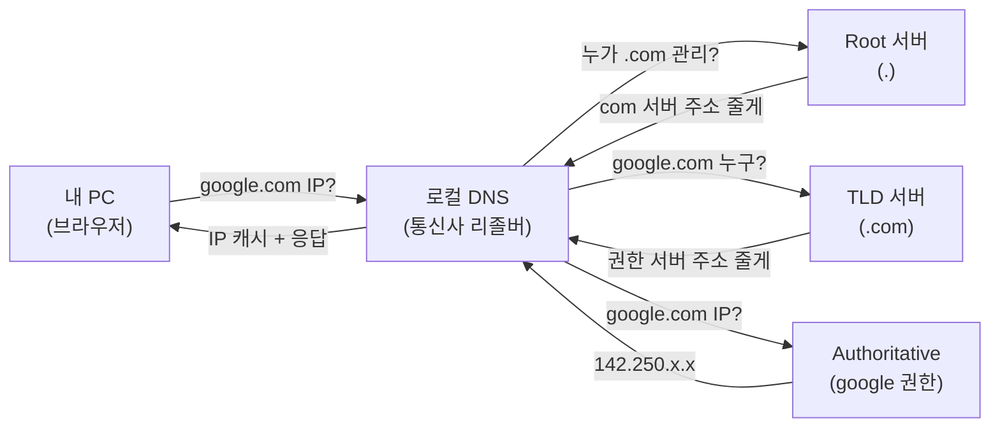
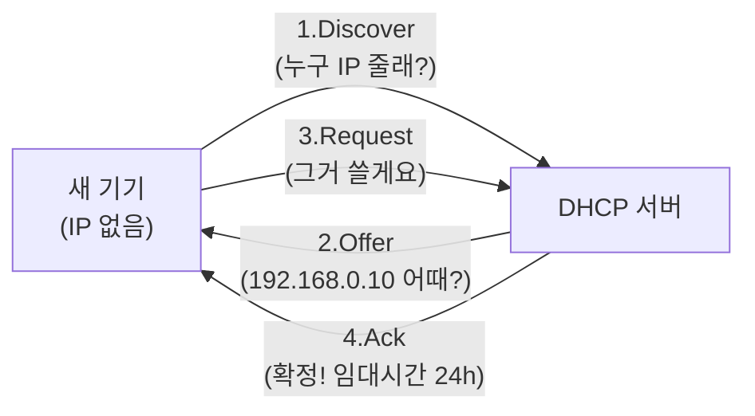

- **DNS** → 사람이 외운 이름(`google.com`)을 컴퓨터가 쓰는 주소(`142.250.x.x`)로 바꿔주는 **번호 안내**
- **DHCP** → 네트워크에 처음 들어온 기기에 IP·게이트웨이를 **자동으로 배정**해주는 안내 데스크
- 한 줄 차이 → DNS는 **이름→주소 변환** · DHCP는 **주소 자체를 빌려줌**

## 114 안내 vs 호텔 체크인

- **DNS = 전화번호부·114 안내** → "김철수 가게 번호 뭐예요?" → "010-1234-5678" → 사람은 이름만 외우고 번호는 안내가 찾아줌
- **DHCP = 호텔 체크인 데스크** → 투숙객이 오면 빈 방번호 배정 → 나갈 때 반납 → 다음 손님이 그 방 재사용

<KeyPoint title="이 비유에서 가져갈 것">
DNS = 외우기 쉬운 이름을 진짜 주소로 번역(이름은 그대로, 서버 IP는 바뀌어도 OK) ·
DHCP = 주소를 직접 외울 필요 없이 접속하면 자동으로 빌려주고 시간 지나면 회수
</KeyPoint>

## DNS 해석 과정 (google.com 입력)

- 브라우저에 `google.com` 치면 → 여러 서버에 차례로 물어봐 IP를 찾아옴
- 한 번 찾으면 **캐시**에 저장 → 다음엔 바로 사용



<Timeline>
<TimelineItem title="1. 캐시 확인">
브라우저 캐시 → OS hosts → 로컬 DNS 캐시 순서로 먼저 확인 · 있으면 즉시 응답
</TimelineItem>
<TimelineItem title="2. 로컬 DNS(리졸버)에 질의">
PC는 리졸버에게 "알아서 찾아줘"라고 한 번만 물음 → **재귀 질의(recursive)**
</TimelineItem>
<TimelineItem title="3. 리졸버가 위에서부터 추적">
Root → TLD(.com) → Authoritative 순으로 "다음 어디 물어봐?" 반복 → **반복 질의(iterative)**
</TimelineItem>
<TimelineItem title="4. IP 응답 + 캐시 저장">
최종 IP를 PC에 전달 · TTL 동안 캐시에 저장 → 다음 요청은 빠르게
</TimelineItem>
</Timeline>

## 재귀 질의 vs 반복 질의

<Compare>
<CompareCol title="🙋 재귀 질의" subtitle="PC ↔ 로컬 DNS" color="sky">
- "끝까지 알아서 찾아줘"
- 묻는 쪽은 한 번만 질문
- 답(IP) 아니면 실패만 받음
- 부담은 리졸버가 짊어짐
</CompareCol>
<CompareCol title="🔁 반복 질의" subtitle="로컬 DNS ↔ 상위 서버들" color="amber">
- "내가 모르면 다음 갈 곳 알려줘"
- 단계마다 직접 다시 질문
- Root→TLD→권한 서버로 점점 좁혀감
- 부담은 묻는 쪽(리졸버)에 있음
</CompareCol>
</Compare>

## 주요 레코드 종류

| 레코드 | 역할 | 예시 |
|--------|------|------|
| **A** | 도메인 → IPv4 | `google.com → 142.250.196.110` |
| **AAAA** | 도메인 → IPv6 | `google.com → 2404:6800::200e` |
| **CNAME** | 도메인 → 다른 도메인(별칭) | `www → example.com` |
| **MX** | 메일 서버 지정 | `gmail → mail.google.com` |
| **NS** | 이 도메인 관리 네임서버 | `ns1.google.com` |
| **TXT** | 텍스트(SPF·도메인 인증 등) | `v=spf1 ...` |

<Note type="note" title="CNAME 주의">
- CNAME은 최상위(root) 도메인엔 못 붙임 → `example.com` 자체엔 A/AAAA만 · `www.example.com`엔 CNAME OK
- AWS는 root에 alias 레코드(Route 53 전용)로 우회
</Note>

## nslookup / dig 실습

```bash
# 간단 조회
$ nslookup google.com
Name:   google.com
Address: 142.250.196.110

# 상세 조회 (dig) — A 레코드와 응답 시간
$ dig google.com +short
142.250.196.110

# MX(메일 서버) 조회
$ dig gmail.com MX +short
5 gmail-smtp-in.l.google.com.
10 alt1.gmail-smtp-in.l.google.com.

# 특정 DNS 서버 지정 조회 (구글 8.8.8.8)
$ dig @8.8.8.8 example.com
```

## DHCP 4단계 (DORA)

- 기기가 네트워크에 **처음 접속** → IP가 없어 통신 불가 → DHCP 서버에 방번호(IP) 신청
- 4단계 = **D-O-R-A** (Discover → Offer → Request → Ack)



<Layers>
<Layer title="1. Discover" sub="기기 → 전체(브로드캐스트)" color="pink">
"여기 DHCP 서버 있나요? IP 좀 주세요" · 아직 IP 없어 전체에 방송
</Layer>
<Layer title="2. Offer" sub="서버 → 기기" color="sky">
"이 IP(192.168.0.10) 쓸래? 게이트웨이·DNS도 같이 줄게" · 여러 서버면 제안 여러 개
</Layer>
<Layer title="3. Request" sub="기기 → 서버" color="amber">
"그 IP로 정식 요청합니다" · 제안 중 하나 골라 확정 요청
</Layer>
<Layer title="4. Ack" sub="서버 → 기기" color="green">
"확정! 임대기간(lease) 동안 사용" · 기기가 IP 설정 완료 → 통신 시작
</Layer>
</Layers>

<Note type="pink" title="실무 팁">
- IP는 **임대(lease)** 개념 → 기간 절반쯤 지나면 자동 갱신 요청 → 안 쓰면 회수돼 재사용
- DNS와 DHCP는 함께 동작 → DHCP가 나눠준 정보 안에 "쓸 DNS 서버 주소"도 포함
- 사내·집 공유기가 보통 DHCP + DNS 캐시 역할 동시 수행
- IP 충돌·인터넷 안 됨 → `ipconfig /renew`(Win) · `dhclient`(Linux)로 재임대 시도
</Note>
