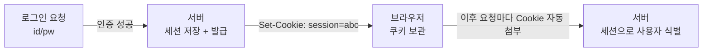

- **HTTP** → 웹에서 클라이언트(브라우저)와 서버가 주고받는 요청·응답 규칙
- **HTTPS** → HTTP에 **TLS 암호화**를 씌워 도청·위변조 막은 것
- 핵심 성질 → **무상태(stateless)** · 요청 하나하나는 서로를 기억 못 함

## 식당 주문으로 이해하기

- **요청(Request) = 주문** → "파스타 하나요"(메서드 + 경로) · "알레르기 있어요"(헤더) · 주문 내용(바디)
- **응답(Response) = 음식 + 상태** → 음식(바디) + "나왔습니다"(200) / "재료 없어요"(404) / "주방 고장"(500)
- 손님이 다시 와도 점원은 **지난 주문을 기억 못 함** → 그래서 번호표·도장(쿠키·세션)이 필요

<KeyPoint title="이 비유에서 가져갈 것">
HTTP는 매 요청이 독립(무상태) → 서버는 손님을 기본적으로 못 알아봄 ·
그래서 로그인 유지·장바구니는 쿠키·세션으로 따로 "기억"을 붙여줌
</KeyPoint>

## HTTP 메서드

<Cards cols={2}>
<Card icon="📥" title="GET">
리소스 조회 · 바디 없음 · 캐시 가능 · 멱등(여러 번 호출해도 결과 같음)
</Card>
<Card icon="📤" title="POST">
리소스 생성·처리 요청 · 바디에 데이터 · 멱등 아님(누르면 또 생성)
</Card>
<Card icon="✏️" title="PUT">
리소스 전체 교체(없으면 생성) · 멱등
</Card>
<Card icon="🩹" title="PATCH">
리소스 일부만 수정 · 보통 멱등 아님
</Card>
<Card icon="🗑️" title="DELETE">
리소스 삭제 · 멱등(이미 지웠으면 그대로)
</Card>
<Card icon="🔎" title="HEAD / OPTIONS">
HEAD=헤더만 조회(바디 없이) · OPTIONS=지원 메서드 확인(CORS preflight)
</Card>
</Cards>

## 상태 코드 분류

| 범위 | 의미 | 대표 코드 |
|---|---|---|
| 1xx | 정보 | 100 Continue |
| 2xx | 성공 | 200 OK · 201 Created · 204 No Content |
| 3xx | 리다이렉트 | 301 영구이동 · 302 임시이동 · 304 Not Modified(캐시) |
| 4xx | 클라이언트 잘못 | 400 잘못된 요청 · 401 인증 필요 · 403 권한 없음 · 404 없음 · 429 너무 많은 요청 |
| 5xx | 서버 잘못 | 500 내부 오류 · 502 Bad Gateway · 503 일시 불가 |

<Note type="warning" title="401 vs 403 자주 헷갈림">
- 401 Unauthorized → "너 **누구야?**" 인증 자체가 안 됨(로그인 안 함·토큰 만료)
- 403 Forbidden → "누군진 알겠는데 **권한 없어**" 인증은 됐지만 접근 불가
</Note>

## curl -v 로 직접 보기

```bash
curl -v https://example.com/api/users
```

```
> GET /api/users HTTP/2          # 요청 라인: 메서드 + 경로 + 버전
> Host: example.com              # 요청 헤더
> User-Agent: curl/8.0
> Accept: */*
>
< HTTP/2 200                     # 응답: 상태 코드
< content-type: application/json # 응답 헤더
< set-cookie: session=abc123     # 서버가 쿠키 심어줌
<
{"users": [...]}                 # 응답 바디
```

- `>` 보낸 것 · `<` 받은 것 → 헤더와 바디가 빈 줄 하나로 구분됨

## 쿠키와 세션

- HTTP는 무상태 → "로그인 유지"를 위해 상태를 따로 저장



<Compare>
<CompareCol title="🍪 쿠키 (Cookie)" subtitle="브라우저 저장" color="amber">
- 데이터를 **클라이언트**가 보관
- 요청마다 자동 전송
- 탈취·변조 위험 → 민감정보 직접 저장 금지
- HttpOnly·Secure·SameSite로 보호
</CompareCol>
<CompareCol title="🗂️ 세션 (Session)" subtitle="서버 저장" color="sky">
- 실제 데이터는 **서버**가 보관
- 쿠키엔 식별자(session id)만
- 서버 메모리·DB 부담 ↑
- 토큰(JWT)은 서버 저장 없이 자체 검증
</CompareCol>
</Compare>

## HTTP/1.1 vs 2 vs 3

<Timeline>
<TimelineItem title="HTTP/1.1 — 한 줄 서기">
연결당 요청 하나씩 순서대로 · 앞 요청 느리면 뒤가 막힘(HOL Blocking) · Keep-Alive로 연결 재사용
</TimelineItem>
<TimelineItem title="HTTP/2 — 한 연결에 여러 차선">
멀티플렉싱(한 TCP 연결로 동시 다중 요청) · 헤더 압축(HPACK) · 서버 푸시 · 단 TCP 레벨 HOL Blocking은 남음
</TimelineItem>
<TimelineItem title="HTTP/3 — TCP 버리고 UDP(QUIC)">
QUIC(UDP 기반) 사용 · TCP HOL Blocking 해소 · 연결 수립 빠름(0-RTT) · 네트워크 바뀌어도 연결 유지
</TimelineItem>
</Timeline>

| 항목 | HTTP/1.1 | HTTP/2 | HTTP/3 |
|---|---|---|---|
| 전송 | TCP | TCP | UDP(QUIC) |
| 다중 요청 | 순차 | 멀티플렉싱 | 멀티플렉싱 |
| 헤더 압축 | ✕ | HPACK | QPACK |
| HOL Blocking | 있음 | TCP단 잔존 | 해소 |
| 암호화 | 선택 | 사실상 필수 | 기본 내장 |

## HTTPS · TLS handshake

- HTTP 위에 TLS 암호화 계층 → 주고받는 내용 도청·위변조·위장 방지
- 본격 데이터 전에 "암호 방식 합의 + 신원 확인 + 키 교환" 과정 거침

<Timeline>
<TimelineItem title="1. Client Hello">
클라이언트가 지원 TLS 버전·암호 스위트 목록·랜덤값 전송
</TimelineItem>
<TimelineItem title="2. Server Hello + 인증서">
서버가 암호 스위트 선택·랜덤값·**인증서**(공개키 포함) 전송
</TimelineItem>
<TimelineItem title="3. 인증서 검증">
클라이언트가 CA 서명 확인 → 진짜 서버인지 신원 검증
</TimelineItem>
<TimelineItem title="4. 키 교환 → 세션 키 생성">
양쪽 랜덤값·공개키로 동일한 **대칭 세션 키** 생성 (이후 통신은 대칭키로 빠르게 암호화)
</TimelineItem>
<TimelineItem title="5. Finished → 암호화 통신">
핸드셰이크 완료 확인 → 이제 HTTP 데이터를 세션 키로 암호화해 주고받음
</TimelineItem>
</Timeline>

<Note type="note" title="비대칭 + 대칭 둘 다 쓰는 이유">
- 비대칭(공개키) → 신원 확인·세션 키 안전 교환에만 사용 (느림)
- 대칭(세션 키) → 실제 데이터 암복호화에 사용 (빠름)
- 느린 비대칭으로 "키만" 안전하게 나누고, 본 통신은 빠른 대칭키 → 보안 + 속도 둘 다
</Note>

<Note type="pink" title="실무 팁">
- 쿠키엔 HttpOnly(JS 접근 차단)·Secure(HTTPS만)·SameSite(CSRF 방어) 꼭 설정
- HTTP/2·3는 사실상 HTTPS 전제 → TLS 없이 안 쓰임
- 304 Not Modified·캐시 헤더(ETag·Cache-Control) 잘 쓰면 트래픽·응답속도 크게 개선
</Note>
