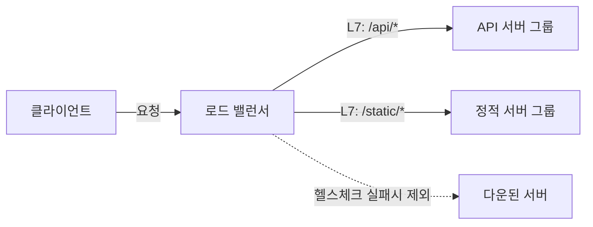

- **로드 밸런서** → 들어온 요청을 여러 서버에 **고르게 나눠** 한 서버에 몰리지 않게 함
- 효과 → 부하 분산 + 한 서버 죽어도 나머지로 우회(고가용성)
- 한 줄 차이 → **L4**는 IP·포트만 보고 빠르게 · **L7**은 URL·헤더까지 보고 똑똑하게

## 식당 줄 안내원으로 이해하기

- 손님이 몰리는 식당 입구에 **줄 안내원** → "1번 홀로 가세요, 2번 홀로 가세요" → 홀마다 손님 고르게 분산
- 한 홀(서버)이 꽉 차거나 닫히면 → 안내원이 그 홀로 안 보냄 (= 헬스체크)
- "단골은 항상 김셰프 자리로" → 같은 손님을 같은 홀로 (= sticky session)

<KeyPoint title="이 비유에서 가져갈 것">
로드 밸런서 = 입구의 줄 안내원 · 서버 = 홀 ·
한 홀이 터지지 않게 고르게 분산하고, 닫힌 홀엔 손님 안 보내고(헬스체크), 필요하면 단골을 같은 홀로 고정(sticky)
</KeyPoint>

## L4 vs L7

<Compare>
<CompareCol title="⚡ L4 (전송 계층)" subtitle="IP + 포트로 분배" color="sky">
- TCP/UDP 패킷의 IP·포트만 봄
- 내용(URL·쿠키)은 안 봄
- 매우 빠름 · 처리 비용 낮음
- 단순 분산 · 초대용량 트래픽
- AWS **NLB**
</CompareCol>
<CompareCol title="🧠 L7 (응용 계층)" subtitle="URL·헤더 보고 분배" color="pink">
- HTTP 내용까지 해석
- `/api`는 API서버, `/img`는 이미지서버로 라우팅
- 쿠키 기반 sticky·SSL 종료 가능
- 똑똑하지만 처리 비용 ↑
- AWS **ALB**
</CompareCol>
</Compare>



## 분배 알고리즘

| 알고리즘 | 동작 | 적합한 상황 |
|----------|------|-------------|
| **Round Robin** | 순서대로 돌아가며 1→2→3→1 | 서버 성능 비슷할 때 |
| **Weighted RR** | 성능 좋은 서버에 가중치 ↑ | 서버 사양 다를 때 |
| **Least Connection** | 현재 연결 가장 적은 서버로 | 요청 처리 시간 들쭉날쭉할 때 |
| **IP Hash** | 클라 IP 해시 → 항상 같은 서버 | 세션 고정 필요할 때 |

<ProsCons>
<Pros title="Round Robin">
- 구현 단순 · 예측 가능
- 서버 성능 균등하면 효율적
- 추가 계산 비용 거의 없음
</Pros>
<Cons title="Round Robin">
- 요청별 처리 시간 차이 무시
- 무거운 요청이 한 서버에 몰릴 수 있음
- 서버 사양 다르면 불균형
</Cons>
</ProsCons>

## 헬스체크

- 로드 밸런서가 각 서버에 주기적으로 "살아있니?" 신호 → 응답 없으면 분배 대상에서 제외
- 다시 정상 응답하면 자동 복귀

<Timeline>
<TimelineItem title="1. 주기적 점검">
설정 간격(예 30초)마다 `/health` 같은 경로로 요청 전송
</TimelineItem>
<TimelineItem title="2. 임계값 판정">
연속 N회 실패 → unhealthy 표시 · 연속 M회 성공 → healthy 복귀
</TimelineItem>
<TimelineItem title="3. 트래픽 차단/복구">
unhealthy 서버엔 요청 안 보냄 → 정상 서버로만 분산 → 사용자 무중단
</TimelineItem>
</Timeline>

## Sticky Session (세션 고정)

- 같은 사용자를 **항상 같은 서버로** 보내는 기능 → 서버 메모리에 세션 저장한 경우 필요
- ALB는 쿠키(`AWSALB`)로 사용자 식별 → 다음 요청도 같은 서버로

<Note type="warning" title="Sticky의 함정">
- 특정 서버에 부하 쏠림 → 분산 효과 약화
- 그 서버 죽으면 → 세션 통째로 날아감
- 권장 → 세션을 **Redis 등 외부 저장소**로 빼서 sticky 없이도 어느 서버든 처리하게 (stateless)
</Note>

## AWS ALB vs NLB 실무

```bash
# ALB 헬스체크 설정 (CLI 예시)
aws elbv2 modify-target-group \
  --target-group-arn $TG_ARN \
  --health-check-path /health \
  --health-check-interval-seconds 30 \
  --healthy-threshold-count 2 \
  --unhealthy-threshold-count 3

# ALB 응답 확인 (curl)
$ curl -I https://my-app.example.com/health
HTTP/2 200
server: awselb/2.0
```

<Cards cols={2}>
<Card icon="🧠" title="ALB (L7)">
HTTP/HTTPS · 경로·호스트 기반 라우팅 · SSL 종료 · WebSocket · 마이크로서비스에 적합
</Card>
<Card icon="⚡" title="NLB (L4)">
TCP/UDP · 초저지연·초고속 · 고정 IP 제공 · 수백만 RPS · 게임·금융 등 극한 트래픽
</Card>
</Cards>

<Note type="pink" title="고를 때">
- HTTP 기반 웹·API + 경로 라우팅 필요 → **ALB**
- 극한 성능·고정 IP·비HTTP 프로토콜 → **NLB**
- 둘 다 헬스체크 + Auto Scaling 연동 → 서버 자동 추가·제거시 자동으로 분배 대상 갱신
- 세션은 외부 저장소로 빼서 stateless 지향 → sticky 의존 줄이기
</Note>
