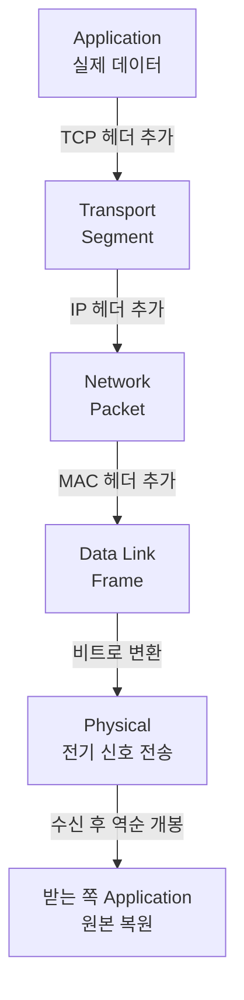

- **OSI 7계층** → 네트워크 통신을 7개 단계로 쪼갠 표준 모델
- 핵심 아이디어 → 한 덩어리로 보면 복잡한 통신을 **층층이 나눠** 각 층은 자기 일만
- 위층(앱)은 아래층(전기 신호)이 어떻게 도는지 **몰라도 됨** → 책임 분리

## 택배 배송으로 이해하기

- 친구에게 선물 보내기 → 여러 단계를 거침 → 각 단계 담당이 다름
- 나(선물 고름) → 상자 포장 → 송장 작성 → 분류 센터 → 트럭 → 도로 → 친구 도착 후 **역순으로 풀림**
- 각 담당은 **앞 단계만 신뢰** → 도로 상태를 송장 쓰는 사람이 신경 안 씀
- OSI도 똑같음 → 보낼 때 위 → 아래로 포장(캡슐화), 받을 때 아래 → 위로 개봉(역캡슐화)

<KeyPoint title="이 비유에서 가져갈 것">
각 계층은 바로 아래·위 계층하고만 대화 ·
보낼 때 헤더를 하나씩 덧붙여 포장(캡슐화) → 받을 때 하나씩 벗겨 개봉(역캡슐화) ·
한 계층 바꿔도 다른 계층 영향 최소 (모듈화)
</KeyPoint>

## 7개 계층 한눈에

- 아래(물리)에서 위(응용)로 갈수록 사람한테 가까운 추상화

<Layers>
<Layer title="7. Application" sub="응용" color="pink">
사용자가 직접 쓰는 서비스 · HTTP·DNS·SMTP·FTP · 브라우저·메일 클라이언트
</Layer>
<Layer title="6. Presentation" sub="표현" color="rose">
데이터 표현·변환 · 인코딩(UTF-8)·암호화(TLS)·압축(JPEG) → 받는 쪽이 알아보게 정리
</Layer>
<Layer title="5. Session" sub="세션" color="violet">
연결 시작·유지·종료 관리 · 누가 언제 말할지 대화 흐름 통제
</Layer>
<Layer title="4. Transport" sub="전송" color="sky">
종단 간 신뢰성·순서·흐름 제어 · **TCP / UDP** · Port로 앱 구분
</Layer>
<Layer title="3. Network" sub="네트워크" color="cyan">
다른 네트워크까지 길찾기(라우팅) · **IP** 주소 · 라우터
</Layer>
<Layer title="2. Data Link" sub="데이터 링크" color="green">
같은 네트워크 안 노드 간 전달 · **MAC** 주소 · 스위치 · 오류 검출(프레임)
</Layer>
<Layer title="1. Physical" sub="물리" color="amber">
실제 비트를 전기·빛·전파로 변환 · 케이블·랜선·허브 · 0과 1 신호
</Layer>
</Layers>

## 계층별 단위·주소·장비

| 계층 | 데이터 단위(PDU) | 주소 | 대표 장비 | 대표 프로토콜 |
|---|---|---|---|---|
| 7 Application | Data | - | - | HTTP, DNS, SMTP |
| 6 Presentation | Data | - | - | TLS, JPEG, ASCII |
| 5 Session | Data | - | - | NetBIOS, RPC |
| 4 Transport | Segment(TCP)/Datagram(UDP) | Port | - | TCP, UDP |
| 3 Network | Packet | IP | 라우터 | IP, ICMP |
| 2 Data Link | Frame | MAC | 스위치, 브리지 | Ethernet, ARP |
| 1 Physical | Bit | - | 허브, 케이블 | RS-232 |

## 캡슐화 / 역캡슐화

- 보낼 때 → 위 계층 데이터에 아래 계층이 자기 헤더를 덧씌움 (택배 포장지 한 겹씩)
- 받을 때 → 아래에서 위로 헤더를 하나씩 벗기며 원래 데이터 복원

- 한 계층이 추가한 헤더는 **같은 계층끼리만** 읽고 처리 → 상대 4계층은 4계층 헤더만 봄

## 브라우저로 google.com 접속할 때 실제 흐름

<Timeline>
<TimelineItem title="7 Application — 요청 생성">
브라우저가 `GET / HTTP/1.1` 요청 작성 · 앞서 DNS로 google.com → IP 주소 변환
</TimelineItem>
<TimelineItem title="4 Transport — 포트·연결">
TCP로 목적지 443 포트 지정 · 3-way handshake로 연결 · 데이터를 Segment로 분할
</TimelineItem>
<TimelineItem title="3 Network — 길찾기">
출발지·목적지 IP 헤더 붙임 · 라우터들이 최적 경로로 Packet 전달
</TimelineItem>
<TimelineItem title="2 Data Link — 다음 홉 전달">
바로 옆 라우터 MAC 주소로 Frame 만들어 전달 · 홉마다 MAC은 새로 바뀜
</TimelineItem>
<TimelineItem title="1 Physical — 전송">
0/1 비트를 랜선 전기·광케이블 빛·Wi-Fi 전파로 변환해 실제 전송
</TimelineItem>
<TimelineItem title="수신 → 역순 개봉">
구글 서버가 1 → 7 역캡슐화로 요청 복원 → 응답을 다시 7 → 1로 포장해 회신
</TimelineItem>
</Timeline>

## TCP/IP 4계층과의 매핑

- 실무는 OSI보다 **TCP/IP 4계층** 모델을 더 자주 씀 → OSI는 개념 학습·표준용

<Compare>
<CompareCol title="OSI 7계층" subtitle="이론·표준 모델" color="sky">
- 7 Application
- 6 Presentation
- 5 Session
- 4 Transport
- 3 Network
- 2 Data Link
- 1 Physical
</CompareCol>
<CompareCol title="TCP/IP 4계층" subtitle="실제 인터넷 구현" color="green">
- Application (OSI 5·6·7 묶음)
- Transport (OSI 4)
- Internet (OSI 3)
- Network Access (OSI 1·2 묶음)
</CompareCol>
</Compare>

<Note type="note" title="외우는 요령">
- 위→아래 첫 글자: **A**ll **P**eople **S**eem **T**o **N**eed **D**ata **P**rocessing
- 4계층 Port / 3계층 IP / 2계층 MAC → "전송은 포트, 네트워크는 IP, 링크는 MAC"
</Note>

<Note type="warning" title="자주 헷갈리는 포인트">
- 라우터 = 3계층(IP 보고 길찾기) · 스위치 = 2계층(MAC 보고 전달) → 헷갈리지 말 것
- IP 주소는 끝까지 안 바뀜 · MAC 주소는 홉(라우터) 거칠 때마다 바뀜
- TLS 암호화는 보통 6계층 표현 영역으로 분류 → HTTPS가 여기서 동작
</Note>
