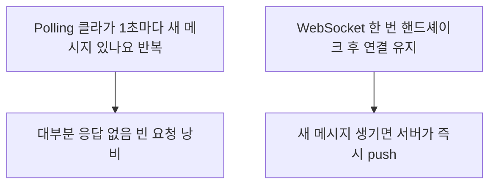

- **REST** → 요청마다 편지 한 통 주고받기 (필요할 때 묻고 답 받음)
- **WebSocket** → 전화 연결 계속 유지 (서버·클라이언트 아무 때나 말 검)
- **gRPC** → 정해진 양식의 빠른 사내 메신저 (서비스끼리 효율 통신)

## 편지 vs 전화로 이해하기

- REST = **편지** → 물어볼 때마다 한 통 보내고 답장 한 통 받음 · 서버가 먼저 말 못 검
- WebSocket = **전화 통화** → 한 번 연결하면 양쪽 다 아무 때나 말함 · 서버가 먼저 알림 푸시 가능
- gRPC = **사내 전용 메신저** → 양식(protobuf) 정해두고 짧고 빠르게 · 서비스 간 통신에 최적

<KeyPoint title="핵심 차이">
REST = 클라이언트가 물을 때만(요청-응답) · WebSocket = 연결 유지하며 양방향 수시로 ·
gRPC = 효율(이진 포맷·HTTP/2)과 계약(스키마) 우선
</KeyPoint>

## REST — 자원 중심 설계

- 모든 것을 **자원(resource)** 으로 보고 URL로 표현 · 행위는 HTTP 메서드로
- 예: 사용자 → `/users/1` · GET(조회) POST(생성) PUT(수정) DELETE(삭제)

<Cards cols={2}>
<Card icon="🔗" title="Uniform Interface">
일관된 인터페이스 · URL=자원, 메서드=행위 → 예측 가능
</Card>
<Card icon="🚫" title="Stateless">
서버가 클라이언트 상태 저장 안 함 · 요청마다 필요한 정보 다 담음 → 확장 쉬움
</Card>
<Card icon="💾" title="Cacheable">
응답에 캐시 가능 여부 표시 → 같은 요청 재사용 → 성능 ↑
</Card>
<Card icon="🧱" title="Layered System">
클라이언트는 중간 계층(LB·프록시·게이트웨이) 몰라도 됨
</Card>
<Card icon="🖥️" title="Client-Server">
화면(클라)과 데이터(서버) 분리 → 독립 진화
</Card>
<Card icon="📦" title="Code on Demand">
필요 시 서버가 실행 코드 전달 (선택 사항)
</Card>
</Cards>

```http
GET /users/1 HTTP/1.1
Host: api.example.com

HTTP/1.1 200 OK
Content-Type: application/json

{ "id": 1, "name": "yoona" }
```

## HTTP polling vs WebSocket

- REST로 실시간 흉내 → **계속 물어봄**(polling) · 비효율 (변화 없어도 묻고, 변화 있어도 다음 요청까지 모름)
- WebSocket → 한 번 연결 후 **서버가 먼저 푸시** 가능 · 진짜 실시간



<Compare>
<CompareCol title="🔁 HTTP Polling" subtitle="REST 반복 요청" color="amber">
- 클라가 주기적으로 계속 물음
- 변화 없어도 요청 발생 → 낭비
- 알림이 polling 주기만큼 지연
- 구현 단순 · 기존 REST 그대로
</CompareCol>
<CompareCol title="🔌 WebSocket" subtitle="지속 연결 양방향" color="green">
- 한 번 연결 후 계속 유지
- 서버가 먼저 push 가능 → 즉시
- 헤더 오버헤드 적음 · 효율
- 연결 관리·재연결 로직 필요
</CompareCol>
</Compare>

```javascript
// WebSocket 클라이언트 — 채팅
const ws = new WebSocket("wss://chat.example.com/room/1");

ws.onopen = () => ws.send(JSON.stringify({ type: "join", user: "yoona" }));
ws.onmessage = (e) => {          // 서버가 push하면 즉시 호출
  const msg = JSON.parse(e.data);
  console.log(msg.user, msg.text);
};
ws.onclose = () => console.log("연결 종료 → 재연결 로직 필요");
```

- WebSocket 시작 → HTTP **Upgrade** 핸드셰이크로 시작 후 프로토콜 전환 → 같은 TCP 연결을 양방향으로 사용

## gRPC — HTTP/2 + protobuf

- 서비스 간 통신용 RPC 프레임워크 · **함수 호출하듯** 원격 서비스 메서드 호출
- 데이터 → JSON 대신 **protobuf**(이진) → 작고 빠름 · 전송 → HTTP/2(멀티플렉싱·스트리밍)

<Layers>
<Layer title=".proto 스키마" color="sky">
서비스·메시지 구조를 미리 정의 → 서버·클라이언트 코드 자동 생성 → 계약(contract) 강제
</Layer>
<Layer title="protobuf 직렬화" color="green">
이진 포맷 → JSON보다 작고 인코딩·디코딩 빠름
</Layer>
<Layer title="HTTP/2 전송" color="amber">
한 연결로 여러 요청 동시(멀티플렉싱) · 헤더 압축 · 양방향 스트리밍 지원
</Layer>
</Layers>

```protobuf
// user.proto — 양식 먼저 정의
service UserService {
  rpc GetUser (UserRequest) returns (UserReply);
}
message UserRequest { int32 id = 1; }
message UserReply  { int32 id = 1; string name = 2; }
```

```python
# 생성된 코드로 원격 함수 호출하듯 사용
reply = stub.GetUser(UserRequest(id=1))
print(reply.name)
```

## 언제 무엇 — 실무 선택 기준

| 상황 | 선택 | 이유 |
|------|------|------|
| 공개 API · 웹/모바일 앱 | REST | 범용·캐시·디버깅 쉬움 · 브라우저 친화 |
| 채팅·실시간 알림·주식 시세 | WebSocket | 서버 push·양방향 지속 연결 |
| MSA 내부 서비스 간 통신 | gRPC | 빠름·이진·스키마 계약·스트리밍 |
| 단순 주기 갱신(몇 분) | REST polling | 구현 단순 · 실시간 불필요 |
| 브라우저에서 서버로 다량 stream | WebSocket / gRPC-web | 양방향·저지연 |

<Note type="pink" title="현실 조합">
- 한 서비스 안에 섞어 씀 → 외부 노출 REST + 내부 서비스 간 gRPC + 실시간 화면 WebSocket
- 채팅 서버 → WebSocket으로 메시지 push, 과거 메시지 조회는 REST
- gRPC는 브라우저 직접 호출 제약 → 보통 백엔드 간 · 브라우저엔 gRPC-web 게이트웨이
</Note>

## 관련 링크

- [http](/cs/networks/http) — 세 방식 모두 HTTP/HTTP2 위에서 동작
- [tcp-ip](/cs/networks/tcp-ip) — 그 아래 TCP 연결
- [process-thread](/cs/os/process-thread) — WebSocket 동시 연결 처리 모델
