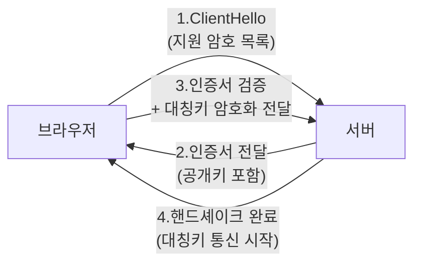

- **암호화** → 중간에서 누가 엿봐도 못 읽게 내용을 자물쇠로 잠그는 것
- **TLS/HTTPS** → 웹 통신을 암호화 + 상대가 진짜인지 확인하는 표준
- 한 줄 차이 → **대칭키**는 자물쇠·열쇠가 같음(빠름) · **비대칭키**는 잠그는 열쇠·푸는 열쇠가 다름(안전한 키 교환)

## 자물쇠와 열쇠로 이해하기

- **대칭키 = 똑같은 열쇠 두 개** → 둘이 같은 열쇠를 나눠 가짐 → 잠그고 푸는 게 같은 열쇠 → 빠르지만 **열쇠를 어떻게 안전하게 전달?**이 문제
- **비대칭키 = 자물쇠는 공개, 열쇠는 나만** → 아무나 내 공개 자물쇠로 잠가 보낼 수 있지만, 푸는 개인키는 나만 가짐 → 키 전달 문제 해결, 대신 느림

<KeyPoint title="이 비유에서 가져갈 것">
대칭키 = 빠르지만 열쇠 공유가 위험 · 비대칭키 = 느리지만 키를 안전하게 주고받음 ·
실제 TLS는 둘을 **섞어 씀** → 비대칭키로 "대칭키를 안전하게 전달" → 이후 통신은 빠른 대칭키로
</KeyPoint>

## 대칭키 vs 비대칭키

<Compare>
<CompareCol title="🔑 대칭키" subtitle="같은 키로 잠그고 풀기" color="sky">
- 암호화·복호화 키 동일
- 매우 빠름 → 대용량 데이터에 적합
- 키를 어떻게 전달하나가 약점
- 예: AES
</CompareCol>
<CompareCol title="🔐 비대칭키" subtitle="공개키 ↔ 개인키 한 쌍" color="pink">
- 공개키로 잠그면 개인키로만 풀림
- 키 전달 안전 · 전자서명 가능
- 느림 → 작은 데이터·키 교환용
- 예: RSA, ECC
</CompareCol>
</Compare>

## HTTPS = HTTP + TLS

- HTTP는 평문 → 중간에서 다 보임 · HTTPS는 TLS로 감싸 암호화
- 자물쇠 아이콘 = TLS 핸드셰이크 성공 + 인증서 검증 통과



<Timeline>
<TimelineItem title="1. ClientHello">
브라우저가 지원하는 TLS 버전·암호화 방식 목록 전송
</TimelineItem>
<TimelineItem title="2. 인증서 전달">
서버가 인증서(공개키 + CA 서명) 전송 → "나 진짜 이 도메인이야"
</TimelineItem>
<TimelineItem title="3. 인증서 검증 + 키 교환">
브라우저가 CA 서명 확인(신뢰된 발급기관?) → 비대칭키로 대칭키 안전하게 전달
</TimelineItem>
<TimelineItem title="4. 대칭키 통신">
이후 실제 데이터는 빠른 대칭키로 암호화 송수신
</TimelineItem>
</Timeline>

## 인증서 (Certificate)

- 인증서 = **신분증** → "이 공개키는 진짜 google.com 것"임을 신뢰된 기관(CA)이 보증
- 브라우저는 미리 신뢰하는 CA 목록 보유 → CA 서명 확인으로 위조 차단

```bash
# 서버 인증서·TLS 정보 확인 (curl)
$ curl -vI https://google.com 2>&1 | grep -i "subject\|issuer\|TLS"
*  subject: CN=*.google.com
*  issuer: C=US; O=Google Trust Services; CN=WR2
*  SSL connection using TLSv1.3 / TLS_AES_256_GCM_SHA384

# openssl로 인증서 만료일 확인
$ openssl s_client -connect google.com:443 2>/dev/null \
  | openssl x509 -noout -dates
notBefore=...
notAfter=...
```

## 방화벽

<Layers>
<Layer title="Packet Filtering" sub="L3/L4" color="sky">
IP·포트 기준 허용/차단 · 빠르지만 내용은 못 봄 (예 22번 포트만 허용)
</Layer>
<Layer title="Stateful Inspection" sub="연결 상태 추적" color="amber">
연결 흐름 기억 → "내가 보낸 요청의 응답만 허용" → 더 똑똑한 차단
</Layer>
<Layer title="WAF (Web Application Firewall)" sub="L7" color="pink">
HTTP 내용 검사 → SQLi·XSS 등 웹 공격 패턴 차단 (예 AWS WAF)
</Layer>
</Layers>

## 흔한 공격 유형

<Cards cols={3}>
<Card icon="🌊" title="DDoS">
수많은 좀비 PC가 동시에 요청 폭탄 → 서버 마비 · 대응: 트래픽 분산·CDN·rate limit
</Card>
<Card icon="🕵️" title="MITM">
통신 중간에서 가로채 엿보기·조작 · 대응: TLS 암호화 + 인증서 검증
</Card>
<Card icon="💉" title="SQL Injection">
입력값에 SQL 주입 → DB 탈취·삭제 · 대응: prepared statement·입력 검증
</Card>
</Cards>

<Note type="danger" title="SQL Injection 예시">
- 취약: `"SELECT * FROM users WHERE id = '" + input + "'"` → input에 `' OR '1'='1` 넣으면 전체 조회됨
- 안전: 파라미터 바인딩 사용 → `WHERE id = ?` + 값 분리 전달 → 주입 문자열이 데이터로만 취급
</Note>

<Note type="pink" title="실무 핵심">
- 평문 HTTP 금지 → 전 구간 HTTPS · HSTS로 강제
- 인증서 자동 갱신(Let's Encrypt·ACM) → 만료로 인한 접속 장애 예방
- DB 접근은 항상 파라미터 바인딩 · ORM 사용시도 raw query 주의
- 방화벽은 계층 방어 → 보안그룹(L4) + WAF(L7) 함께 적용
</Note>
