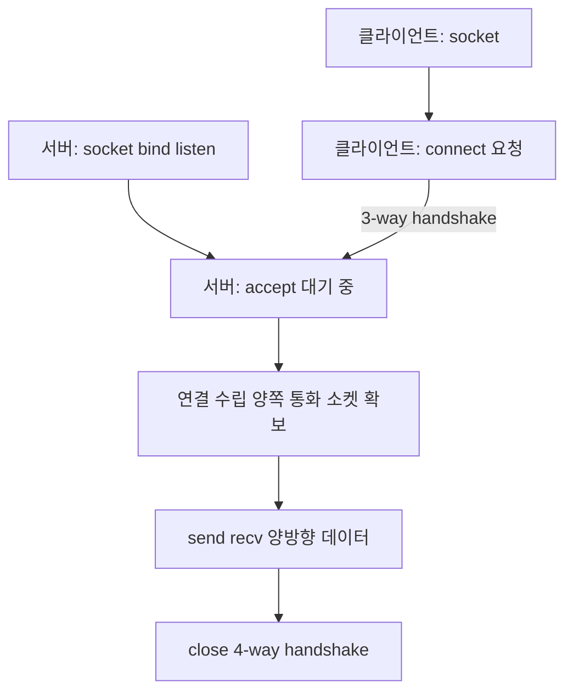

- **소켓** → 두 프로그램이 네트워크로 데이터 주고받는 **양 끝 연결점**
- IP(어느 컴퓨터) + Port(그 컴퓨터의 어느 프로그램) → 한 쌍이 곧 소켓 주소
- OS가 만들어주는 **파일 디스크립터** 하나 → 읽기·쓰기로 네트워크 통신

## 전화기로 이해하기

- 소켓 = **전화기 양 끝** · 서버는 전화기 놓고 벨 울리길 기다림, 클라이언트는 번호 눌러 전화 검
- IP = 건물 주소 · Port = 그 건물의 **내선 번호** → 같은 건물(서버)에 80번(웹)·22번(SSH) 등 여러 내선
- 전화 연결되면(accept) → 양쪽 다 말하고 듣기 가능 → 끊으면(close) 통화 종료

<KeyPoint title="이 비유에서 가져갈 것">
서버 소켓 = 대표 전화(벨 받는 용도) · accept하면 통화 전용 소켓이 따로 생김 →
대표 전화는 계속 다음 벨을 받고, 실제 통화는 새 소켓이 담당
</KeyPoint>

## 소켓 주소 = IP + Port

<Cards cols={3}>
<Card icon="🏢" title="IP">
어느 컴퓨터인지 · 예: 192.168.0.10
</Card>
<Card icon="🔢" title="Port">
그 컴퓨터의 어느 프로그램인지 · 0~65535 · 80=HTTP, 443=HTTPS, 22=SSH
</Card>
<Card icon="📄" title="File Descriptor">
OS가 소켓에 매기는 정수 번호 · read/write로 다룸 (Unix는 소켓도 파일로 취급)
</Card>
</Cards>

- well-known port 0~1023 → 시스템 예약 (HTTP·SSH 등)
- 49152~65535 → 임시 포트(ephemeral) · 클라이언트가 연결 걸 때 OS가 자동 배정

## TCP 소켓 연결 흐름

- 서버는 자리를 펴고(socket→bind→listen) 손님을 받음(accept) · 클라이언트는 전화를 검(connect)

<Timeline>
<TimelineItem title="1. socket() — 전화기 장만">
서버·클라이언트 모두 소켓 생성 → file descriptor 발급 · 아직 아무 연결 없음
</TimelineItem>
<TimelineItem title="2. bind() — 내선 번호 등록 (서버)">
서버 소켓에 IP·Port 묶기 → "나는 8080번으로 받겠다" 선언
</TimelineItem>
<TimelineItem title="3. listen() — 벨 켜기 (서버)">
연결 대기 상태 전환 · 대기 큐(backlog) 마련 → 들어오는 요청 줄 세움
</TimelineItem>
<TimelineItem title="4. connect() — 전화 걸기 (클라이언트)">
클라이언트가 서버 IP·Port로 연결 요청 → TCP 3-way handshake 시작
</TimelineItem>
<TimelineItem title="5. accept() — 통화 시작 (서버)">
대기 큐에서 연결 하나 꺼냄 → **통화 전용 소켓** 새로 반환 · 원래 서버 소켓은 계속 listen
</TimelineItem>
<TimelineItem title="6. send/recv — 대화">
연결된 소켓으로 양방향 데이터 주고받기 · TCP라 순서·도착 보장
</TimelineItem>
<TimelineItem title="7. close() — 통화 종료">
소켓 닫기 → 4-way handshake로 연결 해제
</TimelineItem>
</Timeline>

## 클라이언트-서버 통신 그림



- accept가 돌려준 소켓 ≠ 처음 만든 서버 소켓 → 서버 소켓은 **계속 새 손님 받는 창구**
- 그래서 동시 접속 처리 → accept한 소켓마다 스레드·프로세스·비동기로 분산 ([process-thread](/cs/os/process-thread))

## TCP 소켓 Python 예제

```python
# ── 서버 ──
import socket

server = socket.socket(socket.AF_INET, socket.SOCK_STREAM)  # IPv4 + TCP
server.setsockopt(socket.SOL_SOCKET, socket.SO_REUSEADDR, 1)  # 재시작 시 포트 재사용
server.bind(("0.0.0.0", 8080))   # 내선 등록
server.listen(5)                  # 대기 큐 5칸, 벨 켜기
print("listening on 8080")

while True:
    conn, addr = server.accept()  # 통화 전용 소켓 반환 (블로킹)
    data = conn.recv(1024)        # 최대 1024 bytes 수신
    conn.sendall(b"echo: " + data)
    conn.close()
```

```python
# ── 클라이언트 ──
import socket

client = socket.socket(socket.AF_INET, socket.SOCK_STREAM)
client.connect(("127.0.0.1", 8080))  # 전화 걸기
client.sendall(b"hello")
print(client.recv(1024))             # b"echo: hello"
client.close()
```

## UDP 소켓 — 연결 없이 던지기

- TCP = 전화(연결 후 대화) · UDP = **엽서**(주소 적어 그냥 던짐, 받든 말든 보장 없음)
- connect·accept 없음 → 바로 `sendto`/`recvfrom`으로 주소 찍어 송수신

<Compare>
<CompareCol title="📞 TCP (SOCK_STREAM)" subtitle="연결형" color="sky">
- connect·accept로 연결 수립
- 순서·도착 보장 · 재전송
- 스트림(경계 없는 바이트 흐름)
- 파일 전송·HTTP·DB 등 정확성 중요할 때
</CompareCol>
<CompareCol title="📮 UDP (SOCK_DGRAM)" subtitle="비연결형" color="amber">
- 연결 과정 없음 · 패킷 단위로 던짐
- 보장 없음(유실·순서 뒤바뀜 가능)
- 메시지 경계 유지(datagram)
- 실시간 영상·게임·DNS 등 속도 우선일 때
</CompareCol>
</Compare>

```python
# UDP 서버 — listen·accept 없음
import socket
udp = socket.socket(socket.AF_INET, socket.SOCK_DGRAM)
udp.bind(("0.0.0.0", 9090))
data, addr = udp.recvfrom(1024)   # 보낸 쪽 주소도 함께 받음
udp.sendto(b"pong", addr)         # 그 주소로 바로 응답
```

## blocking vs non-blocking

- `accept`·`recv` 같은 호출 → 기본은 **결과 올 때까지 멈춤**(blocking)
- 멈춰 있는 동안 다른 소켓 처리 불가 → 동시 접속 많으면 비효율

<Compare>
<CompareCol title="⏸️ Blocking" subtitle="기본 동작" color="stone">
- recv 호출 → 데이터 올 때까지 대기
- 코드 단순 · 직관적
- 소켓당 스레드 필요 → 동시 접속 많으면 무거움
</CompareCol>
<CompareCol title="▶️ Non-blocking" subtitle="setblocking(False)" color="green">
- 데이터 없으면 즉시 리턴(예외·빈 결과)
- 한 스레드로 수천 소켓 감시 가능
- select·epoll·asyncio와 함께 → 이벤트 루프
</CompareCol>
</Compare>

```python
# non-blocking + select — 한 스레드로 여러 소켓 감시
import socket, select

server.setblocking(False)
sockets = [server]
while True:
    readable, _, _ = select.select(sockets, [], [])  # 읽을 게 생긴 소켓만 반환
    for s in readable:
        if s is server:
            conn, _ = s.accept()
            conn.setblocking(False)
            sockets.append(conn)
        else:
            data = s.recv(1024)
            ...
```

<Note type="note" title="실무에서는">
- 동시 접속 많은 서버 → blocking + 스레드 풀, 또는 non-blocking + epoll/asyncio
- Python `asyncio`, Node `libuv`, nginx → 모두 non-blocking 이벤트 루프 기반
- 채팅 서버처럼 연결 수천 개 유지 → blocking 스레드는 한계 → 이벤트 루프 선택
</Note>

## 관련 링크

- [tcp-ip](/cs/networks/tcp-ip) — TCP/IP 계층과 3-way handshake
- [http](/cs/networks/http) — 소켓 위에서 도는 HTTP
- [process-thread](/cs/os/process-thread) — accept한 소켓을 스레드·프로세스로 분산
