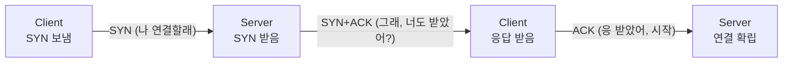
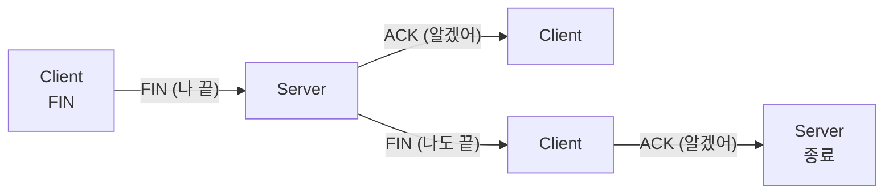

- **TCP** → 연결을 맺고 데이터를 **순서대로·빠짐없이** 보내는 신뢰성 프로토콜
- **UDP** → 연결 없이 일단 **던지는** 빠른 프로토콜 (도착·순서 보장 안 함)
- 한 줄 차이 → 정확함(TCP) vs 빠름(UDP)

## 전화 vs 편지로 이해하기

- **TCP = 전화** → "여보세요?"(연결 확인) 하고 통화 시작 → 말 안 들리면 "다시 말해줘"(재전송) → 끊을 때도 "끊을게~ 응 끊어"(종료 인사)
- **UDP = 엽서 무더기** → 주소만 적어 우체통에 다 던짐 → 받는 쪽 확인 안 함 → 빠르지만 일부는 분실·순서 뒤바뀜 가능
- 영상 통화·게임은 0.1초 늦은 옛 데이터보다 **지금 최신**이 중요 → UDP

<KeyPoint title="이 비유에서 가져갈 것">
TCP = 통화처럼 연결 확인·재전송·순서 보장 (대신 느리고 무거움) ·
UDP = 엽서처럼 그냥 던짐 (빠르고 가볍지만 분실·순서 보장 없음)
</KeyPoint>

## TCP vs UDP

<Compare>
<CompareCol title="🤝 TCP" subtitle="연결형·신뢰성" color="sky">
- 연결 설정 후 통신 (3-way handshake)
- 데이터 순서 보장 · 손실 시 재전송
- 흐름 제어·혼잡 제어 있음
- 헤더 큼(20B+) · 상대적으로 느림
- 웹(HTTP), 메일, 파일 전송
</CompareCol>
<CompareCol title="📨 UDP" subtitle="비연결형·고속" color="amber">
- 연결 없이 바로 전송
- 순서·도착 보장 없음 · 재전송 없음
- 제어 기능 없음 → 단순
- 헤더 작음(8B) · 빠르고 가벼움
- 영상 스트리밍, 게임, DNS, VoIP
</CompareCol>
</Compare>

<Stats>
<Stat value="20B" label="TCP 헤더 최소" sub="옵션 시 더 큼" />
<Stat value="8B" label="UDP 헤더" sub="고정·단순" />
<Stat value="65535" label="포트 최대" sub="0~65535" />
<Stat value="3 / 4" label="연결 / 해제" sub="handshake 단계" />
</Stats>

## 3-way handshake (연결 시작)

- 통화 시작 전 "들려?" "응 들려, 너는?" "응 나도" 하고 확인하는 과정



<Timeline>
<TimelineItem title="1. SYN — 클라이언트 → 서버">
"연결하고 싶어" · 클라이언트가 임의 시퀀스 번호(seq=x) 담아 SYN 전송 · 상태 SYN_SENT
</TimelineItem>
<TimelineItem title="2. SYN + ACK — 서버 → 클라이언트">
"좋아, 네 요청 받음(ack=x+1) · 나도 연결할게(seq=y)" · 상태 SYN_RCVD
</TimelineItem>
<TimelineItem title="3. ACK — 클라이언트 → 서버">
"네 응답도 받음(ack=y+1)" · 양쪽 다 준비 완료 → 상태 ESTABLISHED · 이제 데이터 전송 가능
</TimelineItem>
</Timeline>

## 4-way handshake (연결 종료)

- 끊을 때는 **양쪽 다** "나 할 말 끝났어"를 따로 말해야 함 → 그래서 4단계



- 1) Client FIN → 2) Server ACK → (서버 남은 데이터 마저 전송) → 3) Server FIN → 4) Client ACK
- 마지막 ACK 후 클라이언트는 잠시 **TIME_WAIT** → 뒤늦게 온 패킷 처리·재전송 대비

<Note type="note" title="왜 종료는 4단계인가">
- 연결은 SYN+ACK를 한 번에 합쳐 3단계 · 종료는 서버가 보낼 데이터가 남았을 수 있어 ACK와 FIN을 따로 → 4단계
- close 직후 바로 못 끝내고 TIME_WAIT 거치는 이유 → 늦게 도착한 패킷이 새 연결과 섞이는 것 방지
</Note>

## 흐름 제어 vs 혼잡 제어

<Compare>
<CompareCol title="흐름 제어" subtitle="받는 쪽 보호" color="green">
- 받는 쪽이 처리 못 하게 너무 많이 보내는 것 방지
- **Window Size**로 "이만큼만 보내" 알림
- 수신 버퍼 가득 차면 윈도우 줄임
- 1:1 관계 (송신자 ↔ 수신자)
</CompareCol>
<CompareCol title="혼잡 제어" subtitle="네트워크 보호" color="pink">
- 네트워크(중간 경로) 막히는 것 방지
- Slow Start → 조금씩 보내다 늘림
- 손실 감지 시 전송량 확 줄임 (AIMD)
- 전체 네트워크 상태가 대상
</CompareCol>
</Compare>

- 흐름 제어 → "**받는 사람**이 감당 못 함" 문제
- 혼잡 제어 → "**가는 길**이 막힘" 문제 → 둘 다 TCP가 알아서, UDP는 둘 다 없음

## 실무에서 확인하기

```bash
# 현재 TCP 연결 상태 보기 (ESTABLISHED / TIME_WAIT 등)
netstat -an | grep ESTABLISHED

# handshake 패킷 직접 캡처 (SYN/ACK/FIN 플래그 확인)
tcpdump -i any 'tcp port 443' -nn

# 특정 호스트까지 경로의 각 라우터(홉) 확인
traceroute google.com
```

<Note type="pink" title="고를 때">
- 정확성·순서가 생명(결제·파일·로그인) → TCP
- 실시간성이 생명·약간 손실 OK(게임·라이브·음성) → UDP
- DNS는 보통 UDP(빠른 단발 질의) · 응답 크면 TCP로 폴백
- HTTP/3는 UDP 위 QUIC 사용 → "UDP=불안정"은 옛말, 위에서 신뢰성 직접 구현
</Note>
