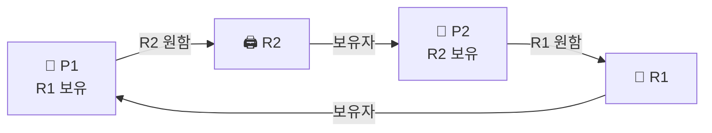

- 둘 이상이 **서로가 가진 자원을 기다리며 영원히 멈춘** 상태
- 아무도 양보 안 함 → 영원히 진행 불가

## 순환 대기 구조

- 좁은 사거리, 네 방향 차가 동시에 진입
- 각 차는 **앞 차가 비켜야** 갈 수 있음
- 그런데 네 대가 원형으로 물려서 → **아무도 못 감**
- 이게 정확히 데드락: "내가 가진 걸 쥔 채, 남이 가진 걸 기다림"



- P1은 R1을 쥐고 R2를 기다림 · P2는 R2를 쥐고 R1을 기다림 → **원형 대기** → 둘 다 멈춤

## 4가지 필요조건 — 전부 충족해야 발생

<Cards cols={2}>
<Card icon="🚫" title="1. 상호 배제">
자원을 **한 번에 하나만** 사용 가능 (공유 불가) · 예: 프린터 1대
</Card>
<Card icon="✋" title="2. 점유와 대기">
자원을 **쥔 채로** 다른 자원을 더 기다림 · 예: 포크 1개 들고 2번째 포크 대기
</Card>
<Card icon="🔒" title="3. 비선점">
남의 자원을 **강제로 못 뺏음** · 자발적으로 놓을 때까지 대기
</Card>
<Card icon="🔄" title="4. 순환 대기">
P1→P2→...→P1 으로 **원형**으로 물고 물림
</Card>
</Cards>

<KeyPoint title="여기가 핵심">
네 조건이 **전부** 충족돼야 데드락 발생 → 거꾸로 **하나만 깨도 예방** 가능 ·
대부분의 해결책은 "이 네 개 중 하나를 못 만들게 하기"
</KeyPoint>

## 코드로 보기 — 두 락이 엇갈릴 때

```python
lockA, lockB = Lock(), Lock()

# 스레드 1               # 스레드 2
with lockA:             with lockB:      # 순서가 반대!
    with lockB:             with lockA:
        ...                     ...
```

- 두 스레드가 **반대 순서**로 락을 잡으면:

| 시간 | 스레드 1 | 스레드 2 | 상태 |
|------|------|------|------|
| 1 | lockA 획득 | | A=T1 |
| 2 | | lockB 획득 | B=T2 |
| 3 | lockB 대기… | | T1 멈춤 (B는 T2가 쥠) |
| 4 | | lockA 대기… | T2 멈춤 (A는 T1가 쥠) |
| 5 | 🔒 영원히 | 🔒 영원히 | **데드락** |

<Note type="success" title="가장 쉬운 예방">
- 모든 스레드가 **락을 같은 순서로** 잡게 강제 (lockA → lockB 항상)
- → 순환 대기(4번 조건) 깨짐 → 데드락 불가
</Note>

## 해결 4가지 전략

| 전략 | 방법 | 트레이드오프 |
|------|------|------|
| **예방 (Prevention)** | 4조건 중 하나를 원천 차단 (예: 락 순서 고정) | 단순하지만 자원 활용 ⬇️ |
| **회피 (Avoidance)** | 안전 상태(safe state)만 허용 — **은행원 알고리즘** | 미래 요구를 알아야 함 |
| **탐지 + 복구** | 데드락 생기게 두고, 주기적 탐지 → 강제 종료/롤백 | 탐지·복구 비용 |
| **무시 (Ostrich)** | 그냥 무시 (드물면 재부팅) | 대부분 OS가 현실적으로 선택 |

<Note type="note" title="은행원 알고리즘 (회피) 한 줄">
- 자원 요청 시 "이걸 줘도 모두가 결국 끝낼 수 있나(safe state)?"를 검사 → 가능할 때만 허용
- 마치 은행이 "대출해줘도 모든 고객 상환 가능한가" 확인하듯
</Note>

## 실무에서 진짜 만나는 곳 — DB 데드락

<Note type="pink" title="정리 + 실무">
- DB도 트랜잭션이 행 락을 엇갈려 잡으면 데드락 → DB가 **탐지 후 한 트랜잭션을 죽임**(victim) → 앱은 재시도
- 예방 실무: **락을 항상 같은 순서로** · 트랜잭션 짧게 · 타임아웃 설정
- 데드락 ≠ 단순 느림 → "영원히" 멈춤 (4조건 모두 성립)
- 관련: [동기화](/cs/os/sync)의 락을 잘못 쓰면 데드락으로 이어짐
</Note>
