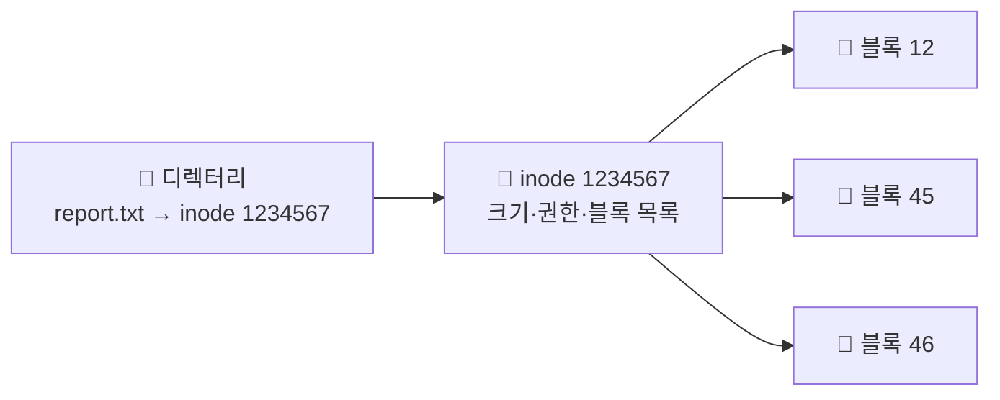

- 파일 시스템 = OS가 디스크에 **파일을 저장·조직·찾는** 방식
- 디스크는 그냥 거대한 바이트 덩어리 → 이를 "파일/폴더"로 보이게 해주는 계층

## 도서관으로 이해하기

- **책(파일)** 은 서가 곳곳에 흩어져 꽂혀 있음 (디스크 블록)
- 책마다 **정보 카드(inode)** → 제목·크기·**어느 서가 칸들에 나뉘어 있는지** 기록
- **카탈로그(디렉터리)** → "이름 → 카드 번호(inode)" 연결
- 책 찾기 = 카탈로그에서 이름으로 카드 찾고 → 카드가 가리키는 서가 칸에서 내용 읽기

<KeyPoint title="이름과 실체의 분리">
디렉터리는 **이름 → inode 번호**만 연결 · 실제 데이터 위치·크기·권한은 전부 **inode**에 있음 ·
그래서 같은 파일에 이름 여러 개(하드링크)도 가능
</KeyPoint>

## inode와 디렉터리

- **inode** = 파일의 메타데이터 + 데이터 블록 위치 목록 (이름은 안 들어 있음)

| inode에 든 것 | 예 |
|------|------|
| 파일 종류·권한 | `-rw-r--r--` |
| 크기·소유자·타임스탬프 | 4KB·user·수정시각 |
| **데이터 블록 포인터** | 블록 12, 45, 46... |

```bash
ls -i  # 파일의 inode 번호 보기
# 1234567 report.txt
```



## 블록 할당 방식

- 파일 데이터를 디스크 블록에 어떻게 배치하나

| 방식 | 설명 | 약점 |
|------|------|------|
| **연속 할당** | 블록을 이어서 배치 | 빠른 순차 읽기 / 외부 단편화·크기 변경 어려움 |
| **연결 할당** | 블록마다 다음 블록 위치 저장 | 단편화 적음 / 임의 접근 느림 |
| **색인 할당(inode)** | inode가 블록 위치들을 모아둠 | 임의 접근 빠름 / 대부분의 현대 FS |

<Note type="note" title="큰 파일은 어떻게">
- inode의 블록 포인터가 부족하면 → **간접 블록**(블록을 가리키는 블록)으로 확장
- 단일·이중·삼중 간접으로 아주 큰 파일도 표현
</Note>

## 저널링 — 갑자기 꺼져도 안전하게

- 쓰는 도중 정전·크래시 → 파일 시스템 깨질 위험 (반만 쓰인 상태)
- **저널링**: 실제 반영 전에 "뭘 할지"를 **저널(로그)** 에 먼저 기록

<Timeline>
<TimelineItem title="1. 저널에 기록">
"이 블록들을 이렇게 바꿀 것" 을 로그에 먼저 씀
</TimelineItem>
<TimelineItem title="2. 실제 반영">
디스크 본 영역에 실제 변경 적용
</TimelineItem>
<TimelineItem title="3. 크래시 시 복구">
중간에 죽어도 저널을 보고 다시 진행하거나 되돌림 → 일관성 유지
</TimelineItem>
</Timeline>

<Note type="success" title="실무 연결">
- ext4·NTFS·XFS 등 현대 파일시스템이 저널링 사용
- DB의 [트랜잭션 로그(WAL)](/cs/db/transactions)와 같은 원리 — "먼저 로그, 나중 반영"
</Note>

## VFS — 종류 달라도 같은 인터페이스

<Note type="pink" title="정리">
- 디렉터리(이름→inode) + inode(메타+블록 위치) + 데이터 블록으로 파일 구성
- 현대 FS는 색인(inode) 할당 + 큰 파일은 간접 블록
- 저널링으로 크래시에도 일관성 (로그 먼저 → 반영)
- **VFS**: ext4·NTFS·NFS 등 종류가 달라도 OS가 같은 인터페이스(`open`·`read`)로 다룸 → 앱은 종류 신경 안 씀
</Note>
