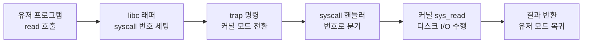

- **인터럽트** → "지금 하던 일 멈추고 이것부터 처리해!" 하는 신호
- 키보드·디스크·타이머 등이 CPU에게 보냄 → CPU는 하던 명령 멈추고 즉시 대응
- **시스템 콜** → 프로그램이 OS(커널)에게 "이거 대신 해줘"라고 요청하는 공식 창구
- 둘 다 공통점 → 평범한 코드 실행 흐름을 끊고 **커널 모드로 진입**

## 일하다 전화 받기 (인터럽트 비유)

- 책상에서 문서 작성 중(프로그램 실행) → 전화벨(인터럽트) 울림
- 쓰던 문장 위치 메모해두고(상태 저장) → 전화 받음(ISR 실행)
- 통화 끝나면 → 메모 보고 끊긴 문장부터 이어서 작성(원래 흐름 복귀)
- 핵심 → 전화는 **언제 올지 모름**(비동기) · 와도 일을 잃지 않게 위치 저장 필수

## 식당에서 주방 못 들어가기 (시스템 콜 비유)

- 손님(프로그램) → 직접 주방(하드웨어/커널 자원) 들어가면 안 됨(위험·혼란)
- 주문서 작성 → 직원(커널)에게 전달 → 직원이 주방서 처리 → 결과만 손님에게
- 시스템 콜 = 이 "주문서" → 프로그램이 직접 디스크·네트워크 못 만지고 커널 통해 요청

<KeyPoint title="이 비유에서 가져갈 것">
인터럽트 = 외부가 CPU를 끊는 비동기 신호(전화) · 시스템 콜 = 프로그램이 스스로 커널에 요청하는 동기 호출(주문) ·
공통 = 둘 다 일반 흐름 끊고 커널 모드로 들어가 처리 후 복귀
</KeyPoint>

## 유저 모드 vs 커널 모드

- CPU는 두 권한 레벨로 동작 → 아무 코드나 하드웨어 직접 못 건드리게 막음

<Compare>
<CompareCol title="🙍 유저 모드" subtitle="일반 프로그램 실행" color="sky">
- 우리가 짠 앱 코드가 도는 곳
- 하드웨어·메모리 직접 접근 **금지**
- 위험한 명령(I/O·메모리 매핑) 실행 불가
- 자원 필요하면 → 시스템 콜로 요청
</CompareCol>
<CompareCol title="🛡️ 커널 모드" subtitle="OS 핵심 실행" color="pink">
- OS 커널 코드가 도는 곳
- 모든 하드웨어·메모리 접근 **허용**
- 특권 명령(privileged instruction) 실행 가능
- 요청 처리 끝나면 → 유저 모드로 복귀
</CompareCol>
</Compare>

<Note type="warning" title="왜 모드를 나누나">
- 유저 코드가 하드웨어 직접 만지면 → 버그 하나로 시스템 전체 다운·보안 붕괴
- 위험한 작업은 전부 커널이 검증 후 대행 → 격리·보호
- 모드 전환(유저↔커널)은 비용 발생 → 시스템 콜 남발하면 느려짐
</Note>

## 인터럽트 종류

<Cards cols={2}>
<Card icon="⌨️" title="하드웨어 인터럽트">
외부 장치가 발생 · 키보드 입력·디스크 I/O 완료·타이머·네트워크 패킷 도착 · **비동기**(언제든) · 예측 불가
</Card>
<Card icon="🧮" title="소프트웨어 인터럽트 (trap)">
CPU 명령 실행 중 발생 · 시스템 콜·0 나누기·잘못된 메모리 접근(page fault) · **동기**(특정 명령에서) · 예측 가능
</Card>
</Cards>

- 하드웨어 인터럽트 = 외부 사건(IRQ) → 일하던 중 갑자기
- 소프트웨어 인터럽트 = 내부 사건(trap/exception) → 특정 명령이 원인
- 시스템 콜도 결국 → 소프트웨어 인터럽트(trap)로 커널 진입

## 인터럽트 처리 흐름

- 인터럽트 발생 → 벡터 테이블에서 처리 함수(ISR) 찾아 실행 → 끝나면 원래 자리 복귀

<Stepper>
<StepperItem title="1. 인터럽트 발생">
장치가 IRQ 신호 발생 · 또는 명령 실행 중 trap 발생 · CPU가 현재 명령 마치고 인지
</StepperItem>
<StepperItem title="2. 현재 상태 저장">
실행 중이던 PC(다음 명령 주소)·레지스터를 스택/PCB에 저장 → 나중에 복귀하려고
</StepperItem>
<StepperItem title="3. 커널 모드 전환 + 벡터 조회">
유저 → 커널 모드 전환 · 인터럽트 번호로 인터럽트 벡터 테이블 조회 → ISR 주소 획득
</StepperItem>
<StepperItem title="4. ISR 실행">
해당 인터럽트 처리 루틴(ISR) 실행 · 예) 키보드면 입력 버퍼에 문자 저장, 디스크면 데이터 전달
</StepperItem>
<StepperItem title="5. 상태 복원 + 복귀">
저장해둔 PC·레지스터 복원 · 유저 모드 복귀 → 끊겼던 명령부터 이어 실행
</StepperItem>
</Stepper>

## 인터럽트 벡터 & ISR

<Layers>
<Layer title="Interrupt Vector Table" sub="인터럽트 번호 → 처리 함수 주소" color="violet">
인터럽트마다 고유 번호 · 테이블에서 번호로 ISR 주소 즉시 조회 · 메모리 특정 영역에 저장
</Layer>
<Layer title="ISR (Interrupt Service Routine)" sub="실제 처리 코드" color="pink">
해당 인터럽트를 처리하는 커널 함수(=인터럽트 핸들러) · 짧고 빠르게 끝나야 함(다른 인터럽트 막으니까)
</Layer>
<Layer title="Interrupt Controller" sub="우선순위 정리" color="amber">
여러 인터럽트 동시 발생 시 → 우선순위로 정렬 · 더 급한 인터럽트가 덜 급한 것 선점 가능
</Layer>
</Layers>

## 시스템 콜 흐름

- 유저 프로그램이 파일을 읽는 `read()` 한 줄이 실제로 거치는 길

```c
char buf[128];
int n = read(fd, buf, 128);   // 라이브러리 함수 호출처럼 보이지만...
// 내부에서 syscall 번호를 레지스터에 넣고 trap 명령 실행 → 커널 진입
```



<Timeline>
<TimelineItem title="1. 요청 준비">
프로그램이 syscall 번호(예: read)·인자(fd·버퍼·길이)를 레지스터에 세팅
</TimelineItem>
<TimelineItem title="2. trap → 커널 진입">
trap(소프트웨어 인터럽트) 명령 실행 → 유저 모드에서 커널 모드로 전환
</TimelineItem>
<TimelineItem title="3. 디스패치 + 처리">
커널이 syscall 번호로 알맞은 핸들러 분기 → 실제 작업(디스크 읽기 등) 수행
</TimelineItem>
<TimelineItem title="4. 결과 반환 + 복귀">
결과값을 레지스터에 담아 유저 모드로 복귀 → 프로그램은 평범한 함수 리턴처럼 받음
</TimelineItem>
</Timeline>

<Note type="note" title="자주 쓰는 시스템 콜">
- 파일 → `open` · `read` · `write` · `close`
- 프로세스 → `fork` · `exec` · `exit` · `wait`
- 메모리 → `mmap` · `brk`
- 통신 → `socket` · `send` · `recv`
</Note>

## 인터럽트 ↔ 컨텍스트 전환 관계

- 인터럽트가 컨텍스트 스위칭의 **방아쇠**가 되는 경우 많음

<ProsCons>
<Pros title="인터럽트로 시작되는 전환">
- 타이머 인터럽트 → "시간 다 됐다" → 스케줄러가 다른 프로세스로 전환
- I/O 완료 인터럽트 → 기다리던 프로세스 ready로 → 전환 기회
- 선점형 스케줄링의 핵심 동력 → 인터럽트 없으면 강제 양보 불가
</Pros>
<Cons title="전환은 공짜가 아님">
- 모드 전환(유저↔커널) 자체 비용 발생
- 컨텍스트 스위칭이면 → 레지스터·메모리 맵·캐시까지 교체(더 무거움)
- 인터럽트 잦으면 → 처리·전환 오버헤드로 처리량 저하
</Cons>
</ProsCons>

<Note type="pink" title="구분 정리">
- 인터럽트 처리(ISR) ≠ 항상 컨텍스트 스위칭 → 짧은 ISR은 같은 프로세스로 그냥 복귀
- 단, 인터럽트 결과로 스케줄러가 돌면 → 그때 컨텍스트 스위칭 발생
- 시스템 콜 = 모드 전환은 하지만 → 프로세스는 그대로(블로킹되면 전환 발생)
</Note>

## 정리

<KeyPoint title="한눈에">
- 인터럽트 = 비동기(하드웨어)·동기(trap) 신호 → 흐름 끊고 ISR 실행 후 복귀
- 시스템 콜 = 유저 프로그램의 커널 요청 창구 → trap으로 커널 모드 진입
- 유저 모드 = 권한 없음(앱) · 커널 모드 = 권한 있음(OS) → 보호 위해 분리
- 인터럽트(특히 타이머) → 컨텍스트 스위칭·선점 스케줄링의 방아쇠
</KeyPoint>

- 컨텍스트 스위칭·프로세스 상태 → [process-thread](/cs/os/process-thread)
- 선점형 스케줄링 자세히 → [cpu-scheduling](/cs/os/cpu-scheduling)
- page fault도 trap의 일종 → [virtual-memory](/cs/os/virtual-memory)
