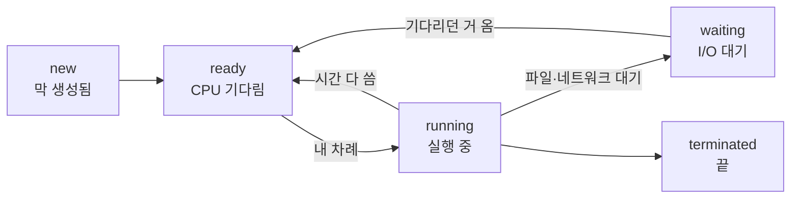

- **프로세스** → 실행 중인 프로그램 하나 · 자기만의 메모리 공간
- **스레드** → 프로세스 **안에서** 동시에 도는 작업 흐름 · 메모리 공유
- 한 줄 차이 → 메모리를 **따로**(프로세스) vs **공유**(스레드)

## 크롬 탭으로 이해하기

- 크롬 **탭 하나 = 프로세스** → 탭마다 메모리 독립 → 한 탭이 멈춰도(크래시) **다른 탭·브라우저는 멀쩡**
- 한 탭 **안에서** 페이지 그리기·스크롤·이미지 로딩이 동시에 → 이게 **스레드** (같은 탭 메모리 공유)
- 탭 많이 켜면 메모리 쭉쭉 ↑ → 프로세스마다 메모리를 **따로** 갖기 때문

<KeyPoint title="이 비유에서 가져갈 것">
프로세스 = 격리(하나 죽어도 남 안 죽음, 대신 메모리 많이 씀) ·
스레드 = 공유(가볍고 데이터 주고받기 쉬움, 대신 하나가 메모리 망치면 같이 죽음)
</KeyPoint>

## 프로세스 vs 스레드

<Compare>
<CompareCol title="📦 프로세스" subtitle="독립 실행 단위" color="violet">
- 메모리 공간 각자 (Code/Data/Heap/Stack 따로)
- 서로 침범 불가 → 안정적
- 통신하려면 **IPC**(파이프·소켓·공유메모리)
- 생성·전환 비용 ⬆️
</CompareCol>
<CompareCol title="🧵 스레드" subtitle="프로세스 내 흐름" color="sky">
- Code/Data/Heap **공유** · Stack만 따로
- 변수 그대로 공유 → 데이터 주고받기 쉬움
- 하나 잘못되면 **프로세스 전체** 영향
- 생성·전환 비용 ⬇️
</CompareCol>
</Compare>

## 프로세스 메모리 구조

- 프로세스 하나가 받은 메모리는 네 영역으로 나뉨

<Layers>
<Layer title="Stack" sub="함수 호출용" color="pink">
지역 변수·함수 호출 정보 · 함수 부르면 쌓이고(push) 끝나면 사라짐(pop) → 자동 정리
</Layer>
<Layer title="↕ 빈 공간" color="stone">
Stack은 위에서 아래로, Heap은 아래에서 위로 채워짐 → 둘이 늘어나다 **만나면 메모리 부족**(stack overflow)
</Layer>
<Layer title="Heap" sub="동적 할당용" color="sky">
실행 중 직접 할당(`malloc`·`new`)한 데이터 · 개발자 또는 GC가 정리
</Layer>
<Layer title="Data" sub="전역·static" color="amber">
전역 변수·static 변수 · 프로그램 내내 유지
</Layer>
<Layer title="Code" sub="Text" color="green">
실행할 기계어 · 읽기 전용
</Layer>
</Layers>

- **스레드는 Code·Data·Heap을 공유하고, Stack만 각자** 가짐
- → 그래서 스레드끼리 전역/힙 변수로 쉽게 데이터 공유 (대신 [동기화](/cs/os/sync) 필요)

## 프로세스 상태 변화



- **ready** → 준비 완료, CPU만 받으면 됨 (대기 줄에 서 있음)
- **running** → 지금 CPU 쓰는 중 (코어 하나에 한 순간 딱 하나)
- **waiting** → 파일 읽기·네트워크 응답 등 기다리는 중 (CPU는 다른 애한테 양보)

## 컨텍스트 스위칭

- CPU가 A → B로 바꿔 실행할 때, A가 어디까지 했는지 저장해두고 B를 불러옴

<Timeline>
<TimelineItem title="1. 중단">
A 실행 중 시간 소진 또는 I/O 요청 발생
</TimelineItem>
<TimelineItem title="2. 저장">
A의 현재 상태(레지스터·실행 위치)를 A의 보관함(PCB)에 저장
</TimelineItem>
<TimelineItem title="3. 복원 → 실행">
B의 보관함에서 상태 꺼내 복원 → B가 멈췄던 데서 이어서 실행
</TimelineItem>
</Timeline>

<Note type="warning" title="이게 공짜가 아님">
- 갈아타는 동안엔 **실제 일을 안 함** → 순수 낭비(오버헤드)
- 프로세스 전환 > 스레드 전환 (메모리 공간·캐시까지 통째로 바뀌니까)
- 너무 자주 갈아타면 → 일보다 갈아타기에 시간 더 씀
</Note>

## 멀티프로세스 vs 멀티스레드

```python
# 멀티스레드 — 메모리 공유, 가벼움 (I/O 작업에 유리)
from threading import Thread
Thread(target=download).start()

# 멀티프로세스 — 메모리 독립, 진짜 병렬 (CPU 연산에 유리)
from multiprocessing import Process
Process(target=heavy_calc).start()
```

<Note type="pink" title="고를 때">
- 네트워크·파일 등 **기다리는 일** 많음 → 스레드 (가볍고 공유 쉬움)
- 무거운 **계산** 많음 → 멀티프로세스 (코어 여러 개로 진짜 병렬 · 특히 Python은 GIL 때문에 스레드로 CPU 병렬이 안 됨)
- 스레드로 공유 데이터 건드리면 → [동기화](/cs/os/sync) 꼭 (안 하면 값 꼬임)
- 한 작업 죽어도 나머지 살아야 함 → 프로세스로 격리
</Note>
