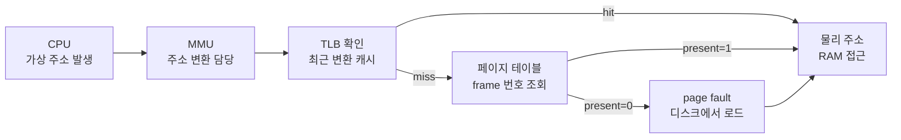

- **가상 메모리** → 각 프로세스가 "메모리를 통째로 혼자 쓰는 척" 하게 해주는 환상
- 실제 RAM은 작아도 → 프로세스는 거대한 연속 주소 공간을 가진 것처럼 동작
- 핵심 트릭 → 가상 주소를 실제 물리 주소로 **그때그때 변환**(주소 변환)
- 다 안 올리고 → 지금 쓸 부분만 RAM에 올림(demand paging) · 부족하면 디스크로 밀어냄(swap)

## 작은 책상으로 큰 작업하기 (비유)

- 책상(RAM) → 작아서 책 몇 권만 올려둘 수 있음
- 책장(디스크) → 크지만 멀고 느림 · 책 전부 보관
- 일하는 사람 → "책 전부 책상에 펼쳐둔 척" 하고 작업 진행
- 실제로는 → 지금 펼쳐볼 책만 책장에서 꺼내 책상에 올림(demand paging)
- 책상 꽉 차면 → 안 보던 책 한 권 책장에 도로 넣고(swap out) 새 책 꺼냄(swap in)

<KeyPoint title="이 비유에서 가져갈 것">
가상 주소 = "내 책 위치 번호"(논리적) · 물리 주소 = "책상 위 실제 자리"(물리적) ·
주소 변환 = 책 번호 보고 책상 어디 있나 찾기 · 책상에 없으면 책장에서 꺼냄(page fault)
</KeyPoint>

## 왜 가상 메모리가 필요한가

<Cards cols={3}>
<Card icon="🧱" title="격리">
프로세스마다 독립 주소 공간 → 남의 메모리 못 건드림(보안·안정)
</Card>
<Card icon="📏" title="큰 공간 환상">
RAM보다 큰 프로그램도 실행 → 안 쓰는 부분은 디스크에
</Card>
<Card icon="🧩" title="단편화 완화">
물리 메모리 흩어진 빈칸도 페이지 단위로 활용 → 연속 공간 필요 없음
</Card>
</Cards>

## 페이지 vs 프레임

- 가상 주소 공간을 일정 크기로 자른 조각 → **page**
- 물리 메모리(RAM)를 같은 크기로 자른 칸 → **frame**
- page 크기 = frame 크기 (보통 4KB) → 1 page가 1 frame에 딱 들어감

<Compare>
<CompareCol title="📄 Page" subtitle="가상 메모리 조각" color="sky">
- 프로세스 가상 주소 공간을 나눈 단위
- 번호로 식별 → page number
- 디스크/RAM 어디든 있을 수 있음
</CompareCol>
<CompareCol title="🧊 Frame" subtitle="물리 메모리 칸" color="green">
- 실제 RAM을 나눈 고정 칸
- 번호로 식별 → frame number
- 비어 있거나 어떤 page가 올라가 있음
</CompareCol>
</Compare>

## 가상 주소 → 물리 주소 변환 흐름

- CPU가 내는 주소는 전부 **가상 주소** · MMU가 물리 주소로 바꿔줌



- 가상 주소 = **page number + offset**(칸 안 위치)
- page number → page table 조회 → frame number 획득
- 물리 주소 = **frame number + offset** (offset은 그대로)

## 주소 변환 구성 요소

<Layers>
<Layer title="MMU" sub="Memory Management Unit" color="violet">
CPU 안의 하드웨어 · 가상 주소 → 물리 주소 변환을 매 접근마다 수행 · 소프트웨어 아님(빨라야 하니까)
</Layer>
<Layer title="TLB" sub="Translation Lookaside Buffer" color="pink">
최근 변환 결과 캐시 · "page→frame" 매핑 소수 보관 · hit이면 page table 안 거치고 즉시 변환 → 속도 핵심
</Layer>
<Layer title="Page Table" sub="page→frame 매핑표" color="sky">
프로세스마다 하나 · 각 page가 어느 frame에 있는지, RAM에 있는지(present bit) 기록 · 메인 메모리에 있음
</Layer>
<Layer title="Page Table Entry" sub="PTE 한 줄" color="amber">
frame number + present bit(RAM 유무) + dirty bit(수정됨) + 권한 bit(읽기/쓰기) 등
</Layer>
</Layers>

<Note type="note" title="TLB가 왜 중요한가">
- page table은 RAM에 있음 → 변환 한 번에 메모리 접근 한 번 추가(느림)
- TLB hit이면 → 그 추가 접근 생략 → 거의 공짜로 변환
- 실제 프로그램은 같은 page 반복 접근(지역성) → TLB hit률 매우 높음(보통 99%+)
</Note>

## 페이지 폴트 처리 단계

- 접근하려는 page가 RAM에 없을 때(present=0) 발생 → OS가 디스크에서 끌어올림

<Timeline>
<TimelineItem title="1. fault 발생">
MMU가 PTE의 present=0 확인 → CPU에 trap(page fault interrupt) 발생 → 커널 진입
</TimelineItem>
<TimelineItem title="2. 유효성 검사">
정말 그 프로세스의 정당한 주소인지 확인 → 아니면 segmentation fault(프로세스 종료)
</TimelineItem>
<TimelineItem title="3. 빈 frame 확보">
빈 frame 있으면 사용 · 없으면 페이지 교체 알고리즘으로 victim 선정 → swap out
</TimelineItem>
<TimelineItem title="4. 디스크에서 로드">
필요한 page를 디스크(swap 영역/파일)에서 frame으로 복사 → I/O 대기(느림)
</TimelineItem>
<TimelineItem title="5. 테이블 갱신 → 재실행">
PTE에 frame number 기록·present=1 설정 → 멈췄던 명령어 처음부터 재실행 → 이번엔 성공
</TimelineItem>
</Timeline>

<Note type="warning" title="page fault는 느리다">
- RAM 접근 ≈ 수십 ns · 디스크 접근 ≈ 수 ms → 약 10만 배 차이
- page fault 자주 나면 → 프로그램이 일보다 디스크 기다리기에 시간 다 씀(thrashing)
</Note>

## 디맨드 페이징 & 스와핑

- **demand paging** → 미리 다 안 올림 · 접근하는 순간(요청 시) 그 page만 올림
- 프로그램 시작 빠름 · 안 쓰는 page는 영영 안 올라옴 → 메모리 절약
- **swap** → RAM 부족 시 안 쓰는 page를 디스크로 밀어냄(out) · 다시 필요하면 가져옴(in)

```c
// 예: 64MB 배열을 잡아도 실제로 건드린 부분만 RAM 차지
char *buf = malloc(64 * 1024 * 1024);  // 가상 공간만 예약
buf[0] = 'a';        // 이 순간 첫 page만 page fault → RAM 로드
// 나머지 page는 건드릴 때까지 RAM 안 올라옴 (demand paging)
```

<Stats>
<Stat value="4KB" label="일반 page 크기" sub="x86 기준" />
<Stat value="~100ns" label="page fault 처리" sub="빈 frame 있을 때" />
<Stat value="~ms" label="swap-in I/O" sub="디스크 접근 시" />
</Stats>

## 페이지 교체 알고리즘

- RAM 꽉 찼는데 새 page 필요 → 누구를 내보낼지(victim) 고르는 규칙
- 목표 → 곧 다시 쓸 page는 남기고, 안 쓸 page를 내보내 page fault 최소화

<Cards cols={3}>
<Card icon="🚪" title="FIFO">
가장 먼저 들어온 page부터 내보냄 · 구현 쉬움 · 자주 쓰는 page도 오래됐단 이유로 쫓겨남(나쁜 선택)
</Card>
<Card icon="🕑" title="LRU">
가장 오래 안 쓴 page 내보냄(Least Recently Used) · "과거 안 썼으면 미래도 안 쓸 것" 가정 · 실제 성능 우수 · 구현 비용 ↑
</Card>
<Card icon="🔮" title="Optimal">
앞으로 가장 늦게 쓸 page 내보냄 · fault 최소(이론상 최적) · 미래를 알아야 해서 구현 불가 → 비교 기준용
</Card>
</Cards>

### 시뮬레이션: 참조열 1 2 3 1 2 4 (frame 3개)

- 같은 참조열로 세 알고리즘 비교 → hit(이미 있음) / miss(새로 로드)

| 참조 | FIFO 상태 | FIFO | LRU 상태 | LRU | Optimal 상태 | OPT |
|------|-----------|------|----------|-----|--------------|-----|
| 1 | [1] | miss | [1] | miss | [1] | miss |
| 2 | [1,2] | miss | [1,2] | miss | [1,2] | miss |
| 3 | [1,2,3] | miss | [1,2,3] | miss | [1,2,3] | miss |
| 1 | [1,2,3] | **hit** | [1,2,3] | **hit** | [1,2,3] | **hit** |
| 2 | [1,2,3] | **hit** | [1,2,3] | **hit** | [1,2,3] | **hit** |
| 4 | [4,2,3] (1 out) | miss | [4,2,3] (3 out) | miss | [1,2,4] (3 out) | miss |

- FIFO → 가장 먼저 온 1 내보냄 (1 다음에 또 쓰일지 안 봄)
- LRU → 가장 안 쓴 3 내보냄 (1·2는 최근 사용)
- Optimal → 앞으로 안 쓰일 3 내보냄 (미래 참조 보고 결정)

<Note type="danger" title="Belady's Anomaly (FIFO 함정)">
- 보통 frame 늘리면 → page fault 줄어듦(상식)
- FIFO는 → frame 늘렸는데 오히려 fault가 **늘어나는** 역설 발생 가능
- LRU·Optimal은 이 현상 없음(stack 알고리즘) → FIFO의 또 다른 약점
</Note>

## 정리

<KeyPoint title="한눈에">
- 가상 메모리 = 격리 + RAM보다 큰 공간 환상 → 핵심은 주소 변환
- 변환 경로 = CPU → MMU → (TLB hit이면 끝 / miss면 page table) → 없으면 page fault
- demand paging = 쓸 때만 로드 · swap = 부족하면 디스크로 밀어냄
- 교체 알고리즘 = Optimal(이상) > LRU(현실 최선) > FIFO(단순하나 약점 많음)
</KeyPoint>

- 메모리 영역(Code/Data/Heap/Stack) 기본기 → [memory](/cs/os/memory)
- 프로세스마다 page table 따로 가짐 → [process-thread](/cs/os/process-thread)
