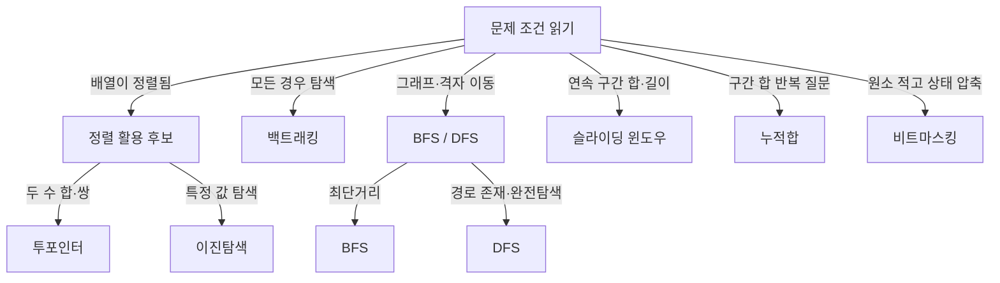

- 코딩테스트 문제 → 새로 푸는 게 아니라 **패턴 알아보고 끼워 맞추기**
- 핵심 → 문제 조건에서 **트리거 신호** 잡아내기 (정렬됨·연속 구간·완전탐색 등)
- 패턴마다 → 신호 → Python 템플릿 → 대표 문제 → 시간복잡도 세트로 암기

## 요리 레시피처럼 외우는 패턴

- 요리 → 재료(문제 조건) 보고 맞는 레시피(패턴) 고름
- 양파·간장 보이면 → 볶음 레시피 / 정렬된 배열·두 합 보이면 → 투포인터
- 매번 발명 안 함 → **레시피북에서 꺼내 쓰기**

<KeyPoint title="이 페이지에서 가져갈 것">
패턴은 외우는 게 아니라 신호로 떠올리는 것 ·
"정렬됨 + 쌍 찾기" → 투포인터 · "연속 구간 합/최대" → 슬라이딩 윈도우 ·
"정렬됨 + 탐색" → 이진탐색 · "모든 경우" → 백트래킹
</KeyPoint>

## 7대 빈출 패턴 한눈에

<Cards cols={2}>
<Card icon="📖" title="투포인터">
정렬된 배열 양 끝에서 책갈피처럼 좁혀오기 · 두 수 합·중복 제거 · O(n)
</Card>
<Card icon="🚌" title="슬라이딩 윈도우">
버스 창밖 풍경 한 구간씩 밀며 보기 · 연속 부분배열 합·최대 · O(n)
</Card>
<Card icon="📕" title="이진탐색 응용">
사전 펼쳐 절반씩 좁히기 · 정렬 배열 탐색·parametric search · O(log n)
</Card>
<Card icon="🌊" title="BFS / DFS">
미로 한 칸씩 퍼지기(BFS) vs 끝까지 파고들기(DFS) · 그래프·격자 · O(V+E)
</Card>
<Card icon="🌳" title="백트래킹">
갈림길 다 가보고 막히면 되돌아오기 · 순열·조합·N-Queens · 지수시간
</Card>
<Card icon="📊" title="누적합">
달려온 거리 미리 기록 → 구간 합 즉시 계산 · 구간 합 쿼리 · O(1) 조회
</Card>
<Card icon="🎚️" title="비트마스킹">
스위치 on/off로 부분집합 표현 · 상태 압축 DP·집합 연산 · O(2ⁿ)
</Card>
</Cards>

## 신호 → 패턴 매핑표

| 문제에서 보이는 신호 | 떠올릴 패턴 | 대표 유형 |
| --- | --- | --- |
| 정렬된 배열 + 두 수의 합·쌍 찾기 | 투포인터 | Two Sum II |
| 연속 부분배열 합·길이·최댓값 | 슬라이딩 윈도우 | 최소 길이 부분배열 |
| 정렬됨 + "찾기"·"최소 가능한 값" | 이진탐색 / 파라메트릭 서치 | 나무 자르기 |
| 격자·그래프 최단거리·연결요소 | BFS / DFS | 미로 탈출·섬 개수 |
| "모든 경우의 수"·순열·조합 | 백트래킹 | N-Queens·부분집합 |
| 구간 합을 여러 번 질문 | 누적합 / 프리픽스 합 | 구간 합 구하기 |
| 원소 ≤ 20·부분집합 상태 관리 | 비트마스킹 | 외판원 순회(TSP) |

## 패턴별 Python 템플릿

```python
# 1. 투포인터 — 정렬된 배열에서 합 = target 쌍 찾기
def two_pointer(nums, target):
    lo, hi = 0, len(nums) - 1
    while lo < hi:
        s = nums[lo] + nums[hi]
        if s == target:
            return (lo, hi)
        elif s < target:
            lo += 1   # 합 키우기
        else:
            hi -= 1   # 합 줄이기
    return None

# 2. 슬라이딩 윈도우 — 합 >= target 인 최소 길이 구간
def sliding_window(nums, target):
    lo = total = 0
    best = float("inf")
    for hi in range(len(nums)):
        total += nums[hi]            # 오른쪽 창 확장
        while total >= target:       # 조건 만족하면 왼쪽 수축
            best = min(best, hi - lo + 1)
            total -= nums[lo]
            lo += 1
    return best if best != float("inf") else 0
```

```python
# 3. 이진탐색 — 정렬 배열에서 target 위치
def binary_search(arr, target):
    lo, hi = 0, len(arr) - 1
    while lo <= hi:
        mid = (lo + hi) // 2
        if arr[mid] == target:
            return mid
        elif arr[mid] < target:
            lo = mid + 1
        else:
            hi = mid - 1
    return -1

# 4. BFS — 격자 최단거리 (한 칸씩 동심원으로 퍼짐)
from collections import deque
def bfs(grid, start):
    q = deque([start])
    visited = {start}
    dist = {start: 0}
    while q:
        r, c = q.popleft()
        for dr, dc in [(1,0),(-1,0),(0,1),(0,-1)]:
            nr, nc = r + dr, c + dc
            if (nr, nc) not in visited and grid[nr][nc] != 1:
                visited.add((nr, nc))
                dist[(nr, nc)] = dist[(r, c)] + 1
                q.append((nr, nc))
    return dist
```

```python
# 5. 백트래킹 — 부분집합·순열 (선택 → 재귀 → 되돌리기)
def backtrack(nums):
    result, path = [], []
    def dfs(start):
        result.append(path[:])           # 현재 상태 기록
        for i in range(start, len(nums)):
            path.append(nums[i])         # 선택
            dfs(i + 1)                    # 재귀
            path.pop()                    # 되돌리기(backtrack)
    dfs(0)
    return result

# 6. 누적합 — 구간 [l, r] 합을 O(1)로
def prefix_sum(nums):
    prefix = [0] * (len(nums) + 1)
    for i, v in enumerate(nums):
        prefix[i + 1] = prefix[i] + v
    return lambda l, r: prefix[r + 1] - prefix[l]   # [l, r] 합

# 7. 비트마스킹 — 모든 부분집합 순회
def subsets_bitmask(nums):
    n = len(nums)
    for mask in range(1 << n):            # 0 ~ 2ⁿ-1
        subset = [nums[i] for i in range(n) if mask & (1 << i)]
        yield subset
```

## 패턴 판별 흐름도



## 시간복잡도 정리표

| 패턴 | 시간복잡도 | 공간복잡도 | 비고 |
| --- | --- | --- | --- |
| 투포인터 | O(n) | O(1) | 정렬 비용 별도 O(n log n) |
| 슬라이딩 윈도우 | O(n) | O(1)~O(k) | 각 원소 한 번씩 확장·수축 |
| 이진탐색 | O(log n) | O(1) | 탐색 공간 매번 절반 |
| BFS / DFS | O(V+E) | O(V) | 정점·간선 한 번씩 방문 |
| 백트래킹 | O(분기^깊이) | O(깊이) | 가지치기로 실제 줄임 |
| 누적합 | 전처리 O(n)·조회 O(1) | O(n) | 구간 질문 많을수록 이득 |
| 비트마스킹 | O(2ⁿ·n) | O(2ⁿ) | n ≤ 20 권장 |

<Note type="note" title="실무·코테 팁">
- 투포인터·슬라이딩 윈도우 → 정렬 안 됐으면 정렬부터 (정렬 비용 잊지 말기)
- 이진탐색 → "최소·최대 가능한 값" 질문 → 파라메트릭 서치 의심 (백준 2805 나무 자르기)
- BFS는 가중치 1인 최단거리 전용 → 가중치 다르면 다익스트라
- 백트래킹 → 가지치기(early return) 없으면 시간초과 → 조건 미리 거르기
- 비트마스킹 → n > 20이면 메모리·시간 폭발 → 다른 접근 찾기
</Note>

<Note type="warning" title="흔한 실수">
- 투포인터에서 `lo < hi` vs `lo <= hi` 경계 헷갈림 → 자기 자신 쌍 허용 여부로 결정
- 슬라이딩 윈도우 → 음수 포함되면 단순 수축 불가 (조건 재검토)
- 이진탐색 `mid = (lo + hi) // 2` → 큰 수 오버플로 (Python은 안전, C/Java는 `lo + (hi-lo)//2`)
- DFS 재귀 깊이 → Python 기본 1000 한계 → `sys.setrecursionlimit` 또는 반복 DFS
</Note>
