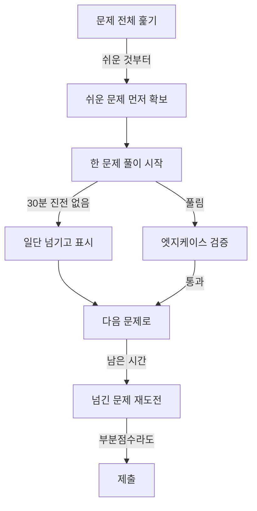

- 코딩테스트 준비 → 무작정 많이 풀기보다 **순서와 유형**이 중요
- 핵심 → 쉬운 패턴부터 → 유형별 대표 문제로 패턴 체화 → 실전 시간관리
- 이 페이지 → 난이도 로드맵·유형별 문제표·풀이 접근 순서·시험장 전략

## 헬스장 루틴처럼 단계 밟기

- 헬스 → 첫날 100kg 안 듦 → 빈 봉부터 → 무게 조금씩 ↑
- 코테도 똑같음 → Easy로 패턴 손에 익히고 → Medium에서 조합 → Hard는 마지막
- 건너뛰면 → 폼 무너짐(개념 구멍) → 부상(시험장 멘붕)

<KeyPoint title="이 페이지에서 가져갈 것">
문제 수가 아니라 순서가 실력 · Easy 50문제로 패턴 12종 체화 →
Medium에서 패턴 조합 연습 → Hard는 면접·고득점용 ·
한 문제 30분 막히면 풀이 보고 다시 푸는 게 더 빠름
</KeyPoint>

## 4단계 학습 로드맵

<Timeline>
<TimelineItem title="1단계 · 자료구조 손풀기 (2주)">
배열·문자열·해시·스택·큐 기본 문제 · LeetCode Easy 위주 · 문법과 입출력 익숙해지기
</TimelineItem>
<TimelineItem title="2단계 · 핵심 패턴 체화 (3주)">
투포인터·슬라이딩 윈도우·이진탐색·BFS/DFS · 패턴별 5~8문제씩 · 신호 보고 패턴 떠올리기 훈련
</TimelineItem>
<TimelineItem title="3단계 · 조합·심화 (4주)">
DP·백트래킹·그래프 심화·그리디 · LeetCode Medium·백준 골드 · 한 문제에 두 패턴 섞기
</TimelineItem>
<TimelineItem title="4단계 · 실전 모의 (지속)">
주 2~3회 가상 콘테스트·시간 재고 풀기 · 약한 유형 골라 복습 · 오답노트 누적
</TimelineItem>
</Timeline>

## 난이도별 추천 문제

| 단계 | 플랫폼·난이도 | 대표 문제 | 익히는 패턴 |
| --- | --- | --- | --- |
| 입문 | LeetCode Easy | Two Sum(1)·Valid Parentheses(20) | 해시·스택 |
| 입문 | 백준 실버 | 스택(10828)·괄호(9012) | 자료구조 기본 |
| 기본 | LeetCode Easy~Med | Best Time to Buy Stock(121)·Binary Search(704) | 슬라이딩·이진탐색 |
| 기본 | 백준 실버~골드5 | 토마토(7576)·DFS와 BFS(1260) | BFS/DFS |
| 중급 | LeetCode Medium | 3Sum(15)·Longest Substring(3)·Course Schedule(207) | 투포인터·윈도우·위상정렬 |
| 중급 | 백준 골드 | 나무 자르기(2805)·연구소(14502) | 파라메트릭·백트래킹+BFS |
| 심화 | LeetCode Medium~Hard | Coin Change(322)·Word Search(79)·LIS(300) | DP·백트래킹 |
| 심화 | 백준 골드~플래티넘 | 외판원 순회(2098)·평범한 배낭(12865) | 비트마스크 DP·배낭 DP |

## 유형별 대표 문제 묶음

<Cards cols={2}>
<Card icon="🔢" title="배열·해시">
Two Sum(LC 1)·Group Anagrams(LC 49)·Top K Frequent(LC 347) · 빈도·중복은 해시부터
</Card>
<Card icon="📖" title="투포인터·윈도우">
3Sum(LC 15)·Container With Most Water(LC 11)·Min Size Subarray(LC 209)
</Card>
<Card icon="🌊" title="그래프·BFS/DFS">
Number of Islands(LC 200)·Course Schedule(LC 207)·백준 미로탐색(2178)
</Card>
<Card icon="🧮" title="DP">
Climbing Stairs(LC 70)·Coin Change(LC 322)·백준 평범한 배낭(12865)
</Card>
<Card icon="🌳" title="백트래킹">
Subsets(LC 78)·Permutations(LC 46)·N-Queens(LC 51)·백준 N과 M(15649)
</Card>
<Card icon="📕" title="이진탐색">
Binary Search(LC 704)·Search Rotated(LC 33)·백준 나무 자르기(2805)
</Card>
</Cards>

## 한 문제 푸는 접근 순서

<Timeline>
<TimelineItem title="1. 문제 다시 쓰기 (2분)">
입력·출력·제약조건 손으로 정리 · "n ≤ 10^5" 같은 제약에서 목표 복잡도 역산
</TimelineItem>
<TimelineItem title="2. 예제 손으로 풀기 (3분)">
작은 입력 직접 따라가며 규칙 발견 · 엣지케이스(빈 입력·최댓값) 미리 메모
</TimelineItem>
<TimelineItem title="3. 패턴 매칭 (2분)">
신호 잡아 패턴 후보 추리기 · 정렬됨→투포인터 / 구간→윈도우 / 완전탐색→백트래킹
</TimelineItem>
<TimelineItem title="4. 의사코드 → 구현 (15분)">
주석으로 큰 흐름부터 · 함수 쪼개기 · 변수명 명확히
</TimelineItem>
<TimelineItem title="5. 검증 (5분)">
예제·엣지케이스 돌리기 · 시간복잡도 제약 안에 드는지 확인
</TimelineItem>
</Timeline>

```text
# 제약조건 → 목표 복잡도 역산 (1초 ≈ 1억 연산 기준)
n ≤ 10        → O(n!)·O(2ⁿ)   완전탐색·백트래킹 OK
n ≤ 20        → O(2ⁿ·n)        비트마스크
n ≤ 1,000     → O(n²)          이중 반복문
n ≤ 100,000   → O(n log n)     정렬·이진탐색·힙
n ≤ 10,000,000→ O(n)·O(log n)  투포인터·누적합·이진탐색
```

## 시험장 시간 관리 전략



<ProsCons>
<Pros title="시간 잘 쓰는 습관">
- 쉬운 문제부터 점수 확보 후 어려운 문제 도전
- 한 문제 30분 룰 — 막히면 표시하고 넘기기
- 부분점수 있으면 완벽 대신 통과 케이스부터
- 제출 전 항상 엣지케이스(빈 입력·최대값·음수) 점검
</Pros>
<Cons title="흔히 망하는 패턴">
- 첫 문제에 1시간 매달려 나머지 못 봄
- 제약조건 안 보고 O(n²)로 짜서 시간초과
- 검증 없이 제출 → 엣지케이스에서 실패
- 어려운 문제 자존심에 붙잡혀 쉬운 점수 놓침
</Cons>
</ProsCons>

<Stats>
<Stat value="30분" label="한 문제 한계" sub="넘으면 표시 후 패스"/>
<Stat value="1억" label="초당 연산" sub="복잡도 역산 기준"/>
<Stat value="50+" label="입문 권장량" sub="Easy로 패턴 체화"/>
</Stats>

<Note type="success" title="추천 학습 루틴">
- 매일 2~3문제 + 주말 모의 1회 · 양보다 꾸준함
- 푼 문제 → 오답노트에 "신호·패턴·실수" 한 줄 기록 → 복습 때 패턴만 보고 떠올리기
- 같은 문제 2~3일 뒤 다시 풀기 → 손에 붙을 때까지 (망각 곡선 대응)
- LeetCode는 유형 태그·기업별 빈출, 백준은 단계별 문제집 활용
</Note>

<Note type="warning" title="피해야 할 함정">
- 풀이 먼저 보고 "이해했다" 착각 → 반드시 안 보고 다시 구현
- Hard만 골라 풀기 → 기본 패턴 구멍 → Easy·Medium 충분히 먼저
- 한 플랫폼만 → LeetCode(영어·면접형)·백준(한글·다양한 난이도) 병행 권장
</Note>
