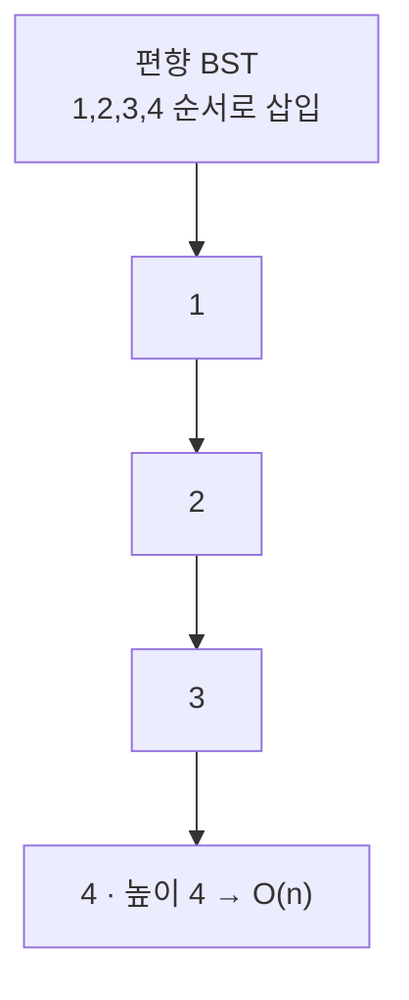
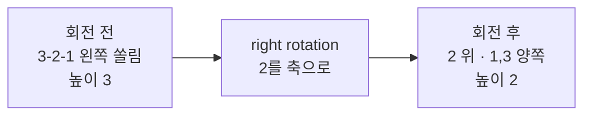

- **BST**(이진 탐색 트리) → 왼쪽 작고 오른쪽 큰 규칙 → 탐색 O(log n) **기대**
- 문제 → 정렬된 값을 순서대로 넣으면 → 한쪽으로만 길어짐 → 사실상 연결 리스트 → O(n)
- **balanced tree** → 넣고 뺄 때마다 **스스로 균형 회복** → 항상 O(log n) 보장
- 대표 두 종류 → **AVL**(엄격하게 균형) · **Red-Black**(느슨하게 균형, 대신 회전 적음)

## 한쪽으로 기운 책장 다시 세우기

- 책을 키 순서대로 한 줄에 계속 쌓으면 → 한쪽으로 길게 늘어진 책장 → 원하는 책 찾으려면 끝까지 훑음
- 균형 트리 → 책 하나 꽂을 때마다 → 너무 기울면 **가운데 책을 받침대 삼아 회전** → 양쪽 높이 비슷하게
- 항상 낮고 넓게 유지 → 어떤 책이든 몇 단계만 내려가면 도달
- AVL = 깐깐한 사서(조금만 기울어도 바로 세움) · Red-Black = 느긋한 사서(어느 정도 기울어도 봐줌)

<KeyPoint title="이 비유에서 가져갈 것">
편향된 BST = 한쪽으로 기운 책장(O(n)) ·
회전(rotation) = 가운데를 축으로 세워 다시 낮고 넓게(O(log n)) ·
AVL은 엄격해 탐색 빠름 · Red-Black은 느슨해 삽입·삭제 빠름
</KeyPoint>

## BST 편향 문제

- 같은 7개 값을 넣어도 **넣는 순서**에 따라 모양이 천지차이



- 정렬 입력 → 오른쪽 자식만 계속 생김 → 높이 = n → 탐색이 선형
- balanced tree → 같은 입력도 회전으로 펴서 → 높이 = log n 유지

## 회전 - 균형 회복의 핵심

- **rotation** → 부모·자식 관계를 살짝 돌려 → BST 규칙은 유지하면서 높이만 낮춤
- 왼쪽으로 길면 left rotation, 오른쪽으로 길면 right rotation (LL/RR/LR/RL 4가지 케이스)



```python
# right rotation — 왼쪽으로 쏠린 트리를 세움
def rotate_right(y):
    x = y.left          # 새 루트 후보 = 왼쪽 자식
    t = x.right         # 옮겨질 가운데 서브트리
    x.right = y         # y를 x의 오른쪽으로 끌어내림
    y.left = t          # 가운데는 y의 왼쪽으로 재배치
    update_height(y)    # 아래쪽부터 높이 갱신
    update_height(x)
    return x            # 새 루트 반환
```

- 회전은 **포인터 몇 개만** 바꿈 → 자체는 O(1)
- 삽입·삭제 경로(루트~잎)에서만 일어남 → 경로 길이 O(log n)

## AVL - 균형 인수로 엄격 관리

- **balance factor**(균형 인수) = 왼쪽 높이 − 오른쪽 높이 → 모든 노드에서 **-1, 0, 1**만 허용
- 삽입·삭제 후 -2 또는 2가 생기면 → 즉시 회전으로 복구

| balance factor | 상태 | 조치 |
|----------------|------|------|
| -1, 0, 1 | 균형 | 그대로 |
| 2 (왼쪽 무거움) | LL | right rotation |
| 2 (왼쪽-오른쪽) | LR | left → right |
| -2 (오른쪽 무거움) | RR | left rotation |
| -2 (오른쪽-왼쪽) | RL | right → left |

```python
def balance(node):
    bf = height(node.left) - height(node.right)
    if bf > 1:                                  # 왼쪽 무거움
        if height(node.left.left) < height(node.left.right):
            node.left = rotate_left(node.left)  # LR → 먼저 펴기
        return rotate_right(node)               # LL
    if bf < -1:                                 # 오른쪽 무거움
        if height(node.right.right) < height(node.right.left):
            node.right = rotate_right(node.right)  # RL
        return rotate_left(node)                # RR
    return node                                 # 이미 균형
```

## Red-Black - 색으로 느슨하게 관리

- 노드마다 **빨강/검정** 색칠 → 색 규칙만 지키면 "대충 균형" 보장
- 가장 긴 경로가 가장 짧은 경로의 **2배를 넘지 않음** → 높이 O(log n)

<Layers>
<Layer title="규칙 1 · 색" color="pink">
모든 노드는 빨강 또는 검정 · 루트는 항상 검정
</Layer>
<Layer title="규칙 2 · 빨강 연속 금지" color="amber">
빨강 노드의 자식은 둘 다 검정 → 빨강이 연달아 못 나옴
</Layer>
<Layer title="규칙 3 · 검정 높이 동일" color="stone">
어떤 노드에서 잎까지 가는 모든 경로의 **검정 노드 수가 같음**
</Layer>
<Layer title="복구 방법" color="sky">
삽입·삭제로 규칙 깨지면 → 색 바꾸기(recolor) + 회전으로 회복
</Layer>
</Layers>

## AVL vs Red-Black

<Compare>
<CompareCol title="🌳 AVL" subtitle="엄격한 균형" color="green">
- 균형 인수 -1~1 → 거의 완벽 균형
- 트리 높이 더 낮음 → **탐색 빠름**
- 삽입·삭제 시 회전 자주 → 쓰기 비용 ↑
- 읽기 많은 워크로드에 유리
</CompareCol>
<CompareCol title="🔴 Red-Black" subtitle="느슨한 균형" color="pink">
- 색 규칙 → 대략 균형(2배 이내)
- 높이 약간 더 높음 → 탐색 살짝 느림
- 회전 적음 → **삽입·삭제 빠름**
- 쓰기 잦은 워크로드·범용에 유리
</CompareCol>
</Compare>

<ProsCons>
<Pros title="균형 트리 장점">
- 최악에도 탐색·삽입·삭제 O(log n) 보장
- 정렬 순서 유지 → 범위 조회·정렬 순회 쉬움
- 편향 입력에도 성능 안정
</Pros>
<Cons title="단점·주의">
- 구현 복잡(회전·색 규칙) → 직접 구현은 까다로움
- 노드마다 추가 정보(높이·색) 저장 → 메모리 약간 ↑
- 단순 키-값에 순서 불필요하면 → 해시 테이블이 더 빠름(O(1) 평균)
</Cons>
</ProsCons>

## 어디에 쓰이나

<Cards cols={2}>
<Card icon="🗄️" title="DB 인덱스">
대부분의 RDB 인덱스는 B-Tree/B+Tree(균형 트리 일가) → 디스크 블록 단위 균형 → 범위 검색·정렬 조회 빠름
</Card>
<Card icon="📚" title="언어 표준 컨테이너">
C++ `std::map`/`std::set`, Java `TreeMap`/`TreeSet` → 내부가 Red-Black tree → 키 정렬 유지
</Card>
<Card icon="⏱️" title="스케줄러·타이머">
Linux CFS 스케줄러가 Red-Black tree로 실행 대상 관리 → 다음 실행할 작업 빠르게 선택
</Card>
<Card icon="🔢" title="순서 있는 키-값">
"X 이상 Y 이하" 범위 질의·정렬 순회 필요할 때 → 해시 대신 균형 트리 선택
</Card>
</Cards>

<Stats>
<Stat value="O(log n)" label="탐색/삽입/삭제" sub="최악에도 보장"/>
<Stat value="O(1)" label="회전 자체" sub="포인터 몇 개만"/>
<Stat value="O(n)" label="순서 순회" sub="중위 순회 = 정렬 출력"/>
</Stats>

<Note type="pink" title="고를 때 한 줄 기준">
- 순서 필요 없고 단순 조회만 → 해시 테이블(평균 O(1))
- 정렬·범위 조회 필요 + 읽기 위주 → AVL
- 정렬·범위 조회 필요 + 쓰기 잦음 → Red-Black (표준 라이브러리 기본)
- 디스크 기반 대용량 인덱스 → B-Tree/B+Tree
</Note>
