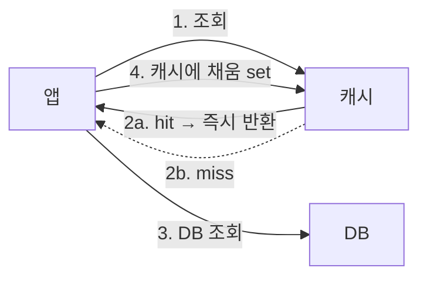
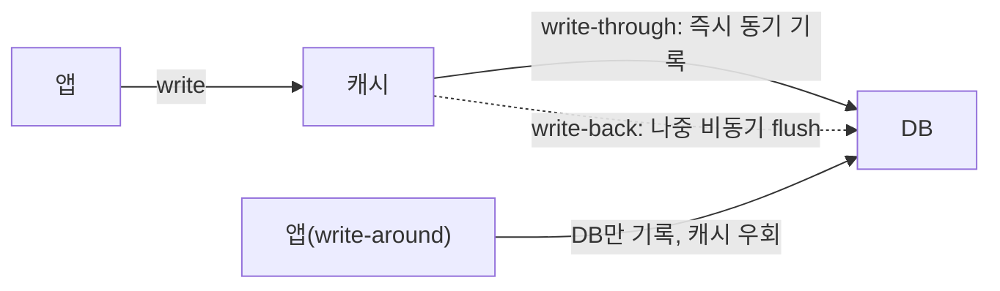

- **캐시** → 느린 원본(DB) 앞에 두는 빠른 임시 저장소 → 같은 데이터 반복 조회를 가속
- 읽기 패턴 → **cache-aside / read-through** · 쓰기 패턴 → **write-through / write-back / write-around**
- 진짜 어려운 건 캐시 자체가 아니라 → **원본과 캐시의 불일치를 어떻게 막느냐(무효화)**

## 자주 쓰는 물건은 책상 위에

- 매번 창고(DB)까지 가면 느림 → 자주 쓰는 물건은 **책상 위(캐시)**에 둠
- 책상에 있으면 즉시 사용(hit) · 없으면 창고 다녀옴(miss)
- 함정 → 창고 물건을 바꿨는데 **책상 위 옛날 것 그대로** → 불일치

<KeyPoint title="이 비유에서 가져갈 것">
책상 = 캐시(빠르지만 작음) · 창고 = DB(느리지만 원본) ·
hit는 즉시·miss는 창고행 · 핵심 난제는 '창고 바뀌면 책상 것도 갱신/폐기'(무효화)
</KeyPoint>

## 읽기 전략



<Compare>
<CompareCol title="🪑 Cache-Aside (Lazy)" subtitle="앱이 캐시를 직접 관리" color="sky">
- miss시 앱이 DB 조회 후 캐시에 적재
- 실제로 요청된 것만 캐싱(메모리 효율)
- 가장 흔함 · Redis 표준 패턴
- 첫 요청은 항상 miss(cold)
- 캐시·DB 불일치는 앱 책임
</CompareCol>
<CompareCol title="🔄 Read-Through" subtitle="캐시 계층이 DB 조회 대행" color="green">
- 앱은 캐시만 봄 · miss시 캐시가 알아서 DB 로드
- 로직이 캐시 계층에 캡슐화
- 라이브러리/프록시 지원 필요
- 동작은 cache-aside와 유사
- 구현·운영 의존성 ↑
</CompareCol>
</Compare>

## 쓰기 전략



| 전략 | 동작 | 장점 | 위험 |
|------|------|------|------|
| **Write-Through** | 캐시+DB 동시 기록(동기) | 항상 일치 | 쓰기 지연 ↑ |
| **Write-Back** | 캐시만 먼저, DB는 비동기 | 쓰기 매우 빠름 | 장애시 유실 위험 |
| **Write-Around** | DB만 기록, 캐시 우회 | 안 읽힐 데이터로 캐시 안 더럽힘 | 직후 읽기 miss |

```python
# Cache-Aside 읽기 + Write-Through 쓰기 (Redis)
def get_user(uid):
    cached = redis.get(f"user:{uid}")
    if cached:
        return json.loads(cached)          # hit
    user = db.query(uid)                   # miss → DB
    redis.set(f"user:{uid}", json.dumps(user), ex=300)  # 적재 + TTL
    return user

def update_user(uid, data):
    db.update(uid, data)                   # 원본 먼저
    redis.delete(f"user:{uid}")            # 캐시 무효화(쓰기 후 삭제 권장)
```

## 캐시 일관성·무효화

<Cards cols={3}>
<Card icon="🗑️" title="Write-Invalidate">
쓰기시 캐시 **삭제** → 다음 읽기에 새로 적재 · 가장 안전·흔함
</Card>
<Card icon="✍️" title="Write-Update">
쓰기시 캐시도 **갱신** → 직후 읽기 빠름 · 동시성·정합 관리 까다로움
</Card>
<Card icon="⏰" title="TTL 기반">
일정 시간 후 자동 만료 → 영구 불일치 방지 · 그 사이 stale 허용
</Card>
</Cards>

<Note type="note" title="갱신 vs 삭제 순서">
- 권장 → **DB 먼저 쓰고, 캐시는 갱신이 아니라 삭제(invalidate)**
- 이유 → 동시 쓰기에서 캐시 갱신은 순서 꼬여 옛값이 남을 수 있음 · 삭제는 다음 읽기에 최신 재적재
- 더 강하게는 → DB 트랜잭션 커밋 후 삭제 + 짧은 지연 후 한 번 더 삭제(double-delete)로 경합 보완
</Note>

## 수치 감각

<Stats>
<Stat value="~1ms" label="Redis 메모리 조회" sub="DB 대비 수십~수백 배 빠름" />
<Stat value="80/20" label="흔한 hit 분포" sub="요청 20%가 80% 데이터 차지" />
<Stat value=">95%" label="목표 hit rate" sub="이 밑이면 캐시 효용 의심" />
<Stat value="10만+ ops/s" label="단일 Redis 처리량" sub="단순 GET/SET 기준" />
</Stats>

## 트레이드오프

<ProsCons>
<Pros title="캐싱 도입 효과">
- DB 부하·지연 급감 · 처리량 ↑
- 비용 절감(DB 스케일업 지연)
- 읽기 폭주 흡수
</Pros>
<Cons title="대가·리스크">
- 캐시-DB 불일치 관리 복잡도
- stale read 가능성
- 캐시 장애시 DB로 트래픽 쏠림(stampede)
</Cons>
</ProsCons>

<Note type="warning" title="흔한 함정">
- **무효화 누락** → 영원히 옛값 서빙 · 모든 쓰기 경로에서 캐시 삭제 보장
- **write-back인데 영속화 전 장애** → 캐시만 있던 최신 쓰기 유실
- **TTL 없음** → 메모리 무한 증가 → eviction이 hot 키까지 날림
- 캐시 죽자 **모든 요청이 DB로** → stampede로 DB까지 다운(다음 장 eviction/stampede 참고)
</Note>

<Note type="pink" title="실무 결론">
- 범용 출발점 → **Cache-Aside + TTL + 쓰기 후 invalidate** (Redis)
- 강한 일관성 필요한 쓰기 → **Write-Through** (지연 감수)
- 쓰기 폭주·약한 일관성 허용 → **Write-Back** (유실 대비책 동반)
- 자주 안 읽힐 데이터 → **Write-Around**로 캐시 오염 방지
</Note>
