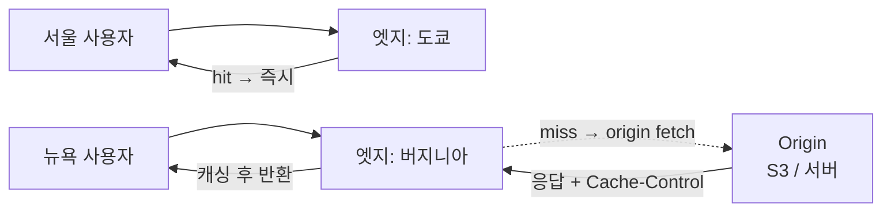

- **CDN** → 전 세계 엣지 서버에 콘텐츠 복제 → 사용자와 **물리적으로 가까운 곳**에서 응답
- 엣지에 있으면 즉시 응답(hit) · 없으면 **origin**에서 가져와 캐싱(miss)
- 캐시 동작의 핵심 → **Cache-Control 헤더**로 무엇을 얼마나 캐싱할지 + 바뀌면 **purge/무효화**

## 동네마다 분점

- 본사 창고(origin) 하나면 → 먼 동네 손님은 배송 오래 걸림
- 동네마다 **분점(edge)**을 두면 → 가까운 분점에서 즉시 수령
- 본사 상품이 바뀌면 → 분점 재고도 갈아줘야 함(무효화) · 안 그러면 옛 상품 판매

<KeyPoint title="이 비유에서 가져갈 것">
본사 = origin(원본) · 분점 = edge(엣지 캐시) · 손님은 가까운 분점에서 받음(저지연) ·
상품 바뀌면 분점 재고 교체(purge) 안 하면 옛것 서빙 → 헤더로 유통기한(TTL) 관리
</KeyPoint>

## edge ↔ origin 구조



## 정적 vs 동적 콘텐츠

<Compare>
<CompareCol title="🖼️ 정적 콘텐츠" subtitle="이미지·JS·CSS·동영상" color="green">
- 잘 안 바뀜 → 긴 TTL로 적극 캐싱
- 엣지 hit rate 매우 높음
- 버전 파일명(app.a1b2.js)으로 캐시 버스팅
- 대역폭·origin 부하 급감
- CDN의 본진
</CompareCol>
<CompareCol title="⚙️ 동적 콘텐츠" subtitle="API·개인화 응답" color="amber">
- 사용자·시점마다 다름 → 캐싱 까다로움
- 짧은 TTL·조건부 캐싱·미캐싱
- 엣지 컴퓨팅(Lambda@Edge)으로 일부 처리
- TLS 종료·압축·라우팅엔 여전히 이득
- 캐시 키 설계(쿼리·쿠키) 중요
</CompareCol>
</Compare>

## Cache-Control 헤더

```bash
# 정적 자산: 1년 캐싱 + 불변 (파일명에 해시 → 바뀌면 새 URL)
Cache-Control: public, max-age=31536000, immutable

# 동적이지만 잠깐 캐싱 + 만료 후 재검증 허용
Cache-Control: public, max-age=60, stale-while-revalidate=30

# 절대 캐싱 금지 (개인화·민감)
Cache-Control: private, no-store

# 조건부 재검증 (ETag)
$ curl -I https://cdn.example.com/app.js
ETag: "a1b2c3"
# 다음 요청 → If-None-Match: "a1b2c3" → 안 바뀌었으면 304 Not Modified (본문 미전송)
```

<Cards cols={3}>
<Card icon="⏱️" title="max-age">
캐시 유효 초 · 이 동안 origin 안 감
</Card>
<Card icon="🔒" title="public / private">
public=CDN 캐싱 OK · private=브라우저만(엣지 캐싱 금지)
</Card>
<Card icon="🔁" title="ETag / 304">
변경 여부만 확인 → 안 바뀌면 본문 없이 304 → 대역폭 절약
</Card>
</Cards>

## 무효화 / Purge

- 원본 바뀌었는데 TTL 안 끝남 → 엣지는 **옛 콘텐츠 계속 서빙**
- 강제 갱신 두 방법 → **purge(무효화)** vs **버전 URL(cache busting)**

<Compare>
<CompareCol title="🧹 Invalidation / Purge" subtitle="엣지 캐시 강제 삭제" color="pink">
- 경로 지정해 엣지 캐시 제거
- 전 엣지 전파에 수초~수분
- 잦으면 비용·전파 지연 부담
- 긴급 수정·잘못 배포 롤백에 유용
</CompareCol>
<CompareCol title="🏷️ Versioned URL" subtitle="파일명·쿼리에 버전" color="sky">
- app.v2.js / ?v=2 → 새 URL = 새 캐시
- purge 불필요 · 즉시 반영
- 옛 URL은 자연 만료
- 정적 자산 표준 전략
</CompareCol>
</Compare>

```bash
# CloudFront 무효화 (경로 지정)
aws cloudfront create-invalidation \
  --distribution-id E123ABC \
  --paths "/index.html" "/css/*"
# 와일드카드 가능 · 전 엣지 전파까지 보통 수분
```

## 수치 감각

<Stats>
<Stat value="수십 ms" label="엣지 hit 응답" sub="가까운 PoP에서 응답" />
<Stat value="100ms+" label="origin 직행(대륙 간)" sub="먼 원본까지 왕복" />
<Stat value=">90%" label="정적 자산 hit rate" sub="긴 TTL + 버전 URL" />
<Stat value="수초~수분" label="purge 전파" sub="전 세계 엣지 반영 지연" />
</Stats>

## 트레이드오프

<ProsCons>
<Pros title="CDN 도입 효과">
- 전 세계 저지연 · origin 부하·대역폭 급감
- 트래픽 폭주·DDoS 흡수 · 가용성 ↑
- TLS 종료·압축·HTTP/2·3 무료 제공
</Pros>
<Cons title="대가·주의">
- 무효화 전파 지연 → 옛 콘텐츠 잠시 서빙
- 캐시 키 잘못 설계시 개인화 데이터 누설 위험
- 동적·개인화 응답은 캐싱 이득 작음
</Cons>
</ProsCons>

<Note type="warning" title="흔한 함정">
- **개인화 응답을 public 캐싱** → 남의 데이터가 엣지에 캐싱되어 타인에게 노출 (private·no-store)
- **TTL 길게 + purge 안 함** → 배포해도 옛 JS·CSS 계속 서빙 (버전 URL로 해결)
- **쿼리스트링·쿠키를 캐시 키에 무분별 포함** → hit rate 급락 (불필요 키 제외 설정)
- **origin만 HTTPS 강제 누락** → 엣지~origin 평문 구간 노출
</Note>

<Note type="pink" title="실무 결론">
- 정적 자산 → **긴 max-age + immutable + 버전 파일명** (purge 불필요)
- 짧게 변하는 동적 → **짧은 max-age + stale-while-revalidate + ETag**
- 개인화·민감 → **private / no-store**로 엣지 캐싱 금지
- 긴급 수정만 purge → 평상시엔 버전 URL로 운영 비용·전파 지연 최소화
</Note>
