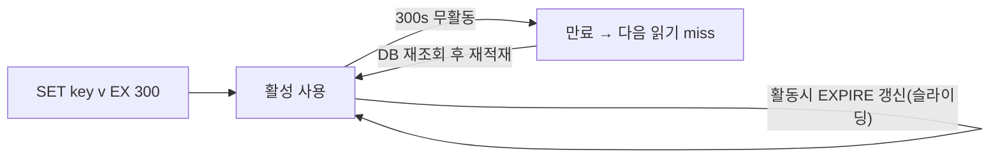

- 캐시 메모리는 유한 → 꽉 차면 **무엇을 버릴지(eviction)** 정해야 함 → LRU·LFU·FIFO
- **TTL** → 키마다 만료 시간 → 영구 불일치·메모리 무한 증가 방지
- 진짜 위험은 만료/장애 직후 → **stampede·thundering herd**로 DB가 한꺼번에 두들겨 맞음

## 책상 꽉 차면 안 쓰는 것부터 치운다

- 책상(캐시) 공간 한정 → 새 물건 올리려면 **뭔가 치워야** 함
- 가장 오래 안 쓴 것 치우기(LRU) · 가장 안 쓰인 것 치우기(LFU) · 먼저 올린 것부터(FIFO)
- 위험 상황 → 책상 위 인기 물건이 동시에 사라지자 **모두가 창고로 한꺼번에 달려감**(stampede)

<KeyPoint title="이 비유에서 가져갈 것">
공간 한계 = eviction 필요 · LRU(오래 안 쓴 것)·LFU(드물게 쓴 것)·FIFO(먼저 들어온 것) ·
hot 키가 한꺼번에 비면 DB로 동시 쇄도 → 미리 막아야(락·jitter·early refresh)
</KeyPoint>

## 축출 정책

<Compare>
<CompareCol title="🕐 LRU" subtitle="Least Recently Used" color="sky">
- 가장 **오래 안 쓴** 키 축출
- 최근 접근 = 곧 또 쓸 것이란 가정
- 시간 지역성 강한 워크로드에 적합
- 구현 흔함(Redis allkeys-lru)
- 일시 스캔에 hot 키 밀릴 수 있음
</CompareCol>
<CompareCol title="📊 LFU" subtitle="Least Frequently Used" color="green">
- 가장 **드물게 쓴** 키 축출
- 누적 인기 반영 · 진짜 hot 보존
- 안정적 인기 분포에 강함
- 빈도 카운트 관리 비용
- 오래된 인기 키가 눌러앉을 수 있음(에이징 필요)
</CompareCol>
<CompareCol title="📥 FIFO" subtitle="First In First Out" color="amber">
- **먼저 들어온** 키부터 축출
- 구현 가장 단순(큐)
- 접근 빈도 무시 → hit rate 낮음
- 캐시 용도엔 비추
- 큐·버퍼 성격엔 적합
</CompareCol>
</Compare>

```bash
# Redis maxmemory + 정책 설정
CONFIG SET maxmemory 2gb
CONFIG SET maxmemory-policy allkeys-lru   # 전체 키 대상 LRU
# 옵션: allkeys-lfu / volatile-ttl(TTL 가까운 것) / noeviction(쓰기 거부)
```

## TTL 설계



<Cards cols={3}>
<Card icon="⏳" title="고정 TTL">
적재 후 N초 뒤 만료 · 단순 · 만료 순간 동시 miss 위험
</Card>
<Card icon="🔁" title="슬라이딩 TTL">
접근할 때마다 만료 연장 · 세션류에 적합 · hot 키가 안 죽음
</Card>
<Card icon="🎲" title="TTL + jitter">
만료 시간에 무작위 분산 → 동시 만료 방지(stampede 완화)
</Card>
</Cards>

## Cache Stampede / Thundering Herd

- hot 키가 만료된 **그 순간** → 동시에 들어온 수많은 요청이 전부 miss → 전부 DB로 직행
- DB가 같은 쿼리를 동시에 N번 → 부하 폭증 · 최악엔 DB 다운 → 캐시 다시 못 채워 악순환

```python
# 방어 1: 분산 락 — 한 요청만 DB 조회, 나머지는 대기/재시도
def get_with_lock(key):
    val = redis.get(key)
    if val: return val
    if redis.set(f"lock:{key}", 1, nx=True, ex=5):   # 락 획득 1명만
        val = db.query(key)
        redis.set(key, val, ex=300)
        redis.delete(f"lock:{key}")
        return val
    time.sleep(0.05)                                  # 나머지는 잠깐 대기 후 재조회
    return get_with_lock(key)

# 방어 2: early recompute — 만료 전 미리 비동기 갱신
#   남은 TTL이 임계 밑이면 백그라운드로 미리 재계산 → 만료 공백 제거
```

<Note type="danger" title="Stampede의 3대 트리거">
- **동시 만료** → 같은 시각 적재된 키들이 한꺼번에 만료 (TTL jitter로 분산)
- **hot 키 만료** → 인기 키 하나 만료에 수천 요청 동시 miss (락·early refresh)
- **캐시 노드 장애** → 캐시 통째로 비어 전 요청 DB행 (replica·circuit breaker)
</Note>

## 방어 기법 정리

| 기법 | 효과 | 비고 |
|------|------|------|
| **TTL jitter** | 동시 만료 분산 | `ex = base ± random` |
| **분산 락 / single-flight** | 중복 DB 조회 1회로 | 나머지는 대기·기존값 |
| **Early recompute** | 만료 전 미리 갱신 | 만료 공백 자체 제거 |
| **Stale-while-revalidate** | 옛값 주며 백그라운드 갱신 | 가용성 우선 |
| **Negative caching** | "없음"도 짧게 캐싱 | 존재 안 하는 키 폭주 방지 |

## 수치 감각

<Stats>
<Stat value="N→1" label="single-flight 효과" sub="동시 N 요청을 DB 1쿼리로" />
<Stat value="±10%" label="권장 TTL jitter" sub="만료 시점 무작위 분산" />
<Stat value="O(1)" label="Redis LRU 근사" sub="샘플링 기반, 완전 LRU 아님" />
<Stat value="~1초" label="stampede 폭발 시간" sub="hot 키 만료 직후 동시 쇄도" />
</Stats>

<Note type="warning" title="흔한 함정">
- **TTL 미설정 + LRU** → 메모리 차면 hot 키까지 축출 · 반드시 TTL과 정책 함께 설계
- **Redis LRU는 근사치** → 샘플 몇 개 비교라 완벽 LRU 아님(보통 충분하나 인지 필요)
- **negative caching 없음** → 존재하지 않는 ID 반복 조회가 전부 DB로 (캐시 관통)
- **noeviction 정책** → 메모리 꽉 차면 쓰기 에러 → 의도치 않은 장애
</Note>

<Note type="pink" title="실무 결론">
- 일반 워크로드 → **allkeys-lru + TTL + jitter** 조합이 무난
- 인기 분포 뚜렷 → **LFU**로 진짜 hot 보존
- hot 키·고비용 쿼리 → **single-flight 락 + early recompute** 필수
- 캐시 관통·동시 만료까지 → negative caching·stale-while-revalidate로 보강
</Note>
