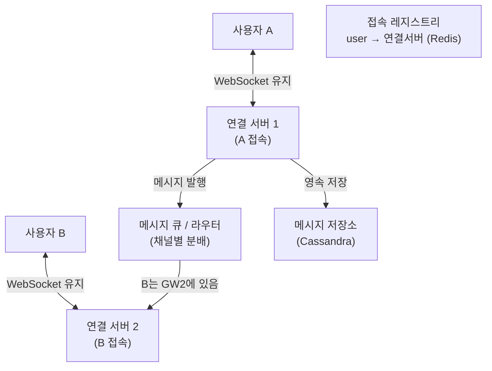

- 사용자끼리 **실시간으로 메시지를 주고받는** 시스템 (슬랙·카톡·디스코드)
- 핵심 = 상시 연결(WebSocket) · 빠른 전달 · 순서/중복 보장 · 오프라인 보관
- 설계 인터뷰 흐름 → 요구사항 → 용량 산정 → 연결 구조 → 전달/순서 → 상태 → 확장

## 실시간 전화 연결로 이해하기

- 일반 HTTP = 편지(요청→응답 후 끊김) · 채팅 = **전화 연결 유지**(양쪽 계속 열림)
- 상대가 말하면 즉시 들림 → 서버가 먼저 밀어 줄 수 있어야 함(push)
- 통화 중 끊기면 → 재연결 + 못 받은 말 다시 받기(오프라인 큐)

## 1. 요구사항 정리

<Cards cols={2}>
<Card icon="✅" title="기능 요구사항">
1:1·그룹 채팅 · 실시간 전달 · 메시지 영속 저장 · 온라인 상태 · 읽음/전달 확인 · 푸시 알림
</Card>
<Card icon="⚙️" title="비기능 요구사항">
낮은 지연(`<100ms`) · 메시지 순서 보장 · 정확히 한 번 표시(중복 제거) · 높은 가용성
</Card>
</Cards>

## 2. 용량 산정 (Capacity)

- 가정 → DAU 50M · 동시 접속 10M · 1인당 40 메시지/일

<Stats>
<Stat value="10M" label="동시 연결" sub="WebSocket 상시 유지" />
<Stat value="2B msg/일" label="메시지량" sub="50M × 40" />
<Stat value="~23K msg/s" label="평균 쓰기" sub="피크 수배 고려" />
<Stat value="~50K conn/노드" label="연결 서버" sub="10M → 200대급" />
</Stats>

- 연결 유지 비용 → 메모리/FD가 관건 · 한 노드 수만~수십만 연결
- 저장 → 메시지는 append-only · 시간순 조회 패턴 → 와이드 컬럼(Cassandra) 적합

## 3. 연결 구조 (WebSocket)



- 각 사용자는 가까운 **연결 서버(stateful)** 에 WebSocket 유지
- 누가 어느 서버에 붙었는지 → Redis 레지스트리(`user_id → server`)에 기록
- A→B 전송 → A의 서버가 큐에 발행 → B가 붙은 서버로 라우팅 → push

## 4. 메시지 전달 흐름

<Timeline>
<TimelineItem title="1. A가 전송">
A의 연결 서버 수신 → message_id 부여 → 저장소에 영속화
</TimelineItem>
<TimelineItem title="2. 라우팅">
레지스트리에서 B 위치 조회 → B의 연결 서버로 큐 통해 전달
</TimelineItem>
<TimelineItem title="3-a. B 온라인">
B 서버가 WebSocket으로 즉시 push → B의 ack 수신
</TimelineItem>
<TimelineItem title="3-b. B 오프라인">
오프라인 큐/미수신 테이블 저장 → 푸시 알림(APNs/FCM) → 재접속 시 동기화
</TimelineItem>
</Timeline>

## 5. 순서 · 중복 · 안정성

<Note type="warning" title="순서·중복 함정">
- 네트워크 재시도 → 같은 메시지 2번 도착 가능 → **client_msg_id(멱등키)** 로 중복 제거
- 분산 환경에서 전역 순서 어려움 → **채팅방 단위** 순서만 보장(방별 시퀀스/타임스탬프)
- 재연결 시 → last_seen_id 기준 그 이후만 동기화(gap fill)
</Note>

<Cards cols={3}>
<Card icon="🔢" title="방별 시퀀스">
방 단위 단조 증가 seq → 클라이언트가 그 순서로 정렬
</Card>
<Card icon="🪪" title="멱등키">
client_msg_id로 중복 수신 무시 → 정확히 한 번 표시
</Card>
<Card icon="✅" title="ack/재전송">
수신 ack 없으면 재전송 → at-least-once + 멱등으로 보정
</Card>
</Cards>

## 6. 온라인 상태 (Presence)

- heartbeat → 클라이언트가 주기적 ping · 끊기면 일정 시간 후 offline 전환
- Redis에 `user → last_active` TTL 저장 · TTL 만료 = offline 판정
- presence fan-out 주의 → 친구 많으면 상태 변경 브로드캐스트 비용 ⬆️ → 구독자에게만 통지

```python
# presence: heartbeat 갱신 + TTL 만료로 offline 판정
def on_heartbeat(redis, user_id):
    redis.set(f"presence:{user_id}", "online", ex=30)  # 30s TTL

def is_online(redis, user_id) -> bool:
    return redis.exists(f"presence:{user_id}") == 1
```

## 7. 저장 · 확장 · 트레이드오프

<ProsCons>
<Pros title="확장 포인트">
- 연결 서버 무상태화(레지스트리는 Redis) → 수평 확장·재연결 자유
- 메시지 큐로 서버 간 분리 → 연결 서버 N대 자유 증설
- 저장소 = 방 id 파티션 키 + 시간 클러스터링 → 최근 메시지 조회 빠름
</Pros>
<Cons title="주의 함정">
- 연결 서버 다운 → 해당 연결 전부 끊김 → 클라이언트 자동 재연결 필수
- 그룹 대형 방 → fan-out 폭발 → 활성 멤버에게만 push + 나머지 pull
- 정확한 전역 순서·강한 일관성은 비용 큼 → 방 단위로 한정
</Cons>
</ProsCons>

| 관심사 | 선택 | 이유 |
|------|------|------|
| 연결 | WebSocket | 서버 push·양방향·낮은 지연 |
| 라우팅 | 레지스트리 + 큐 | 누가 어디 붙었는지 추적·분배 |
| 저장 | 와이드 컬럼(Cassandra) | append-heavy·시간순 조회 |
| 순서 | 방별 시퀀스 | 전역 순서 비용 회피 |
| 상태 | Redis TTL heartbeat | 가볍고 자동 만료 |

<Note type="pink" title="정리">
- 채팅 = 상시 WebSocket + 레지스트리로 라우팅 + 큐로 서버 분리
- 순서는 방 단위 · 중복은 멱등키 · 전달은 ack/재전송으로 보정
- 오프라인 → 미수신 큐 + 푸시 알림 + 재접속 동기화(last_seen_id)
</Note>
