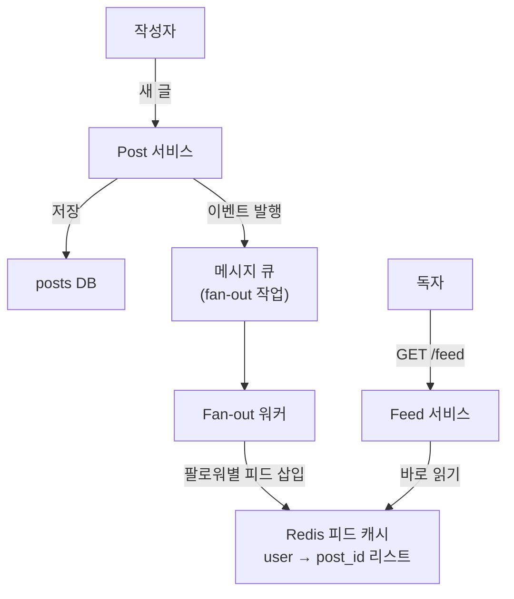

- 팔로우한 사람들의 최신 글을 **시간순/랭킹순으로 모아** 보여 주는 시스템 (인스타·트위터 타임라인)
- 핵심 트레이드오프 → 글 쓸 때 미리 뿌릴까(write) vs 볼 때 모을까(read)
- 설계 인터뷰 흐름 → 요구사항 → 용량 산정 → 모델 → fan-out 전략 → 핫키 → 확장

## 친구 글 모아 보여주기

- 내가 팔로우한 친구들이 올린 글 → 내 화면 한 줄로 정렬해서 보여줌
- 친구가 새 글 올리면 → 내 피드에 곧 떠야 함
- 친구 100명이 동시에 글 → 그걸 내가 볼 때마다 다 긁어 오면 느림 → 미리 만들어 둘지 고민

## 1. 요구사항 정리

<Cards cols={2}>
<Card icon="✅" title="기능 요구사항">
글 작성 · 팔로우/언팔로우 · 홈 피드 조회(최신순) · 무한 스크롤(페이지네이션)
</Card>
<Card icon="⚙️" title="비기능 요구사항">
피드 조회 지연 낮음(`<200ms`) · 높은 가용성 · 약간의 지연 허용(near-real-time)
</Card>
</Cards>

## 2. 용량 산정 (Capacity)

- 가정 → DAU 100M · 1인당 글 0.2개/일 · 피드 조회 5회/일 · 평균 팔로워 200명

<Stats>
<Stat value="20M post/일" label="작성량" sub="100M × 0.2" />
<Stat value="~230 post/s" label="쓰기 QPS" sub="20M / 86400s" />
<Stat value="500M read/일" label="피드 조회" sub="100M × 5" />
<Stat value="~5,800 read/s" label="읽기 QPS" sub="피크 × 수배" />
</Stats>

- fan-out 비용 → 글 1개 × 팔로워 200 → 쓰기 시 평균 200곳 갱신 → 쓰기 증폭 큼
- 셀럽(팔로워 1천만) → 글 1개에 1천만 갱신 → write fan-out 폭발

## 3. 데이터 모델

| 테이블 | 핵심 컬럼 | 비고 |
|------|------|------|
| `posts` | post_id, user_id, content, created_at | 원본 글 |
| `follows` | follower_id, followee_id | 관계(인덱스 양방향) |
| `feed_cache` | user_id, post_id[], updated_at | 미리 만든 피드(Redis list) |

```text
POST /api/posts            { content }            → post_id
GET  /api/feed?cursor=...  → { posts[], next_cursor }
```

## 4. Fan-out 전략

<Compare>
<CompareCol title="Fan-out on Write" subtitle="push · 글 쓸 때 뿌림" color="sky">
- 글 작성 시 모든 팔로워 피드에 미리 삽입
- 읽기 매우 빠름(이미 만들어짐)
- 쓰기 증폭 큼 · 셀럽이면 폭발
- 비활성 유저에도 헛수고
</CompareCol>
<CompareCol title="Fan-out on Read" subtitle="pull · 볼 때 모음" color="amber">
- 조회 시 팔로이들 최신 글 실시간 병합
- 쓰기 가벼움 · 저장 적음
- 읽기 무거움(매번 N명 조회·정렬)
- 팔로우 많으면 조회 지연 ⬆️
</CompareCol>
</Compare>

## 5. Fan-out on Write 흐름



<Timeline>
<TimelineItem title="1. 글 작성">
posts DB 저장 + fan-out 이벤트를 큐에 발행
</TimelineItem>
<TimelineItem title="2. 워커 fan-out">
팔로워 목록 조회 → 각 피드 캐시(Redis list)에 post_id push
</TimelineItem>
<TimelineItem title="3. 독자 조회">
자기 피드 캐시에서 post_id 목록만 읽음(이미 정렬됨)
</TimelineItem>
<TimelineItem title="4. 본문 hydrate">
post_id로 글 본문/작성자 일괄 조회(multi-get) → 응답
</TimelineItem>
</Timeline>

## 6. 핫키(셀럽) 문제 · 하이브리드

<Note type="warning" title="셀럽 핫키 문제">
- 팔로워 1천만 셀럽이 글 1개 → write fan-out 1천만 갱신 → 큐·캐시 폭주
- 특정 핫 유저 피드 키에 읽기 집중 → Redis 노드 과부하(핫키)
</Note>

- 해법 = **하이브리드** → 일반 유저는 push(write), 셀럽은 pull(read)
- 조회 시 → 내 push 피드 + 내가 팔로우한 셀럽 글을 **실시간 병합** → 두 방식 장점 결합

<Cards cols={3}>
<Card icon="📤" title="일반 작성자">
fan-out on write · 팔로워 적어 증폭 작음
</Card>
<Card icon="⭐" title="셀럽 작성자">
fan-out 생략 · 조회 시 pull로 합침
</Card>
<Card icon="🔀" title="피드 조립">
push 피드 ⊕ 셀럽 최신글 → 시간/랭킹 정렬
</Card>
</Cards>

## 7. 확장 · 트레이드오프

<ProsCons>
<Pros title="확장 포인트">
- 피드 캐시 Redis 샤딩(user_id 기준) · 본문은 multi-get으로 N+1 회피
- fan-out은 비동기 큐 + 워커 풀로 흡수 · 백프레셔 적용
- 비활성 유저 lazy fan-out → 헛작업 절감
</Pros>
<Cons title="주의 함정">
- write 일관성 → 피드 캐시 갱신 지연 = near-real-time 수용
- 캐시 크기 → 피드는 최근 N개만 보관(나머지 pull로 백필)
- 랭킹 도입 시 → 단순 시간순보다 정렬 비용·복잡도 ⬆️
</Cons>
</ProsCons>

<Note type="pink" title="정리">
- 핵심 선택 → write(읽기 빠름·쓰기 폭발) vs read(쓰기 가벼움·읽기 무거움)
- 실무 정답 → 하이브리드(일반 push + 셀럽 pull)로 핫키 회피
- 피드 = post_id 리스트만 캐시 · 본문은 multi-get으로 hydrate
</Note>
