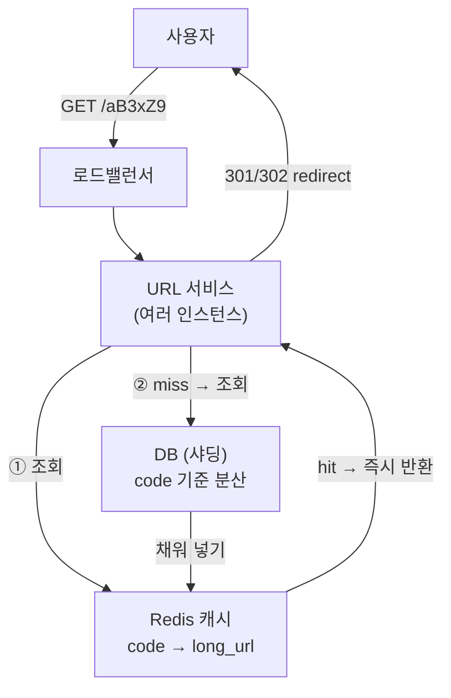

- 긴 URL을 **짧은 별명**으로 바꿔 주고 그 별명으로 원본을 찾아 주는 서비스 (bit.ly·tinyurl)
- 핵심은 **읽기(리다이렉트)가 압도적으로 많은** read-heavy 시스템
- 설계 인터뷰 흐름 → 요구사항 → 용량 산정 → API/스키마 → 아키텍처 → 병목·확장

## 긴 주소에 짧은 별명 붙이기

- "https://example.com/a/very/long/path?x=1&y=2" → "sho.rt/aB3xZ9"
- 별명만 알면 원본으로 점프 · 별명은 짧고 안 겹쳐야 함
- 한 번 만들면 거의 안 바뀌고 계속 읽힘 → 캐시가 잘 먹는 구조

## 1. 요구사항 정리

<Cards cols={2}>
<Card icon="✅" title="기능 요구사항">
긴 URL → 짧은 코드 생성 · 짧은 코드 → 원본 리다이렉트 · 만료(TTL) · 커스텀 별칭(선택)
</Card>
<Card icon="⚙️" title="비기능 요구사항">
높은 가용성 · 낮은 리다이렉트 지연 · 코드 추측 어려움 · read:write ≈ 100:1
</Card>
</Cards>

## 2. 용량 산정 (Capacity)

- 가정 → 쓰기 100M/월 · read:write = 100:1 · 5년 보관

<Stats>
<Stat value="~40 write/s" label="쓰기 QPS" sub="100M / 30일 / 86400s" />
<Stat value="~4,000 read/s" label="읽기 QPS" sub="쓰기 × 100" />
<Stat value="6B rows" label="5년 총 URL" sub="100M × 60개월" />
<Stat value="~3 TB" label="저장량" sub="6B × ~500B/row" />
</Stats>

- 코드 길이 → base62(0-9·a-z·A-Z) 7자리 = 62⁷ ≈ 3.5조 → 수십 년 충분
- 읽기 4K QPS → 단일 DB로도 가능하나 **캐시로 대부분 흡수** 설계

## 3. API & 스키마

```text
POST /api/shorten      { long_url, custom_alias?, ttl? } → { short_url }
GET  /{short_code}     → 301/302 Redirect to long_url
```

| 컬럼 | 타입 | 설명 |
|------|------|------|
| `id` | BIGINT PK | 시퀀스(코드 생성 시드) |
| `short_code` | VARCHAR(7) UNIQUE | base62 인코딩 결과 |
| `long_url` | VARCHAR(2048) | 원본 URL |
| `created_at` | DATETIME | 생성 시각 |
| `expires_at` | DATETIME NULL | 만료(TTL) |

## 4. 코드 생성 전략

<Compare>
<CompareCol title="해시 + base62" subtitle="MD5/SHA 앞자리" color="amber">
- long_url 해시 → 앞 7자 base62
- 같은 URL → 같은 코드(중복 절약)
- 충돌 가능 → 재해시·salt 필요
</CompareCol>
<CompareCol title="ID → base62 인코딩" subtitle="시퀀스 변환" color="sky">
- 전역 유일 id(스노우플레이크) → base62
- 충돌 없음 · 짧고 단순
- 순차 추측 가능 → 셔플/오프셋로 완화
</CompareCol>
</Compare>

```python
# 정수 id -> base62 short code
ALPHABET = "0123456789abcdefghijklmnopqrstuvwxyzABCDEFGHIJKLMNOPQRSTUVWXYZ"

def encode(n: int) -> str:
    s = []
    while n:
        n, r = divmod(n, 62)
        s.append(ALPHABET[r])
    return "".join(reversed(s)) or "0"
```

## 5. 아키텍처



## 6. 리다이렉트 흐름

<Timeline>
<TimelineItem title="1. 요청 수신">
GET /{code} → 로드밸런서 → 서비스 인스턴스
</TimelineItem>
<TimelineItem title="2. 캐시 조회">
Redis에서 code 조회 · hit면 바로 long_url 반환(대부분 여기서 끝)
</TimelineItem>
<TimelineItem title="3. 캐시 miss → DB">
DB 조회 → 결과를 캐시에 채움(write-through/lazy)
</TimelineItem>
<TimelineItem title="4. 리다이렉트 응답">
301(영구·브라우저 캐시·트래픽 절감) vs 302(임시·클릭 집계 가능)
</TimelineItem>
</Timeline>

<Note type="note" title="301 vs 302 선택">
- 301 영구 → 브라우저가 캐시 → 다음부터 서버 안 거침(트래픽 ⬇️, 단 클릭 집계 어려움)
- 302 임시 → 매번 서버 경유 → 클릭 통계·A/B 가능(트래픽 ⬆️)
- 통계가 필요하면 302
</Note>

## 7. 병목 · 확장

<ProsCons>
<Pros title="확장 포인트">
- 읽기 → Redis 캐시로 대부분 흡수 · 읽기 복제본 추가
- 쓰기 → id 생성기(스노우플레이크/티켓 서버)로 충돌 없는 코드
- DB → short_code 해시 기반 샤딩 → 수평 분산
</Pros>
<Cons title="주의 함정">
- 해시 충돌 → UNIQUE 제약 + 재시도 필수
- 핫 URL → 특정 code 집중(핫키) · CDN/엣지 캐시로 분산
- 만료 처리 → TTL 배치 삭제 또는 조회 시 lazy expire
</Cons>
</ProsCons>

<Note type="pink" title="정리">
- read-heavy → 캐시가 1순위 설계 · 4K QPS 대부분 Redis가 흡수
- 코드 생성 → 충돌 없는 id→base62 권장 · 7자리면 수조 개
- 확장 → 샤딩 + 읽기 복제 + CDN · 핫키만 따로 신경
</Note>
