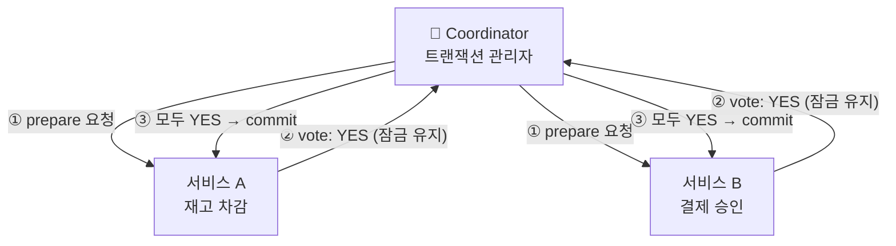

- 여러 서비스(DB)에 걸친 작업을 **하나의 트랜잭션처럼** 묶고 싶음
- 단일 DB의 ACID를 네트워크 너머로 확장 → 부분 실패·지연·노드 다운이 변수
- 두 가지 길 → **2PC**(강한 일관성·blocking) vs **Saga**(가용성·최종 일관성)

## 결혼 주례로 이해하기

- 주례 = 코디네이터 · 신랑/신부 = 참여 서비스
- 1단계 "이의 없습니까?" → 양쪽 다 "네"(prepare 응답)
- 2단계 "성혼 선언합니다" → 확정(commit)
- 한 명이라도 "이의 있음" → 전체 취소(abort) · **모두 동의해야만** 진행

<KeyPoint title="핵심 질문">
"여러 곳에 나눠 쓰는데 어떻게 다 같이 성공/실패시키나?" ·
2PC = **먼저 모두에게 물어보고 그다음 한 번에 확정**(강한 합의, 대신 기다림) ·
Saga = **각자 먼저 진행하고 틀어지면 되돌림**(빠르게, 대신 중간 노출)
</KeyPoint>

## 2PC 흐름 (Two-Phase Commit)

- Phase 1 (prepare) → 코디네이터가 모든 참여자에게 "준비됐나" 질의 · 참여자는 변경을 디스크에 기록하고 **락을 건 채** YES/NO 응답
- Phase 2 (commit/abort) → 전원 YES면 commit 명령 · 한 곳이라도 NO/무응답이면 abort
- 모든 참여자가 같은 결정에 도달 → 강한 일관성(atomicity 보장)

## 2PC가 멈추는 순간 (Blocking)

- 핵심 함정 → 참여자가 YES 투표 후 **코디네이터가 죽으면** 어떻게 할지 모름
- commit인지 abort인지 결정을 못 들음 → 락을 쥔 채 무한 대기

<Timeline>
<TimelineItem title="1. prepare 완료">
A·B 모두 YES 투표 · 자원에 락 걸고 결과 대기
</TimelineItem>
<TimelineItem title="2. 코디네이터 crash">
2단계 명령 보내기 직전 코디네이터 다운 · 참여자는 결정을 못 받음
</TimelineItem>
<TimelineItem title="3. 참여자 blocking">
commit/abort 불확실 → 함부로 못 풂 · 락 유지 → 해당 행 다른 트랜잭션도 멈춤
</TimelineItem>
<TimelineItem title="4. 연쇄 정체">
코디네이터 복구 전까지 가용성 하락 · 3PC도 네트워크 분단엔 완벽 해결 못 함
</TimelineItem>
</Timeline>

<Note type="danger" title="2PC의 구조적 약점">
- 동기 blocking → 한 노드 장애가 전체를 멈춤 · 가용성 ⬇️
- 락 보유 시간 김 → 처리량 ⬇️ · 마이크로서비스에서 기피
- 코디네이터 = 단일 장애점(SPOF) · 그래서 대규모 분산 환경은 Saga로
</Note>

## Saga — 보상 트랜잭션

- 큰 트랜잭션을 **로컬 트랜잭션 여러 개**로 쪼갬 · 각 단계는 자기 DB에서 즉시 commit
- 중간에 실패 → 앞서 성공한 단계들을 **역순으로 되돌리는** 보상(compensating) 트랜잭션 실행
- 여행 예약 비유 → 항공·호텔·렌터카 차례로 예약 → 렌터카 실패 시 호텔 취소 → 항공 취소

<Timeline>
<TimelineItem title="T1 주문 생성 → commit">
주문 서비스 로컬 커밋 · 이미 외부에 반영됨
</TimelineItem>
<TimelineItem title="T2 결제 → commit">
결제 서비스 로컬 커밋
</TimelineItem>
<TimelineItem title="T3 재고 차감 → 실패 ❌">
재고 부족 → 이후 진행 불가
</TimelineItem>
<TimelineItem title="C2 결제 환불 (보상)">
T2 되돌림 · 결제 취소
</TimelineItem>
<TimelineItem title="C1 주문 취소 (보상)">
T1 되돌림 · 주문 상태 cancelled
</TimelineItem>
</Timeline>

## Choreography vs Orchestration

- Saga 단계 조율 방식 → 이벤트로 알아서 vs 지휘자가 명령

<Compare>
<CompareCol title="Choreography" subtitle="이벤트 기반 분산" color="sky">
- 각 서비스가 이벤트 발행/구독 → 다음 단계 스스로 트리거
- 중앙 조정자 없음 · 느슨한 결합
- 단계 늘면 흐름 추적 어려움(순환 이벤트)
- 소수 단계·단순 흐름에 적합
</CompareCol>
<CompareCol title="Orchestration" subtitle="중앙 오케스트레이터" color="amber">
- 오케스트레이터가 단계 순서·보상 명령
- 흐름 가시성 ⬆️ · 디버깅·모니터링 쉬움
- 오케스트레이터에 로직 집중(준-SPOF)
- 단계 많고 복잡한 비즈니스에 적합
</CompareCol>
</Compare>

## 트레이드오프

<ProsCons>
<Pros title="Saga 강점">
- 락 없음 → 높은 가용성·처리량
- 서비스별 독립 배포·확장 잘 맞음
- 장기 실행 트랜잭션 가능(사람 승인 등)
</Pros>
<Cons title="Saga 비용">
- 격리성(isolation) 없음 → 중간 상태가 외부에 노출(dirty read)
- 보상 로직을 모든 단계마다 직접 작성
- 보상 자체 실패 대비 필요(재시도·수동 개입)
</Cons>
</ProsCons>

| 기준 | 2PC | Saga |
|------|-----|------|
| 일관성 | 강한 일관성(즉시) | 최종 일관성 |
| 격리성 | 보장 | 미보장(중간 노출) |
| 가용성 | 낮음(blocking) | 높음 |
| 락 | 길게 유지 | 로컬만 짧게 |
| 적합 | 소수 노드·금융 정합성 | 마이크로서비스·대규모 |

<Note type="pink" title="정리">
- 강한 정합성·소수 참여자·짧은 트랜잭션 → 2PC
- 가용성·독립 배포·장기 흐름 → Saga + 보상 설계
- 어느 쪽이든 **idempotency(멱등)** 와 **재시도** 는 필수 · 중복 메시지·재실행 대비
</Note>
