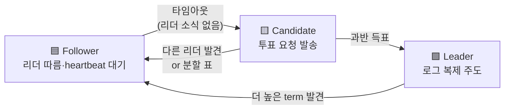
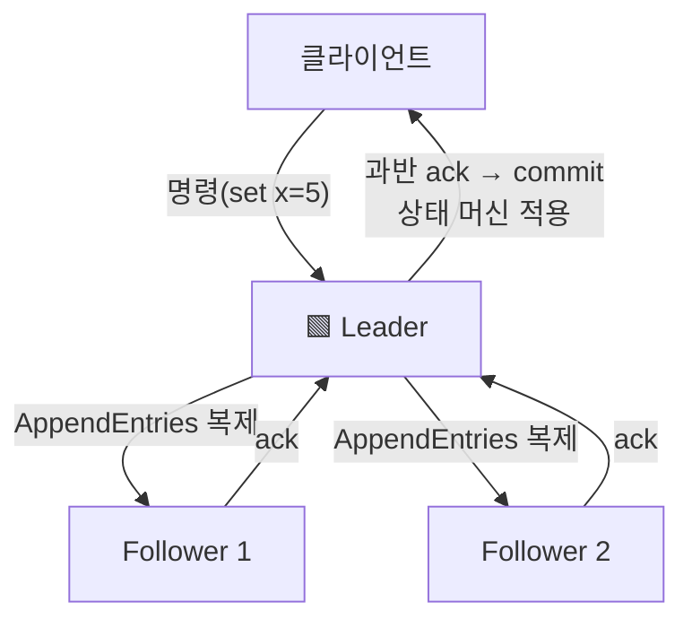

- 여러 노드가 **하나의 값/순서에 똑같이 동의**해야 함 (장애·지연이 있어도)
- 복제된 상태 머신 → 모든 노드가 같은 로그를 같은 순서로 적용 → 같은 결과
- 대표 알고리즘 → 이해하기 쉬운 **Raft** · 원조이자 난해한 **Paxos**

## 반장 투표로 이해하기

- 학급(노드들)이 반장(리더) 한 명을 뽑음 → 과반 득표자가 리더
- 리더가 결정 주도 → 나머지는 따라감(follower)
- 리더가 사라지면(결석) → 다시 투표(재선출)
- 동시에 두 명이 반장 주장 → 표 갈려 과반 못 채움 → 한 명만 살아남게 설계

<KeyPoint title="핵심 질문">
"노드 일부가 죽거나 메시지가 늦어도 모두 같은 결정에 도달하려면?" ·
답 = **리더 한 명 + 과반수 동의(quorum)** · 과반이 동의한 건 절대 뒤집히지 않음 ·
이게 split-brain(두 리더)을 막는 안전장치
</KeyPoint>

## Raft 상태와 역할

- Follower → 평소 상태 · 리더의 heartbeat를 기다림
- Candidate → heartbeat 타임아웃 시 전환 · term 올리고 자기 투표 후 표 요청
- Leader → 과반 득표로 당선 · 주기적 heartbeat로 권위 유지
- term(임기) → 단조 증가 번호 · 더 높은 term을 보면 즉시 follower로 강등

## 리더 선출 (Leader Election)

<Timeline>
<TimelineItem title="1. heartbeat 끊김">
follower가 election timeout(랜덤) 동안 리더 소식 없음
</TimelineItem>
<TimelineItem title="2. candidate 전환">
term += 1 · 자신에게 투표 · 다른 노드에 RequestVote 발송
</TimelineItem>
<TimelineItem title="3. 과반 득표 → 리더">
N/2 + 1 표 모으면 리더 확정 · 즉시 heartbeat 시작
</TimelineItem>
<TimelineItem title="4. 표 분할 시 재시도">
아무도 과반 못 채움 → 랜덤 타임아웃으로 다음 라운드 충돌 회피
</TimelineItem>
</Timeline>

- 랜덤 타임아웃이 핵심 → 동시에 candidate 되는 확률 낮춤 → 표 분할 빠르게 해소

## 로그 복제 (Log Replication)

- 클라이언트 명령은 **리더에게만** 들어감 → 리더 로그에 append
- 리더가 follower들에 AppendEntries로 복제 · **과반이 저장**하면 commit 확정
- commit된 엔트리만 상태 머신에 적용 → 모든 노드 동일 순서·동일 결과

<Note type="warning" title="과반수(Quorum)가 안전한 이유">
- 노드 5개 → quorum = 3 · 어떤 commit도 최소 3대가 가지고 있음
- 두 quorum은 반드시 **하나 이상 노드를 공유** → 모순된 두 결정 동시 불가
- 그래서 네트워크가 갈라져도(2 vs 3) **과반 쪽만** 진행 → split-brain 차단
</Note>

## Raft vs Paxos

<Compare>
<CompareCol title="Raft" subtitle="이해 가능성 우선" color="green">
- 리더 중심 · 단계 분리(선출·복제·안전성)
- 로그는 항상 리더→follower 단방향
- 구현·디버깅 쉬움 → etcd·Consul·TiKV
</CompareCol>
<CompareCol title="Paxos" subtitle="원조·이론적 토대" color="stone">
- proposer·acceptor·learner 역할 · 2-phase
- 단일 값 합의(Basic) → Multi-Paxos로 로그 확장
- 강력하지만 난해 · Chubby·Spanner 계열
</CompareCol>
</Compare>

## Split-Brain 방지

<Cards cols={2}>
<Card icon="🧠" title="split-brain이란">
네트워크 분단으로 양쪽이 각자 리더 주장 → 서로 다른 쓰기 수용 → 데이터 충돌
</Card>
<Card icon="🛡️" title="quorum으로 차단">
과반을 못 가진 쪽은 리더 못 됨·commit 못 함 → 소수파는 읽기/대기만
</Card>
<Card icon="🔢" title="term/epoch 비교">
더 높은 term 등장 시 옛 리더 자동 강등 → 낡은 리더의 쓰기 무효화
</Card>
<Card icon="📉" title="짝수 노드 주의">
4대는 quorum 3 → 2대 다운 견딤이 5대(2대 견딤)와 같음 · 보통 홀수 권장
</Card>
</Cards>

<Stats>
<Stat value="N/2 + 1" label="quorum" sub="commit 최소 동의 수" />
<Stat value="홀수" label="권장 노드 수" sub="3·5·7대" />
<Stat value="(N-1)/2" label="견딜 장애" sub="5대 → 2대 다운 OK" />
<Stat value="단조 증가" label="term" sub="낡은 리더 식별" />
</Stats>

<Note type="pink" title="정리">
- 합의 = 리더 1명 + quorum 동의 → 일관된 순서·결과 보장
- Raft 3단계 → 선출(heartbeat 타임아웃) · 복제(과반 ack) · 안전성(term)
- 새 시스템은 Raft 우선 · split-brain은 quorum + term으로 구조적 차단
</Note>
