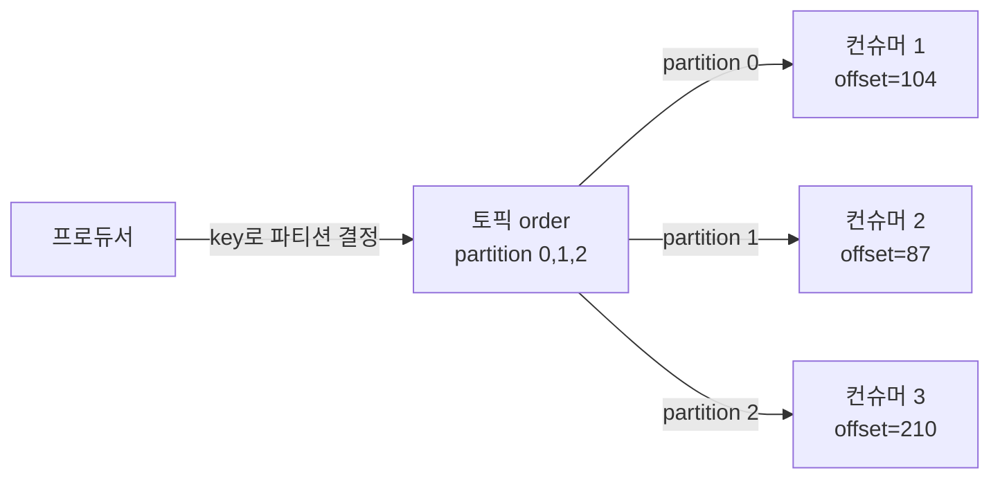
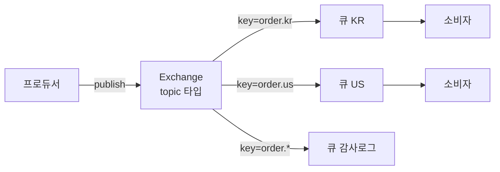

- **Kafka** → 분산 **커밋 로그** → 메시지를 순서대로 적재·보관 → 소비해도 안 사라짐
- **RabbitMQ** → 전통 **메시지 브로커** → 라우팅 후 전달, 소비되면 큐에서 제거
- 한 줄 차이 → 로그 다시 읽기(Kafka) vs 똑똑한 라우팅·전달(RabbitMQ)

## 방송 녹화 vs 우체국으로 이해하기

- **Kafka = 녹화되는 방송 채널** → 모든 방송이 **테이프에 순서대로 기록** → 시청자(소비자)는 원하는 지점부터 재생 → 다시 봐도 테이프 그대로 남음
- **RabbitMQ = 우체국 분류실** → 편지(메시지)에 적힌 주소 보고 **알맞은 사서함으로 분류** → 받는 사람이 꺼내면 사서함에서 사라짐 → 똑똑한 분배가 핵심
- 차이 → 카프카는 **보관·재생**에 강함 · 래빗은 **유연한 라우팅·즉시 전달**에 강함

<KeyPoint title="이 비유에서 가져갈 것">
Kafka = 지워지지 않는 **순서 로그** → 여러 소비자가 각자 위치(offset)로 재생 ·
RabbitMQ = **라우팅 엔진** → 조건대로 분배 후 소비 시 제거
</KeyPoint>

## 모델 차이

<Compare>
<CompareCol title="📼 Kafka" subtitle="로그 기반 (pull)" color="stone">
- 메시지 = **파티션 로그**에 append → 보존 기간 동안 유지
- 소비자가 **offset**으로 어디까지 읽었는지 추적
- 소비해도 삭제 안 됨 → **재처리·다중 소비** 자유
- 처리량(throughput) 극대화에 최적
</CompareCol>
<CompareCol title="📬 RabbitMQ" subtitle="브로커 기반 (push)" color="pink">
- 메시지 = **익스체인지** → 라우팅 → **큐**에 적재
- ack 받으면 큐에서 **제거**(보관 아님)
- 복잡한 라우팅(topic·header·fanout) 강력
- 작업 분배·낮은 지연·유연한 토폴로지에 최적
</CompareCol>
</Compare>

## Kafka — 파티션·오프셋·컨슈머그룹

<Layers>
<Layer title="파티션 (Partition)" sub="병렬 단위" color="sky">
토픽을 여러 조각으로 나눔 → 파티션 단위로 병렬 소비 → 처리량 = 파티션 수에 비례
</Layer>
<Layer title="오프셋 (Offset)" sub="읽은 위치" color="amber">
파티션 내 메시지 순번 → 소비자가 어디까지 읽었는지 기록 → 되감아 재처리 가능
</Layer>
<Layer title="컨슈머 그룹 (Consumer Group)" sub="분배 단위" color="green">
같은 그룹 = 파티션 나눠 소비(작업 분배) · 다른 그룹 = 같은 로그 독립 소비(fan-out)
</Layer>
</Layers>

- **순서 보장** → 같은 파티션 내에서만 → 순서 필요하면 동일 key로 같은 파티션 라우팅
- 파티션당 그룹 내 소비자 1명 → 소비자 수 > 파티션 수면 일부 **놀게 됨**

## RabbitMQ — 익스체인지·라우팅

| Exchange 타입 | 라우팅 방식 | 비유 |
| --- | --- | --- |
| direct | routing key 정확히 일치 | 정확한 사서함 번호 |
| topic | 패턴 매칭(`order.*`) | 지역별 구역 분류 |
| fanout | 무조건 전체 큐 | 전단지 전부 배포 |
| headers | 헤더 속성 매칭 | 라벨 보고 분류 |

- 프로듀서 → 익스체인지에 발행 · 익스체인지 → 바인딩 규칙대로 큐에 라우팅 → 소비 시 제거

## 언제 무엇을

<Cards cols={2}>
<Card icon="📼" title="Kafka가 맞을 때">
대용량 **이벤트 스트리밍** · 로그·메트릭·CDC · **재처리/다중 소비** 필요 · 순서+높은 처리량 · 이벤트 소싱 백본
</Card>
<Card icon="📬" title="RabbitMQ가 맞을 때">
**작업 큐**(task queue)·RPC · 복잡한 라우팅 토폴로지 · 낮은 지연 즉시 전달 · 메시지별 우선순위·TTL · 보관 불필요
</Card>
</Cards>

## 비교 요약

| 항목 | Kafka | RabbitMQ |
| --- | --- | --- |
| 모델 | 로그(append) | 브로커(라우팅·삭제) |
| 소비 후 | 보존(재읽기 가능) | 제거 |
| 전달 | pull(소비자가 당김) | push(브로커가 밀어줌) |
| 순서 | 파티션 내 보장 | 단일 큐 내 보장 |
| 처리량 | 매우 높음 | 높음(라우팅 부하) |
| 라우팅 | 단순(key→파티션) | 강력(exchange) |
| 재처리 | offset 되감기 | 어려움(이미 삭제) |
| 대표 용도 | 스트리밍·로그 | 작업 분배·RPC |

<Note type="warning" title="흔한 오해">
- "Kafka가 무조건 빠르다" → **낮은 지연**·복잡 라우팅·소량 작업 큐는 RabbitMQ가 더 적합할 때 많음
- "RabbitMQ로 이벤트 소싱" → 소비 시 삭제라 재생 어려움 → 보관·재처리 필요하면 Kafka
- 파티션 수는 처리량 상한 → **나중에 줄이기 어려움** → 초기 산정 신중
</Note>

<Note type="danger" title="공통 함정 — 중복·유실·순서">
- 둘 다 기본 **at-least-once** → 소비자 멱등 필수(중복 대비)
- Kafka 순서는 파티션 한정 → 토픽 전체 순서는 보장 안 됨
- RabbitMQ에서 ack 모드·publisher confirm 안 켜면 → 유실 위험 → 신뢰성 옵션 명시
</Note>
