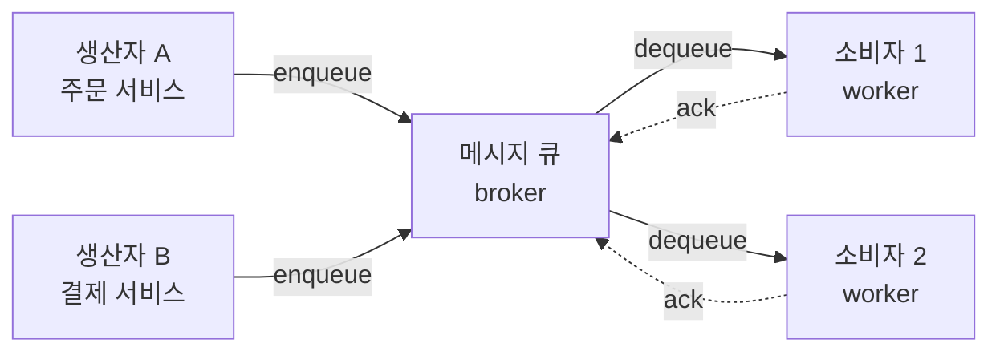
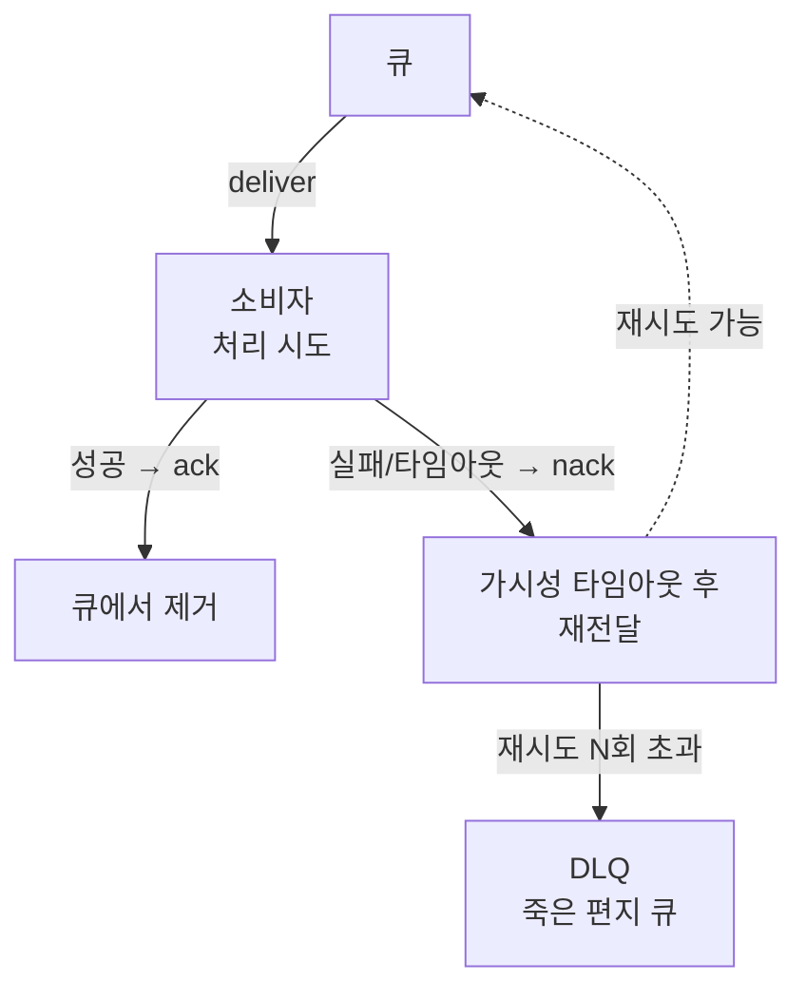

- **메시지 큐** → 생산자와 소비자 사이 **버퍼** → 둘이 직접 안 만나고 큐를 통해 전달
- 핵심 → 비동기 **디커플링** → 보내는 쪽은 큐에 넣고 끝, 받는 쪽은 여유 될 때 꺼냄
- 효과 → 부하 평탄화(buffering) · 장애 격리 · 독립 확장

## 주방 주문 전표로 이해하기

- **홀 직원 = 생산자** → 주문 들어오면 전표 써서 **꽂이에 꽂음** → 주방이 바쁜지 신경 안 씀
- **요리사 = 소비자** → 꽂힌 전표를 **순서대로** 뽑아 처리 → 자기 속도로 소화
- **전표 꽂이 = 큐** → 주문 몰려도 전표만 쌓일 뿐 홀 업무는 안 멈춤 → 피크 흡수
- 요리사 더 투입 → 같은 꽂이에서 나눠 처리 → 소비자 수평 확장

<KeyPoint title="이 비유에서 가져갈 것">
큐 = 생산자·소비자 사이 **완충 버퍼** → 속도 차이 흡수 · 직접 결합 제거 ·
보내고 잊기(fire-and-forget)로 **응답 지연 분리**
</KeyPoint>

## 동기 호출 vs 큐 경유

<Compare>
<CompareCol title="🔗 동기 직접 호출" subtitle="REST 등" color="pink">
- 생산자가 소비자 **응답 기다림** → 느린 쪽에 묶임
- 소비자 죽으면 **요청 실패** → 장애 전파
- 트래픽 스파이크 그대로 소비자에 전달
- 강한 결합 → 같이 배포·확장
</CompareCol>
<CompareCol title="📥 큐 경유 비동기" subtitle="MQ" color="sky">
- 큐에 넣고 **즉시 반환** → 응답 지연 분리
- 소비자 죽어도 메시지 **큐에 보존** → 복구 후 처리
- 스파이크는 큐가 흡수(buffer) → 소비자 평탄 처리
- 느슨한 결합 → 독립 배포·확장
</CompareCol>
</Compare>

## 기본 구조



- 생산자 → 메시지 **enqueue** · 소비자 → **dequeue** 후 처리
- 처리 끝나면 **ack**(확인) → 브로커가 큐에서 제거 · ack 없으면 재전달

## 큐 vs 토픽 — 전달 방식

<Compare>
<CompareCol title="📮 큐 (Queue)" subtitle="점대점 P2P" color="amber">
- 메시지 1개 → 소비자 **딱 한 명**이 가져감
- 여러 소비자 = **작업 분배**(competing consumers)
- 예: 이미지 리사이즈 작업 분산
</CompareCol>
<CompareCol title="📡 토픽 (Topic)" subtitle="발행구독 Pub/Sub" color="green">
- 메시지 1개 → 구독자 **전원**에게 복사 전달
- 여러 소비자 = **각자 사본** 받음(fan-out)
- 예: 주문 이벤트 → 알림·정산·물류 동시 통보
</CompareCol>
</Compare>

## 전달 보장(Delivery Semantics)

- 네트워크·장애 때문에 "정확히 한 번"은 어려움 → 보장 수준 선택

<Cards cols={3}>
<Card icon="🎯" title="At-most-once">
최대 한 번 · ack 안 기다림 → **유실 가능** · 빠름 · 로그·메트릭처럼 일부 손실 OK
</Card>
<Card icon="🔁" title="At-least-once">
최소 한 번 · ack 실패 시 **재전달** → **중복 가능** · 가장 흔함 · 소비자가 멱등 처리
</Card>
<Card icon="💎" title="Exactly-once">
정확히 한 번 · 중복 제거 + 트랜잭션 필요 → 비싸고 느림 · 결제 정산 등
</Card>
</Cards>

<Note type="warning" title="exactly-once의 함정">
- 진짜 exactly-once는 **종단 간 보장 어려움** → 보통 at-least-once + **소비자 멱등성**으로 사실상 한 번 효과
- 브로커가 "exactly-once 지원" 광고해도 → 그 경계는 보통 브로커 내부(produce~commit)일 뿐 → 외부 부수효과(메일 발송 등)는 별도
</Note>

## 메시지 ack & 재전달 흐름



- 소비자가 받은 뒤 잠깐 **invisible**(가시성 타임아웃) → 처리 중 중복 전달 방지
- 처리 실패 반복 → 무한 재시도 막으려 **DLQ**로 격리

## DLQ — Dead Letter Queue

- 계속 실패하는 **독성 메시지**(poison message)를 별도 큐로 빼냄 → 정상 처리 막힘 방지

<Layers>
<Layer title="격리" sub="Isolation" color="pink">
N회 재시도 초과 메시지 → DLQ로 이동 → 메인 큐 막힘(head-of-line blocking) 방지
</Layer>
<Layer title="분석" sub="Inspect" color="amber">
DLQ 메시지 들여다보고 **실패 원인** 파악 → 버그·잘못된 포맷·외부 장애
</Layer>
<Layer title="재처리" sub="Redrive" color="green">
원인 고친 뒤 DLQ → 메인 큐로 **재투입**(redrive) → 유실 없이 복구
</Layer>
</Layers>

## 실제 시스템 — SQS 소비자 의사코드

```python
import boto3, json

sqs = boto3.client("sqs")
QUEUE_URL = "https://sqs.../order-queue"

def poll_loop():
    while True:
        resp = sqs.receive_message(
            QueueUrl=QUEUE_URL,
            MaxNumberOfMessages=10,
            WaitTimeSeconds=20,        # long polling → 빈 폴링 비용 절감
            VisibilityTimeout=60,      # 처리 동안 다른 소비자에게 숨김
        )
        for msg in resp.get("Messages", []):
            try:
                handle(json.loads(msg["Body"]))      # 멱등 처리 권장
                sqs.delete_message(                  # 성공 → ack(삭제)
                    QueueUrl=QUEUE_URL,
                    ReceiptHandle=msg["ReceiptHandle"],
                )
            except Exception:
                pass  # delete 안 함 → 타임아웃 후 재전달 → N회 초과 시 DLQ
```

- `delete_message`가 ack 역할 → 호출 안 하면 자동 재전달
- DLQ는 큐의 **redrive policy**(maxReceiveCount)로 브로커가 자동 이동

## 트레이드오프 한눈에

| 항목 | 동기 호출 | 메시지 큐 |
| --- | --- | --- |
| 결합도 | 강함 | 느슨 |
| 응답 지연 | 소비자에 묶임 | 분리(즉시 반환) |
| 스파이크 대응 | 그대로 전달 | 큐가 버퍼 |
| 장애 격리 | 약함(전파) | 강함(보존) |
| 추가 복잡도 | 낮음 | 브로커 운영·중복 처리 |
| 즉시 결과 | 받음 | 못 받음(eventual) |

<Note type="danger" title="큐 도입 시 흔한 함정">
- **순서 보장** → 일반 큐는 순서 미보장 → 순서 필요하면 FIFO 큐 or 파티션 키
- **중복** → at-least-once 전제 → 소비자는 항상 멱등하게(같은 메시지 두 번 와도 안전)
- **백로그 폭증** → 소비자가 못 따라가면 큐 무한 적재 → 소비자 오토스케일 + 모니터링 필수
</Note>
