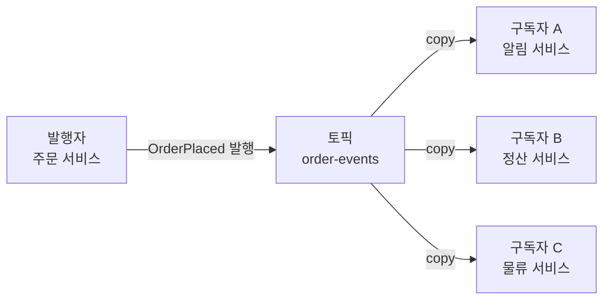
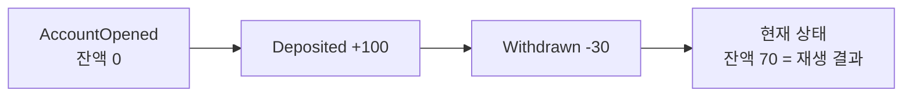

- **Pub/Sub** → 발행자(publisher)가 메시지 발행 → 관심 있는 구독자(subscriber) **전원**이 받음
- 핵심 → 발행자는 **누가 받는지 모름** → 토픽(채널)만 알면 됨 → 완전 분리
- 효과 → 새 구독자 추가해도 발행자 코드 **무수정** → 팬아웃·확장 자유

## 구독 신문 배달로 이해하기

- **신문사 = 발행자** → 신문 찍어서 배달망에 넘김 → 구독자가 몇 명인지 신경 안 씀
- **구독자 = 신문 받는 집** → 구독한 신문만 자기 집에 배달됨
- **배달망 = 토픽/브로커** → 신문사와 집을 **중개** → 신문사는 배달망에만 넘기면 끝
- 새 구독 신청 → 배달망이 알아서 추가 → 신문사는 모름 → 발행자·구독자 **느슨한 결합**

<KeyPoint title="이 비유에서 가져갈 것">
Pub/Sub = 발행자가 **수신자를 모른 채** 토픽에 발행 ·
브로커가 구독자 전원에 **팬아웃** · 구독자 추가/삭제가 발행자에 영향 없음
</KeyPoint>

## 큐(P2P) vs Pub/Sub

<Compare>
<CompareCol title="📮 큐 (Point-to-Point)" subtitle="작업 분배" color="amber">
- 메시지 1개 → 소비자 **한 명**이 가져감
- 목적 → **일** 나눠 처리(competing consumers)
- 예: 영상 인코딩 작업 분산
</CompareCol>
<CompareCol title="📡 Pub/Sub" subtitle="이벤트 통지" color="sky">
- 메시지 1개 → 구독자 **전원** 각자 사본
- 목적 → 한 사건을 **여러 곳에 알림**(fan-out)
- 예: 주문 완료 → 알림·정산·물류 동시 반응
</CompareCol>
</Compare>

## 팬아웃 구조

- 발행자는 **토픽 하나**에만 발행 → 브로커가 구독자 수만큼 복제 전달
- 구독자 D 추가 시 → 토픽 구독만 추가 → 발행자 변경 **없음**

## 이벤트 드리븐 아키텍처(EDA)

- 서비스 간 "직접 호출" 대신 **이벤트 발행/반응**으로 협업 → 시간·공간 분리

<Compare>
<CompareCol title="🤝 명령형(Orchestration)" subtitle="중앙 조율" color="pink">
- 한 서비스가 다른 서비스들을 **직접 호출**해 지휘
- 흐름 한눈에 보임 · 조율자가 모든 의존성 앎
- 조율자 = 병목·강결합 · 새 단계 추가 시 조율자 수정
</CompareCol>
<CompareCol title="🌊 이벤트형(Choreography)" subtitle="자율 반응" color="green">
- 각 서비스가 이벤트 **발행** → 관심 서비스가 **자율 반응**
- 느슨한 결합 · 새 반응 추가가 기존 코드 무영향
- 전체 흐름 추적 어려움 · 디버깅·관측 비용 증가
</CompareCol>
</Compare>

## 이벤트 흐름 예시

<Timeline>
<TimelineItem title="1. 주문 생성">
주문 서비스 → `OrderPlaced` 이벤트 발행 → 자기 일은 끝
</TimelineItem>
<TimelineItem title="2. 자율 반응">
재고 서비스 → 재고 차감 후 `StockReserved` 발행 · 결제 서비스 → 결제 후 `PaymentCompleted` 발행
</TimelineItem>
<TimelineItem title="3. 후속 연쇄">
배송 서비스 → `PaymentCompleted` 구독해 배송 시작 → 누구도 서로 직접 호출 안 함
</TimelineItem>
</Timeline>

## 이벤트 소싱 개요

- 상태(현재 값)가 아니라 **변경 사건 전체**를 순서대로 저장 → 현재 상태는 이벤트 재생(replay)으로 도출

<Cards cols={2}>
<Card icon="📜" title="장점">
완전한 **변경 이력** · 과거 임의 시점 복원(time travel) · 감사(audit)·디버깅에 강함
</Card>
<Card icon="⚠️" title="비용">
조회 시 재생 부담 → **스냅샷** 필요 · 이벤트 스키마 진화 어려움 · 학습 곡선 가파름
</Card>
</Cards>

<Note type="note" title="CQRS와 자주 함께">
- 이벤트 소싱은 **쓰기**(이벤트 적재)에 최적 → 읽기 빠르게 하려면 별도 **읽기 모델**(read model) 분리
- 쓰기/읽기 모델 분리 = **CQRS** → 이벤트 구독해 조회용 뷰 비동기 갱신
</Note>

## 트레이드오프

| 항목 | 직접 호출 | Pub/Sub · EDA |
| --- | --- | --- |
| 결합도 | 강함 | 느슨 |
| 새 수신자 추가 | 발행자 수정 | 구독만 추가 |
| 흐름 가시성 | 높음 | 낮음(분산 추적 필요) |
| 일관성 | 즉시 | eventual |
| 장애 격리 | 약함 | 강함 |
| 디버깅 | 쉬움 | 어려움(상관관계 ID 필요) |

<Note type="danger" title="이벤트 드리븐 함정">
- **이벤트 순서** → 구독자마다 도착 순서 다를 수 있음 → 순서 의존 로직은 버전·시퀀스로 방어
- **중복 수신** → at-least-once 전제 → 구독자 멱등 처리 필수
- **숨은 강결합** → 이벤트 스키마가 사실상 계약 → 함부로 바꾸면 구독자 깨짐 → **스키마 버저닝**
- **유실 vs 추적** → "누가 이 이벤트 안 받았나" 알기 어려움 → DLQ·관측(correlation id) 갖추기
</Note>
