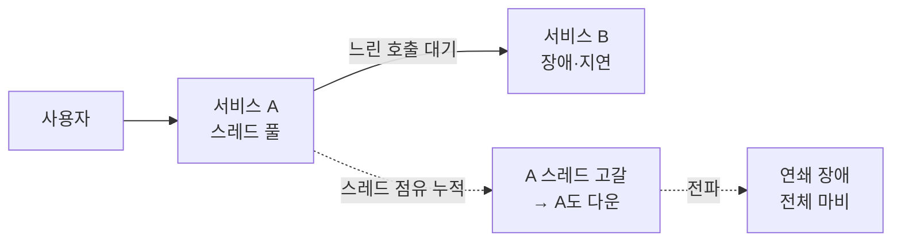
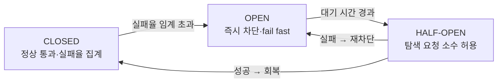

- **Circuit Breaker** → 장애난 의존 서비스 호출을 **즉시 차단** → 연쇄 장애 막음
- **Backpressure** → 처리 못 따라갈 때 **들어오는 부하를 거꾸로 밀어냄** → 과부하 자기보호
- 공통 목적 → 한 곳 장애가 **전체로 번지는 것**(cascading failure) 차단

## 두꺼비집 차단기로 이해하기

- **전기 차단기(두꺼비집)** → 과전류 흐르면 **스스로 내려가** 집 전체 화재 막음 → 문제 회로만 끊김
- 복구되면 → 사람이 다시 올리거나 자동 복귀 → 정상 흐름 재개
- 서비스로 옮기면 → 결제 API가 계속 실패·느려지면 → 그 호출을 **차단**해 우리 서버 스레드 고갈 방지
- 백프레셔 = **수도 밸브** → 하수도가 못 받으면 위에서 물 잠금 → 역류·범람 방지

<KeyPoint title="이 비유에서 가져갈 것">
서킷브레이커 = 망가진 의존성 호출을 **빠르게 실패**(fail-fast)시켜 자원 보호 ·
백프레셔 = 소화 못 할 부하를 **상류로 되밀어** 시스템 자체 붕괴 방지
</KeyPoint>

## 장애 전파 — 왜 차단해야 하나



- B가 느려짐 → A의 요청 스레드가 **응답 대기로 묶임** → A 스레드 풀 고갈 → A까지 다운
- 차단기 없으면 → 하나의 느린 의존성이 **전 시스템**을 끌어내림

## 3가지 상태 전이



<Layers>
<Layer title="CLOSED (정상)" sub="통과" color="green">
요청 정상 통과 · 실패율·지연 집계 → 임계 넘으면 OPEN으로 전환
</Layer>
<Layer title="OPEN (차단)" sub="fail-fast" color="pink">
호출 즉시 실패 반환(또는 fallback) → 의존성에 부하 안 줌 · 일정 시간 후 HALF-OPEN
</Layer>
<Layer title="HALF-OPEN (탐색)" sub="probe" color="amber">
소수 요청만 흘려보내 회복 확인 → 성공이면 CLOSED, 실패면 다시 OPEN
</Layer>
</Layers>

## Resilience4j 설정 예시

```python
# 의사코드 - 임계값 기반 서킷브레이커 동작
config = {
    "failure_rate_threshold": 50,      # 실패율 50% 넘으면 OPEN
    "slow_call_rate_threshold": 80,    # 느린 호출 80% 넘어도 OPEN
    "slow_call_duration": 2.0,         # 2초 넘으면 '느린 호출'로 집계
    "wait_in_open_state": 10.0,        # OPEN 유지 후 HALF-OPEN 전환
    "permitted_calls_in_half_open": 3, # HALF-OPEN 탐색 허용 수
    "sliding_window_size": 100,        # 최근 100건 기준 실패율 계산
}

def call_with_breaker(breaker, remote, fallback):
    if breaker.state == "OPEN":
        return fallback()              # 차단 중 → 즉시 대체 응답
    try:
        return breaker.run(remote)     # 성공/실패를 window에 기록
    except Exception:
        return fallback()              # 실패 → 집계 후 fallback
```

- 실패율은 절대 횟수보다 **윈도우 기반 비율**로 판단 → 트래픽 변동에 견고
- 차단 시 그냥 에러 말고 **fallback**(캐시·기본값·degrade) 제공이 핵심

## 함께 쓰는 패턴

<Cards cols={3}>
<Card icon="⏱️" title="Timeout">
모든 외부 호출에 **상한 시간** → 무한 대기로 스레드 묶이는 것 방지 → 서킷의 전제
</Card>
<Card icon="🧱" title="Bulkhead">
의존성별 **자원 풀 격리**(배의 격벽) → 한 의존성 폭주가 다른 호출 자원 안 잡아먹음
</Card>
<Card icon="🔁" title="Retry">
일시 장애만 제한 재시도 → 단 서킷 OPEN이면 재시도 안 함(증폭 방지)
</Card>
</Cards>

## Backpressure — 부하 되밀기

- 생산이 소비보다 빠를 때 → 무한 버퍼링 대신 **상류에 속도 늦추라 신호**

<Compare>
<CompareCol title="🚰 백프레셔 적용" subtitle="흐름 제어" color="sky">
- 버퍼 차면 상류에 **수신 거부·지연** 신호
- 큐 한도 + **load shedding**(초과 드롭)
- 메모리 안정 · OOM·붕괴 방지
</CompareCol>
<CompareCol title="💥 무제한 버퍼" subtitle="제어 없음" color="pink">
- 처리 못 해도 계속 쌓음 → 큐·메모리 폭증
- 지연 무한 증가 → 결국 OOM·전체 다운
- 장애가 조용히 누적되다 한 번에 터짐
</CompareCol>
</Compare>

<Note type="warning" title="백프레셔 수단">
- **bounded queue** → 큐 크기 상한 → 넘으면 거부(429)·드롭(load shedding)
- **요청 토큰/세마포어** → 동시 처리 수 제한 → 그 이상은 대기·거부
- 스트리밍은 **reactive backpressure**(소비자가 request(n)로 당기는 양 지정)
</Note>

## 트레이드오프

<ProsCons>
<Pros title="장점">
- 연쇄 장애 차단 → **부분 장애가 부분에 머묾**
- fail-fast → 사용자 무한 대기 대신 빠른 대체 응답
- 의존성 회복 시간 벌어줌(부하 제거)
</Pros>
<Cons title="단점·주의">
- 임계값 **튜닝 어려움** → 너무 민감하면 정상도 차단, 둔하면 못 막음
- fallback 설계 필요 → 단순 에러면 사용자 경험 나쁨
- 분산 환경선 인스턴스별 상태 → 전역 판단 어려움
</Cons>
</ProsCons>

<Note type="danger" title="실무 함정">
- **타임아웃 없는 서킷** → 무의미 → 느린 호출이 스레드 묶으면 실패 집계조차 안 됨 → 타임아웃 필수
- 서킷 OPEN인데 **재시도까지 겹치면** → 회복 탐색 방해 → OPEN 상태선 재시도 금지
- fallback이 또 다른 외부 호출이면 → 그것도 장애날 수 있음 → fallback은 **로컬·캐시·기본값** 우선
</Note>
