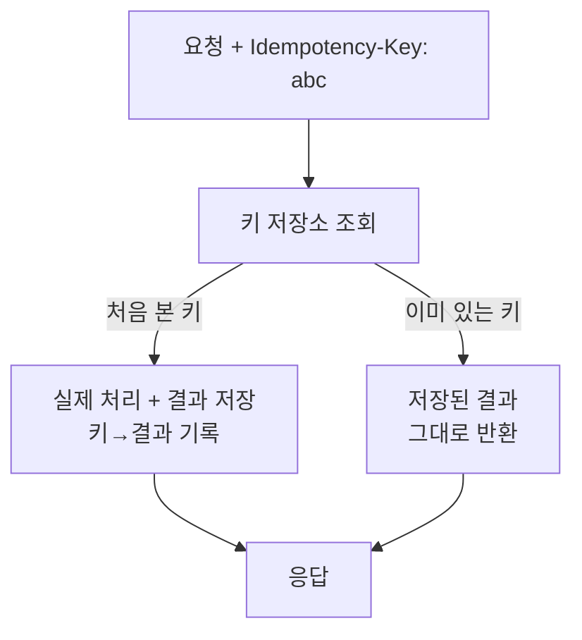

- **멱등성(Idempotency)** → 같은 요청을 **여러 번** 보내도 결과가 **한 번** 보낸 것과 같음
- 왜 필요 → 네트워크 불확실성 → 응답 못 받으면 재시도 → 중복 실행 위험
- 핵심 → 재시도는 **불가피** → 중복이 와도 안전하게 만들어야 함

## 엘리베이터 버튼으로 이해하기

- **엘리베이터 호출 버튼** → 여러 번 눌러도 **한 번 부른 것**과 동일 → 엘리베이터 여러 대 안 옴
- **멱등하지 않은 동작** → 자판기 동전 → 누를 때마다 음료 하나씩 → 두 번 누르면 두 개
- 결제로 옮기면 → "결제하기" 두 번 눌러서 **두 번 청구되면 안 됨** → 멱등 보장 필요
- 같은 요청 식별 → **멱등키** → 같은 키면 두 번째부터 "이미 처리됨" 반환

<KeyPoint title="이 비유에서 가져갈 것">
멱등 = 중복 요청이 와도 **상태가 한 번만** 바뀜 ·
재시도는 안전하게 만드는 게 목적 · 식별은 멱등키로
</KeyPoint>

## HTTP 메서드 멱등성

<Compare>
<CompareCol title="✅ 본래 멱등" subtitle="여러 번 = 한 번" color="green">
- `GET` → 조회, 상태 불변
- `PUT` → 전체 교체, 같은 값으로 덮어쓰기
- `DELETE` → 두 번 지워도 결국 없음(결과 동일)
</CompareCol>
<CompareCol title="⚠️ 비멱등" subtitle="반복 = 누적" color="pink">
- `POST` → 매번 새 리소스 생성 → 중복 위험
- 결제·주문 생성 → 반복 시 중복 청구
- 멱등키로 **명시적 방어** 필요
</CompareCol>
</Compare>

## 멱등키 방식



- 클라이언트가 요청마다 **고유 키** 생성(보통 UUID) → 재시도 시 **같은 키** 재사용
- 서버 → 키 처음 보면 처리·결과 저장 · 이미 있으면 **저장된 응답** 반환(재실행 안 함)

## 중복 결제 방지 의사코드

```python
def create_payment(idem_key: str, amount: int):
    # 1) 멱등키 선점 시도 (원자적 INSERT, 중복키면 실패)
    inserted = db.try_insert_idem(idem_key, status="in_progress")
    if not inserted:
        existing = db.get_idem(idem_key)
        if existing.status == "done":
            return existing.result          # 이미 완료 → 동일 응답 재사용
        raise Conflict("동일 키 처리 중")      # 동시 중복 → 409

    # 2) 실제 결제 (외부 PG 호출)
    result = pg.charge(amount)

    # 3) 결과 확정 저장
    db.update_idem(idem_key, status="done", result=result)
    return result
```

<Note type="warning" title="멱등키 설계 포인트">
- 키 **선점은 원자적**으로(unique index INSERT) → race condition으로 이중 처리 방지
- 키에 **TTL** 부여 → 무한 적재 방지 · 단 결제처럼 중요하면 충분히 길게
- 키 + **요청 본문 해시** 같이 검증 → 같은 키로 다른 금액 보내는 오용 차단
</Note>

## 재시도 전략

- 일시적 장애(timeout·503·네트워크)는 **재시도**로 회복 → 단 무지성 재시도는 폭주 유발

<Timeline>
<TimelineItem title="1. 재시도 가능 판별">
일시 오류(timeout·5xx·연결 끊김)만 재시도 · 4xx(잘못된 요청)는 재시도 무의미
</TimelineItem>
<TimelineItem title="2. 지수 백오프 (Exponential Backoff)">
대기 시간 점점 늘림 → 1s, 2s, 4s, 8s… → 장애난 서버에 몰아치지 않음
</TimelineItem>
<TimelineItem title="3. 지터 (Jitter)">
대기에 **무작위** 섞기 → 모든 클라이언트가 동시 재시도(thundering herd) 방지
</TimelineItem>
</Timeline>

## 지수 백오프 + 지터 구현

```python
import random, time

def retry(call, max_attempts=5, base=0.5, cap=10.0):
    for attempt in range(max_attempts):
        try:
            return call()
        except TransientError:
            if attempt == max_attempts - 1:
                raise
            # full jitter: 0 ~ min(cap, base * 2^attempt) 사이 랜덤 대기
            backoff = min(cap, base * (2 ** attempt))
            time.sleep(random.uniform(0, backoff))
```

<Note type="danger" title="재시도 함정">
- **비멱등 연산 재시도** → 중복 실행 → 반드시 멱등키와 짝지어 재시도
- **고정 간격 재시도** → 동시 폭주 → 백오프 + 지터 필수
- **무한 재시도** → 장애 증폭 → max 횟수·전체 deadline 설정 + 넘으면 서킷브레이커로
- 클라이언트·서버·LB **다층 재시도 중첩** → 실제 호출 수 폭증(retry amplification) 주의
</Note>

## 멱등성 + 재시도 = 안전

<Cards cols={2}>
<Card icon="🔁" title="재시도(가용성)">
일시 장애를 자동 회복 → 성공률 ↑ · 단독으로는 중복 위험
</Card>
<Card icon="🛡️" title="멱등성(정합성)">
중복 요청을 무해화 → 데이터 정합 보장 · 재시도를 안전하게 만드는 짝
</Card>
</Cards>

<Stats>
<Stat value="2x" label="멱등 없는 재시도" sub="중복 결제 위험" />
<Stat value="1x" label="멱등키 적용" sub="몇 번 와도 한 번" />
<Stat value="±jitter" label="백오프 분산" sub="동시 폭주 방지" />
</Stats>
