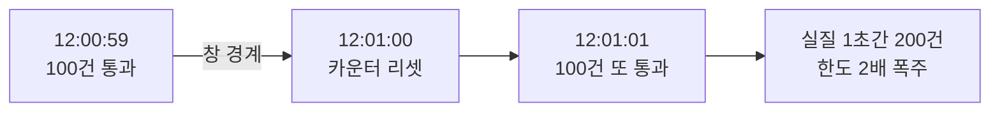

- **Rate Limiting** → 일정 시간당 허용 요청 수를 **제한** → 초과분은 거부(429)·지연·드롭
- 목적 → 과부하·남용 방지 · 공정한 자원 분배 · 비용·장애 폭주 차단
- 핵심 → "허용 한도를 어떻게 세느냐"가 알고리즘 차이

## 놀이기구 인원 제한으로 이해하기

- **놀이기구 = 서버** → 한 번에 태울 수 있는 인원·시간당 회전수 정해짐
- **줄 선 손님 = 요청** → 정원 넘으면 다음 회차로 미루거나(지연) 돌려보냄(거부)
- **시간당 인원표 = rate limit** → 안전·품질 유지 위해 흐름 통제
- 한꺼번에 몰려도 **일정 페이스**로만 통과 → 기구 과부하 방지

<KeyPoint title="이 비유에서 가져갈 것">
Rate limiting = 단위 시간당 통과량을 **상한** ·
순간 폭주(burst)는 흡수하되 평균은 제한 · 초과는 거부/지연으로 보호
</KeyPoint>

## 4가지 알고리즘

<Compare>
<CompareCol title="🪙 Token Bucket" subtitle="버킷에 토큰 충전" color="green">
- 일정 속도로 토큰 **충전** · 요청마다 토큰 1개 소비
- 토큰 있으면 통과, 없으면 거부
- **버스트 허용**(쌓인 토큰만큼) → 가장 흔함
</CompareCol>
<CompareCol title="💧 Leaky Bucket" subtitle="구멍으로 일정 누수" color="sky">
- 요청이 버킷에 차고 **일정 속도로 누출**(처리)
- 출력 속도 **항상 일정** → 트래픽 평탄화
- 버스트 흡수하나 큐 넘치면 드롭
</CompareCol>
</Compare>

<Compare>
<CompareCol title="🪟 Fixed Window" subtitle="고정 시간창 카운트" color="amber">
- 1분 단위로 카운터 → 한도 넘으면 거부 · 창 바뀌면 0
- 단순·메모리 적음
- **경계 문제** → 창 끝·시작 몰리면 순간 2배 통과
</CompareCol>
<CompareCol title="🎚️ Sliding Window" subtitle="이동 시간창" color="pink">
- 직전 N초를 **연속 추적** → 경계 폭주 완화
- 로그 방식(정확·무거움) / 카운터 가중 방식(근사·가벼움)
- 정확하지만 비용 큼
</CompareCol>
</Compare>

## 고정 창의 경계 문제



- 고정 창은 창이 바뀌는 **순간 리셋** → 경계 근처에 몰리면 한도의 2배까지 통과
- 슬라이딩 윈도우 → 직전 구간을 가중 합산해 이 문제 완화

## Token Bucket 구현

```python
import time

class TokenBucket:
    def __init__(self, capacity: int, refill_per_sec: float):
        self.capacity = capacity          # 최대 토큰(버스트 한도)
        self.refill = refill_per_sec      # 초당 충전량(평균 rate)
        self.tokens = capacity
        self.last = time.monotonic()

    def allow(self, cost: int = 1) -> bool:
        now = time.monotonic()
        # 경과 시간만큼 토큰 충전 (capacity 상한)
        self.tokens = min(self.capacity, self.tokens + (now - self.last) * self.refill)
        self.last = now
        if self.tokens >= cost:
            self.tokens -= cost           # 토큰 차감 후 통과
            return True
        return False                      # 토큰 부족 → 거부(429)
```

- `capacity` = 허용 버스트 크기 · `refill` = 장기 평균 허용률
- 충전을 **호출 시점에 lazy 계산** → 타이머 스레드 불필요

## 분산 환경 — Redis

- 서버 여러 대면 메모리 카운터는 **각자 따로** → 합치면 한도 초과 → 공유 저장소 필요

```python
# 고정 창 카운터 - INCR + 최초 1회 EXPIRE
# 원자성 위해 Lua 권장 (INCR/EXPIRE 사이 경합 방지)
LUA = """
local c = redis.call('INCR', KEYS[1])
if c == 1 then redis.call('EXPIRE', KEYS[1], ARGV[1]) end
return c
"""
def allow(redis, user_id, limit=100, window=60):
    key = f"rl:{user_id}:{int(time.time() // window)}"  # 창별 키
    count = redis.eval(LUA, 1, key, window)
    return count <= limit
```

<Note type="warning" title="분산 rate limit 주의">
- **원자성** → read-modify-write 분리 시 경합 → Lua 스크립트나 INCR로 원자 보장
- **시계 편차** → 서버 간 시간 다르면 창 경계 어긋남 → Redis 시간 기준 통일
- 정밀하면 **sliding window log**(ZSET에 timestamp) → 정확하나 메모리·연산 큼
</Note>

## 응답 처리·헤더

<Cards cols={3}>
<Card icon="🚫" title="429 거부">
`429 Too Many Requests` 반환 · 가장 단순 · 클라이언트가 재시도 책임
</Card>
<Card icon="⏳" title="Retry-After">
헤더로 **언제 재시도** 가능한지 안내 → 클라이언트 폭주 재시도 방지
</Card>
<Card icon="📊" title="RateLimit-*">
남은 한도·리셋 시각 헤더 노출 → 클라이언트가 페이스 조절
</Card>
</Cards>

## 알고리즘 비교

| 알고리즘 | 버스트 허용 | 정확도 | 메모리 | 출력 평탄화 |
| --- | --- | --- | --- | --- |
| Token Bucket | O(쌓인 만큼) | 높음 | 적음 | X |
| Leaky Bucket | 흡수 후 평탄 | 높음 | 큐 크기 | O |
| Fixed Window | 경계서 2배 | 낮음(경계) | 매우 적음 | X |
| Sliding Window | 완화 | 높음 | 중~큼 | X |

<Note type="danger" title="실무 함정">
- **누구 기준 제한?** → IP·user·API key 혼동 주의 → NAT 뒤 다수 사용자가 한 IP 공유
- 한도 거부만 하면 클라이언트가 **즉시 재시도 폭주** → 지수 백오프·지터 유도(Retry-After)
- 내부 서비스 간엔 rate limit보다 **백프레셔·서킷브레이커**가 더 적합한 경우 많음
</Note>
