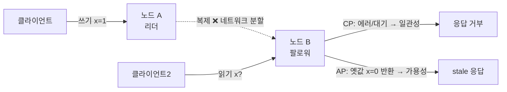
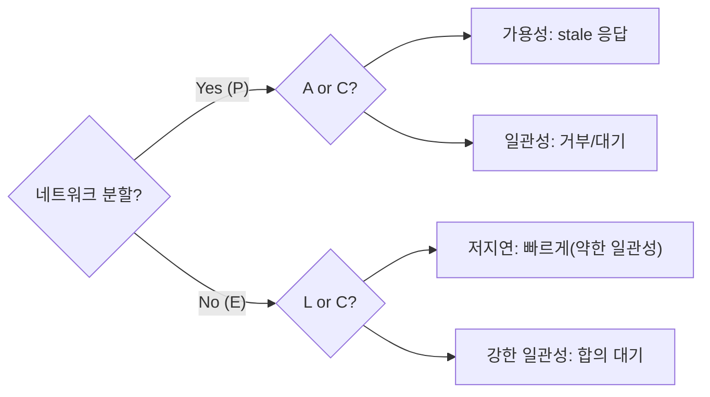

- **CAP 정리** → 분산 시스템은 일관성(C)·가용성(A)·분할내성(P) **셋 중 둘만** 동시 보장
- 네트워크 분할(P)은 분산이면 피할 수 없음 → 현실 선택은 **분할시 C냐 A냐**
- **PACELC** → 분할 없을 때도 일관성 vs **지연(Latency)** 사이 선택이 남음

## 셋 다 동시엔 못 가진다

- 멀리 떨어진 두 지점 매장이 재고 장부를 공유 → 통신선이 끊긴 상황(분할)
- 끊긴 동안 → **장부 일치 보장하려 판매 중단**(C 선택) vs **각자 일단 팔되 나중에 맞추기**(A 선택)
- 둘 다 동시엔 불가능 → 통신 끊긴 채로 "일치도 보장 + 계속 판매"는 모순

<KeyPoint title="이 비유에서 가져갈 것">
통신 끊김 = Partition(피할 수 없음) · 판매 중단해 장부 맞춤 = CP · 일단 팔고 나중 정합 = AP ·
'셋 중 둘'의 진짜 의미 → P는 고정, 분할 순간 C와 A 중 하나를 포기
</KeyPoint>

## CAP 세 요소

<Cards cols={3}>
<Card icon="🎯" title="Consistency (일관성)">
모든 노드가 같은 시점에 **같은 데이터** · 읽으면 항상 최신값
</Card>
<Card icon="💚" title="Availability (가용성)">
모든 요청이 **항상 응답** 받음 (최신이 아닐 수 있어도 에러는 안 냄)
</Card>
<Card icon="🔌" title="Partition tolerance (분할내성)">
노드 간 **통신 끊겨도** 시스템 계속 동작
</Card>
</Cards>

## 분할 발생시: CP vs AP

<Compare>
<CompareCol title="🎯 CP (일관성 우선)" subtitle="분할시 일부 요청 거부" color="sky">
- 정합 깨질 바엔 **응답 거부/대기**
- 항상 최신값 보장
- 금융·재고·예약 등 정확성 필수
- 분할 동안 가용성 희생
- 예: 강한 일관성 모드 시스템
</CompareCol>
<CompareCol title="💚 AP (가용성 우선)" subtitle="분할시 옛값이라도 응답" color="green">
- 끊겨도 **계속 응답** (stale 가능)
- 나중에 eventual consistency로 수렴
- SNS 피드·장바구니·추천 등
- 일시적 불일치 허용
- 예: Dynamo 계열
</CompareCol>
</Compare>

## PACELC: 분할 없을 때의 숨은 선택

- CAP는 분할(P) 순간만 다룸 → 평상시엔?
- **PACELC** → if **P**artition then **A** or **C**, **E**lse then **L**atency or **C**onsistency
- 분할 없어도 → 강한 일관성(노드 간 합의)은 **지연 증가** vs 약한 일관성은 **빠른 응답**

## 실제 분산 DB 분류

| 시스템 | 분할시(P) | 평상시(E) | 분류 |
|--------|-----------|-----------|------|
| **DynamoDB** | A 우선 | L 우선(기본 eventual) | PA/EL |
| **Cassandra** | A 우선 | L 우선(튜닝 가능) | PA/EL |
| **MongoDB** | C 우선(기본) | C 우선 | PC/EC |
| **HBase / BigTable** | C 우선 | C 우선 | PC/EC |
| **CockroachDB / Spanner** | C 우선 | C 우선(지연 감수) | PC/EC |
| **Riak** | A 우선 | L 우선 | PA/EL |

<Note type="note" title="튜닝 가능한 일관성">
- 많은 DB가 **요청 단위로 일관성 레벨 조절** → 한 시스템 안에서 AP·CP 혼용
- Cassandra/Dynamo의 **Quorum** → `R + W > N`이면 읽기에서 최신값 보장 (강한 일관성 쪽)
- `W=1, R=1` → 빠르지만 약한 일관성 · `W=N, R=N` → 느리지만 강함
</Note>

## 수치 감각

<Stats>
<Stat value="R+W>N" label="Quorum 일관성 조건" sub="겹치는 노드가 최신 보장" />
<Stat value="ms~수십 ms" label="단일 리전 합의" sub="강한 일관성 쓰기 지연" />
<Stat value="100ms+" label="멀티 리전 합의" sub="지리적 거리 RTT 누적" />
<Stat value="보통 ~1s" label="eventual 수렴" sub="AP에서 노드 간 동기화 지연" />
</Stats>

## 트레이드오프

<ProsCons>
<Pros title="AP/EL 선택 이유">
- 항상 빠른 응답 · 높은 가용성
- 멀티 리전·대규모 트래픽에 강함
- 일시 불일치 허용 도메인에 최적
</Pros>
<Cons title="대가">
- stale read · 충돌 해결(LWW 등) 필요
- 정확성 필수 업무엔 부적합
- 애플리케이션이 불일치를 감안해야 함
</Cons>
</ProsCons>

<Note type="warning" title="흔한 오해">
- "CAP에서 셋 중 둘 자유 선택" ❌ → 분산이면 **P는 필수** · 실제 선택지는 C vs A
- "강한 일관성 = 무조건 옳음" ❌ → 합의·복제로 **지연·비용** 상승 (PACELC의 E 축)
- "eventual = 데이터 손실" ❌ → 결국 수렴 · 다만 그 사이 stale 읽힐 수 있음
</Note>

<Note type="pink" title="실무 결론">
- 정확성 절대 우선(결제·재고·예약) → **CP / PC·EC** (MongoDB, Spanner)
- 가용성·저지연 우선(피드·로그·세션) → **AP / PA·EL** (Dynamo, Cassandra)
- 정답은 도메인별 다름 → 데이터 항목마다 일관성 요구를 나눠 **혼합 설계**가 현실적
</Note>
