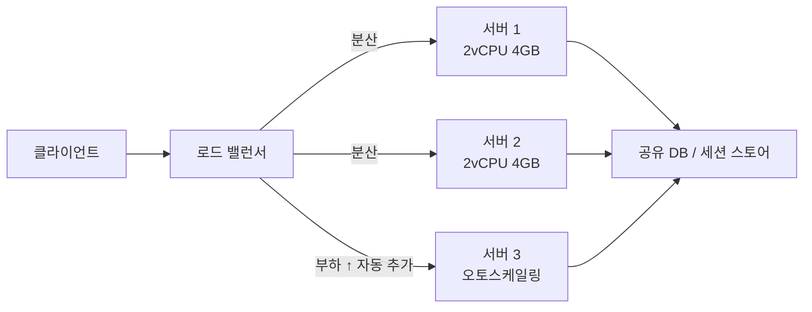

- **스케일업(Vertical)** → 서버 한 대를 더 강하게 (CPU·RAM 증설)
- **스케일아웃(Horizontal)** → 서버 대수를 늘려 부하 분산
- 핵심 갈림길 → 한 대 한계에 부딪히면 결국 **아웃으로 가야** 무한 확장 가능

## 한 사람 능력 키우기 vs 사람 더 뽑기

- 일이 몰릴 때 → **그 사람한테 더 좋은 장비 사주고 야근시키기**(스케일업) vs **사람 더 채용**(스케일아웃)
- 한 사람은 결국 체력·하루 24시간 한계 → 장비 업그레이드도 끝이 있음
- 사람 여럿이면 → 한 명 아파도 나머지가 일함(고가용성) · 다만 업무 분배·소통 비용 발생

<KeyPoint title="이 비유에서 가져갈 것">
스케일업 = 한 명을 슈퍼맨으로 · 스케일아웃 = 평범한 사람 여럿으로 ·
업은 단순하지만 천장이 있고, 아웃은 무한 확장 가능하나 상태 공유·분산 문제를 풀어야 함
</KeyPoint>

## 수직 vs 수평 한눈에

<Compare>
<CompareCol title="⬆️ Vertical (스케일업)" subtitle="한 대를 강하게" color="sky">
- CPU·RAM·디스크 증설 · 인스턴스 타입 격상
- 코드 변경 거의 없음 · 단순
- 단일 노드 → 데이터 일관성 고민 적음
- 천장 존재 · 단일 장애점(SPOF)
- 재부팅 다운타임 동반 흔함
</CompareCol>
<CompareCol title="➡️ Horizontal (스케일아웃)" subtitle="여러 대로 분산" color="pink">
- 동일 서버 N대 + 로드 밸런서
- 사실상 무한 확장 · 고가용성
- 무중단 증설/축소 가능
- 상태 공유·세션·분산 일관성 난제
- LB·오케스트레이션 등 운영 복잡도 ↑
</CompareCol>
</Compare>



## 스케일아웃의 전제: 무상태화(Stateless)

- 서버가 **자기 메모리에 세션·파일을 들고 있으면** → 그 서버로만 가야 해서 분산 깨짐
- 상태를 밖으로 빼야 → 어느 서버로 가도 동일 결과 → 자유롭게 추가/제거 가능

<Cards cols={3}>
<Card icon="🔑" title="세션">
서버 메모리 대신 **Redis** 등 외부 세션 스토어 · 또는 JWT로 무상태
</Card>
<Card icon="📁" title="파일">
로컬 디스크 대신 **S3 / 오브젝트 스토리지** 공유
</Card>
<Card icon="🗃️" title="상태">
서버는 계산만 · 데이터는 DB·캐시 등 공유 백엔드에 위임
</Card>
</Cards>

## 오토스케일링

- 부하 지표(CPU·요청 수·큐 길이)에 따라 **자동으로 서버 추가/제거**
- 트래픽 피크엔 늘리고 새벽엔 줄여 비용 절감

```bash
# AWS Auto Scaling: CPU 50% 목표로 2~10대 사이 자동 조절
aws autoscaling put-scaling-policy \
  --auto-scaling-group-name web-asg \
  --policy-name cpu-target \
  --policy-type TargetTrackingScaling \
  --target-tracking-configuration '{
    "PredefinedMetricSpecification": {"PredefinedMetricType": "ASGAverageCPUUtilization"},
    "TargetValue": 50.0
  }'
# 결과: 평균 CPU 50% 넘으면 scale-out, 한참 밑돌면 scale-in
```

<Timeline>
<TimelineItem title="1. 지표 수집">
CloudWatch가 평균 CPU·요청수를 1분 단위로 집계
</TimelineItem>
<TimelineItem title="2. 임계 초과">
목표(예 50%) 초과 지속 → scale-out 트리거
</TimelineItem>
<TimelineItem title="3. 인스턴스 추가">
새 서버 부팅 + LB 헬스체크 통과 후 분배 대상 편입 (워밍업 시간 고려)
</TimelineItem>
<TimelineItem title="4. 부하 하락시 축소">
지표 안정되면 scale-in → 비용 절감 · 단 연결 드레이닝 후 종료
</TimelineItem>
</Timeline>

## 수치 감각

<Stats>
<Stat value="~수십 배" label="스케일업 천장" sub="단일 인스턴스 최대 사양 한계" />
<Stat value="사실상 ∞" label="스케일아웃 한계" sub="LB·샤딩으로 노드 계속 추가" />
<Stat value="1~5분" label="새 인스턴스 워밍업" sub="부팅+헬스체크+캐시 채움" />
<Stat value="N+1" label="고가용성 최소 대수" sub="한 대 죽어도 용량 유지" />
</Stats>

## 트레이드오프

<ProsCons>
<Pros title="스케일아웃 선택 이유">
- 무한 확장 · 단일 장애점 제거
- 무중단 증설/축소 · 롤링 배포 용이
- 오토스케일링으로 비용 탄력 운영
</Pros>
<Cons title="스케일아웃 비용">
- 상태 외부화·분산 일관성 설계 필요
- LB·서비스 디스커버리·오케스트레이션 운영
- 네트워크 홉 증가로 지연 소폭 ↑
</Cons>
</ProsCons>

<Note type="warning" title="흔한 함정">
- 스케일아웃 했는데 **세션이 로컬 메모리** → 로그인 풀림·장바구니 사라짐 (sticky로 땜질 말고 외부화)
- 서버는 늘렸는데 **DB가 단일 병목** → 읽기 복제·샤딩·캐시로 같이 풀어야 효과
- 오토스케일 임계 너무 민감 → 늘렸다 줄였다 **flapping** · 쿨다운·워밍업 설정 필수
</Note>

<Note type="pink" title="실무 결론">
- 초기·단순 워크로드 → 일단 **스케일업**으로 빠르게 대응 (코드 변경 최소)
- 트래픽 성장·고가용성 요구 → **스케일아웃 + 무상태화 + 오토스케일링**
- 둘은 배타 아님 → 각 노드를 적당히 키운 뒤(업) 여러 대로 분산(아웃)하는 혼합이 현실적
</Note>
