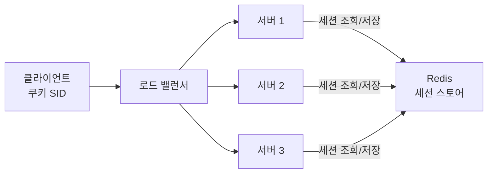

- **Stateless 서버** → 요청에 필요한 정보를 서버가 들고 있지 않음 → 어느 서버로 가도 동일 처리
- 세션을 서버 밖으로 빼는 게 핵심 → **sticky session**(같은 서버 고정) vs **외부 스토어**(Redis) vs **JWT**(토큰 자체에 상태)
- 스케일아웃·무중단 배포의 전제 조건 → 상태가 특정 노드에 묶이면 분산이 깨짐

## 어느 창구든 되는 무인 발권기

- 옛날 은행 → "아까 그 창구 직원"한테만 일 처리 가능 (그 직원이 내 서류 들고 있음) = stateful
- 무인 발권기 → **번호표(토큰)만 있으면 어느 기계든** 동일 처리 = stateless
- 직원 한 명 자리 비우면 그 손님 막힘 vs 무인기는 한 대 고장나도 옆 기계로

<KeyPoint title="이 비유에서 가져갈 것">
stateful = 특정 직원에게 묶임(그 서버 죽으면 세션 증발) · stateless = 번호표만 있으면 아무 창구나 ·
서버는 신원 확인만 하고, 실제 상태는 번호표(JWT)나 공용 보관함(Redis)에 둠
</KeyPoint>

## 세션을 어디에 둘까



<Compare>
<CompareCol title="📌 Sticky Session" subtitle="LB가 같은 서버로 고정" color="amber">
- 쿠키/IP 해시로 사용자→서버 고정
- 세션을 서버 로컬 메모리에 유지 가능
- 구현 단순 · 외부 스토어 불필요
- 그 서버 죽으면 세션 증발
- 부하 쏠림 · scale-in시 세션 유실
</CompareCol>
<CompareCol title="🗄️ 외부 세션 스토어" subtitle="Redis 등 공용 저장소" color="green">
- 모든 서버가 같은 Redis 참조
- 서버 자유 추가/제거 (진짜 stateless)
- 한 서버 죽어도 세션 유지
- Redis가 새 SPOF → HA·클러스터 필요
- 매 요청 네트워크 홉(보통 `<1ms`)
</CompareCol>
</Compare>

## JWT vs 서버 세션

<Compare>
<CompareCol title="🎫 JWT (토큰에 상태)" subtitle="서버 저장 없음" color="sky">
- 토큰 자체에 사용자 정보+서명 포함
- 서버는 서명만 검증 → 조회 불필요
- 완전 stateless · 수평 확장 친화
- 만료 전 강제 무효화 어려움
- 페이로드 커지고 매 요청 전송
</CompareCol>
<CompareCol title="🍪 서버 세션 (SID)" subtitle="스토어에 상태" color="pink">
- 쿠키엔 짧은 SID만 · 상태는 서버측
- 즉시 로그아웃·강제 만료 쉬움
- 페이로드 작음 · 민감정보 노출 ↓
- 매 요청 스토어 조회 필요
- 스토어 가용성에 의존
</CompareCol>
</Compare>

```python
# JWT: 검증만으로 인증 (스토어 조회 X) — 무상태
import jwt
payload = jwt.decode(token, SECRET, algorithms=["HS256"])
user_id = payload["sub"]  # DB/Redis 조회 없이 즉시 신원 확보

# 서버 세션: 쿠키의 SID로 Redis 조회 — 강제 만료 가능
sid = request.cookies["SID"]
session = redis.get(f"sess:{sid}")  # 없으면 만료/로그아웃 처리
```

```bash
# Redis 세션 저장 + TTL (30분 슬라이딩)
SET sess:abc123 '{"user_id":42,"role":"admin"}' EX 1800
GET sess:abc123          # 매 요청마다 조회
EXPIRE sess:abc123 1800  # 활동시 만료 갱신
```

## 무효화·로그아웃 전략

<Cards cols={2}>
<Card icon="⚡" title="서버 세션 로그아웃">
스토어에서 SID 삭제 → 즉시 무효 · 관리자 강제 로그아웃 쉬움
</Card>
<Card icon="🧩" title="JWT 로그아웃">
토큰은 만료 전까지 유효 → **블랙리스트**(Redis)나 **짧은 만료 + refresh token** 조합으로 보완
</Card>
</Cards>

## 수치 감각

<Stats>
<Stat value="~1ms" label="Redis 세션 조회" sub="같은 VPC 네트워크 RTT" />
<Stat value="0 조회" label="JWT 검증" sub="서명 검증만, 스토어 불필요" />
<Stat value="~수백 B" label="JWT 크기" sub="매 요청 헤더로 전송됨" />
<Stat value="15분 / 7일" label="흔한 access/refresh" sub="짧은 access + 긴 refresh" />
</Stats>

## 트레이드오프

<ProsCons>
<Pros title="외부 스토어 + 서버 세션">
- 진짜 무상태 서버 → 자유로운 스케일아웃
- 즉시 강제 로그아웃·세션 무효화
- 쿠키 작음 · 민감정보 서버 보관
</Pros>
<Cons title="대가">
- 매 요청 스토어 조회(지연·부하)
- 스토어 HA 운영 부담(클러스터·복제)
- 스토어 장애 = 전체 인증 영향
</Cons>
</ProsCons>

<Note type="warning" title="흔한 함정">
- **sticky로 땜질** → scale-in·서버 교체시 세션 통째로 증발 · 부하 쏠림
- **JWT에 민감정보** 평문 → base64는 암호화 아님 · 누구나 디코드 가능
- **JWT 무효화 안 됨** 간과 → 탈취 토큰이 만료까지 살아있음 · 짧은 만료+refresh 필수
- Redis 세션인데 **TTL 미설정** → 메모리 무한 증가 → eviction으로 멀쩡한 세션 날림
</Note>

<Note type="pink" title="실무 결론">
- 웹 세션·즉시 로그아웃 중요 → **Redis 세션 스토어 + 짧은 SID 쿠키**
- 다중 서비스·모바일·API 게이트웨이 → **JWT(짧은 access) + refresh token + 블랙리스트**
- 어떤 방식이든 목표는 동일 → 서버를 stateless로 만들어 어느 노드든 동일 처리
</Note>
