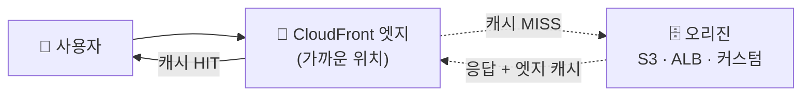

지구 반대편 사용자 → 서울 서버 매 요청 시 고지연 · CDN → 콘텐츠를 **사용자 가까운 엣지**에 캐시해 거리 단축

## 요청 흐름 — 엣지에서 끝내기



- **HIT** → 엣지에서 즉시 응답 (오리진 안 감)
- **MISS** → 오리진에서 가져와 엣지에 캐시 → 다음부터 HIT

<KeyPoint title="CDN의 두 가지 이득">
**지연 ⬇️** (사용자 가까운 엣지) + **오리진 부하 ⬇️** (반복 요청을 엣지가 흡수)
덤으로 엣지에서 TLS·[WAF](/devops/aws/security-deepdive/waf-shield)·DDoS 방어까지
</KeyPoint>

## 핵심 개념

| 개념 | 의미 |
|------|------|
| **Edge Location** | 전 세계 캐시 서버 (사용자 접점) |
| **Origin** | 원본 (S3·ALB·커스텀 서버) |
| **Cache Behavior** | 경로 패턴별 캐시 규칙 |
| **TTL** | 엣지 캐시 유효 시간 |
| **Cache Key** | 무엇을 기준으로 캐시 구분 (URL·헤더·쿠키) |
| **Invalidation** | 캐시 강제 만료 |

## 정적 vs 동적 콘텐츠

<Compare>
<CompareCol title="정적 콘텐츠" subtitle="이미지·JS·CSS·동영상" color="sky">
- 잘 안 바뀜 → **길게 캐시**(TTL 큼)
- 오리진은 보통 S3
- CDN 효과 최대
</CompareCol>
<CompareCol title="동적 콘텐츠" subtitle="API·개인화 응답" color="amber">
- 사용자마다 다름 → 짧게/캐시 안 함
- 캐시 키에 헤더·쿠키 포함
- 그래도 엣지 종단·압축 이득
</CompareCol>
</Compare>

## 캐시 무효화 & 버저닝

- 배포 후 새 파일 반영 안 됨 → **Invalidation**으로 강제 만료
- 더 나은 방법 → 파일명에 **버전/해시**(`app.a1b2c3.js`) → 캐시 무효화 불필요

```bash
# 특정 경로 캐시 무효화
aws cloudfront create-invalidation \
  --distribution-id E123ABC --paths "/index.html" "/css/*"
```

<Note type="warning" title="무효화 남발 주의">
- Invalidation은 비용·지연 발생 → 정적 자산은 **파일명 해싱**으로 캐시버스팅 권장
- `index.html`만 짧은 TTL, 해시 자산은 영구 캐시 패턴이 흔함
</Note>

## 비공개 콘텐츠

- 유료·비공개 파일 → **Signed URL / Signed Cookie**로 만료·접근 제한
- S3 오리진 → **OAC(Origin Access Control)** 로 S3 직접 접근 차단, CloudFront만 허용

<Note type="success" title="대표 구성">
정적 사이트·자산 → **S3(오리진) + CloudFront(CDN) + OAC** + 해시 파일명 → 빠르고 안전하고 캐시 관리 쉬움
</Note>
