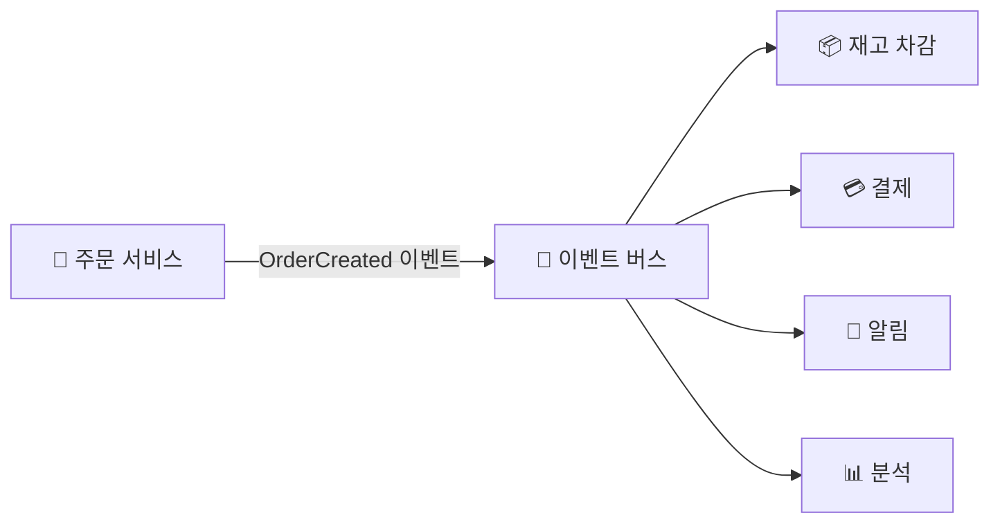

## 동기 호출의 한계

A가 B·C·D를 **직접 호출** → A는 B·C·D를 알아야 하고, 하나라도 느리거나 죽으면 A도 블로킹 · **이벤트 기반(EDA)** → A는 "일어난 일(이벤트)"만 발행하고 이탈 — 누가 듣는지 모른 채

<Compare>
<CompareCol title="🔗 동기 호출" subtitle="명령형" color="amber">
- A가 B·C·D를 직접 호출·대기
- 강결합 (서로 알아야)
- 하나 느리면 전체 지연
- 새 소비자 추가 = A 수정
</CompareCol>
<CompareCol title="📡 이벤트 기반" subtitle="이벤트 발행" color="violet">
- A는 이벤트만 발행하고 끝
- 느슨한 결합 (서로 모름)
- 비동기 → 각자 속도로
- 새 소비자 = A 수정 없이 구독
</CompareCol>
</Compare>

## 흐름 예 — 주문 생성

- 주문 서비스는 `OrderCreated`만 던짐 → 재고·결제·알림·분석이 **각자 알아서** 반응
- 분석 기능 추가? → 그냥 이벤트 구독 추가 (주문 서비스 안 건드림)

## 코레오그래피 vs 오케스트레이션

<Compare>
<CompareCol title="💃 코레오그래피" subtitle="각자 반응" color="sky">
- 중앙 지휘자 없음
- 각 서비스가 이벤트 듣고 자율 행동
- 느슨·확장 쉬움 / 전체 흐름 추적 어려움
</CompareCol>
<CompareCol title="🎬 오케스트레이션" subtitle="중앙 지휘" color="green">
- Step Functions 등이 흐름 지휘
- 순서·보상(롤백) 명시적
- 복잡 트랜잭션·사가에 적합
</CompareCol>
</Compare>

## AWS 구현 요소

| 역할 | 서비스 |
|------|------|
| 이벤트 라우팅(스키마·필터) | [EventBridge](/devops/aws/monitoring/cloudtrail) |
| 팬아웃 알림 | [SNS](/devops/aws/architecture/messaging) |
| 비동기 작업 버퍼 | SQS |
| 실시간 스트림 | Kinesis |
| 반응 처리 | [Lambda](/devops/aws/compute/lambda) |
| 흐름 오케스트레이션 | Step Functions |

## 대가 — 공짜가 아님

<Note type="warning" title="EDA의 어려움">
- **결과적 일관성** → 즉시 반영 아님 (재고·결제가 약간 시차)
- **멱등성 필수** → 이벤트 중복 수신 가능 → 같은 이벤트 두 번 와도 한 번처럼 처리
- **순서 보장 어려움** → 필요하면 FIFO·파티션 키
- **디버깅 어려움** → 흐름이 흩어짐 → [X-Ray](/devops/aws/monitoring/xray) 분산 추적 필수
</Note>

<KeyPoint title="언제 EDA">
느슨한 결합·독립 확장·새 기능 추가 유연성 중요 → EDA
단, **강한 일관성·단순 동기 흐름**이면 직접 호출이 더 쉽고 명확 — 무조건 EDA가 정답은 아님
</KeyPoint>
