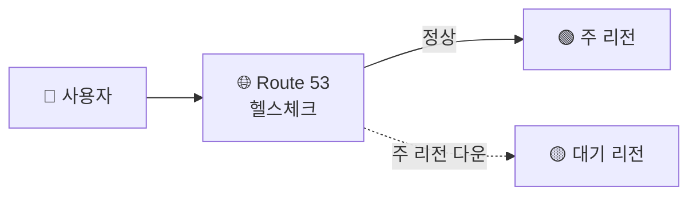

## 가용성 목표 = 9의 개수

가용성 = "9가 몇 개냐" · 9 하나 늘 때마다 허용 다운타임 1/10, 설계 난이도·비용 급증

<Stats>
<Stat value="99.9%" label="three nines" sub="연 8.7시간 다운" />
<Stat value="99.99%" label="four nines" sub="연 52분 다운" />
<Stat value="99.999%" label="five nines" sub="연 5분 다운" />
</Stats>

<KeyPoint title="먼저 정할 것">
"무조건 99.999%" ❌ → **서비스가 요구하는 가용성**을 먼저 정하기
9 하나 더 = 비용·복잡도 급증 → 과한 목표는 낭비
</KeyPoint>

## 핵심 원칙 — 단일 장애점(SPOF) 제거

- 한 곳이 죽으면 전체가 죽는 지점(SPOF)을 없앤다 = **이중화(redundancy)**
- AWS의 물리적 격리 단위:
  - **AZ(가용 영역)** → 한 리전 안의 분리된 데이터센터
  - **Region(리전)** → 지리적으로 떨어진 독립 영역

## Multi-AZ vs Multi-Region

<Compare>
<CompareCol title="Multi-AZ" subtitle="한 리전, 여러 AZ" color="sky">
- AZ 장애 대비 (대부분의 HA)
- 동기 복제·낮은 지연
- ALB·ASG·RDS Multi-AZ 기본
- 비용 합리적
</CompareCol>
<CompareCol title="Multi-Region" subtitle="여러 리전" color="violet">
- **리전 전체 장애**·재해 대비(DR)
- 글로벌 저지연 (사용자 가까이)
- 데이터 동기화·비용·복잡도 ⬆️
- 규정·글로벌 서비스용
</CompareCol>
</Compare>

## HA 구성 요소

| 계층 | HA 방법 |
|------|------|
| 로드밸런서 | [ALB](/devops/aws/networking/load-balancer) 여러 AZ 분산 |
| 컴퓨팅 | [Auto Scaling](/devops/aws/compute/autoscaling) 다중 AZ, min ≥ 2 |
| DB | [RDS Multi-AZ](/devops/aws/storage/rds) · Aurora 다중 AZ |
| 스토리지 | S3(자동 다중 AZ, 11 9s) |
| 글로벌 라우팅 | Route 53 헬스체크·페일오버 |

## Route 53 페일오버

- Route 53가 주 리전 헬스체크 실패 감지 → DNS를 대기 리전으로 전환

## 액티브-액티브 vs 액티브-패시브

| 방식 | 동작 | RTO | 비용 |
|------|------|------|------|
| **Active-Passive** | 평소 주 리전만, 대기 리전 standby | 분 | 중간 |
| **Active-Active** | 여러 리전 동시 서비스 | 거의 0 | 높음 |

<Note type="note" title="DR 전략과 연결">
- HA(가용성)와 DR(재해 복구)은 맞닿아 있음 → [Backup & DR](/devops/aws/storage/backup)의 4전략(Backup&Restore~Active-Active)과 같은 스펙트럼
- RTO/RPO 목표가 곧 어디까지 이중화할지를 결정
</Note>
