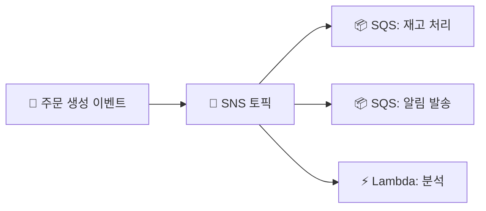

직접 호출로 묶인 서비스 → 하나 느리거나 죽으면 전체 무너짐 · **메시징으로 디커플링** → 각 서비스 독립적으로 버팀

## 셋의 역할 — 큐 vs 펍섭 vs 스트림

| 서비스 | 모델 | 한 줄 |
|------|------|------|
| **SQS** | 큐 (1:1) | 작업을 **쌓아두고 하나씩** 처리 |
| **SNS** | pub/sub (1:N) | 한 메시지를 **여러 구독자에 동시** 전파 |
| **Kinesis** | 스트림 | **순서·재처리** 되는 실시간 데이터 흐름 |

<KeyPoint title="언제 무엇을">
작업 큐(워커가 하나씩 처리) → **SQS** / 한 이벤트를 여러 곳에 알림 → **SNS** /
순서 보장·여러 소비자·재생이 필요한 대량 스트림 → **Kinesis**
</KeyPoint>

## SQS — 작업 큐

- 생산자가 메시지를 넣고, 워커가 **풀(pull)** 해서 처리
- **Visibility Timeout** → 처리 중인 메시지를 잠시 숨김(중복 처리 방지)
- **DLQ(Dead Letter Queue)** → 계속 실패하는 메시지 격리
- 표준(순서 보장 X, 고처리량) vs **FIFO**(순서·정확히 1회)

```bash
aws sqs send-message --queue-url $Q --message-body '{"orderId":123}'
```

<Note type="note" title="Visibility Timeout">
- 워커가 메시지 받음 → 그 시간 동안 다른 워커엔 안 보임 → 처리 완료 시 삭제
- 처리 시간보다 짧게 잡으면 **중복 처리** 발생 → 넉넉히
</Note>

## SNS — 팬아웃(pub/sub)

- 한 토픽에 발행 → **모든 구독자**에게 push (이메일·Lambda·SQS·HTTP)



<Note type="success" title="팬아웃 패턴 (SNS + SQS)">
- SNS → 여러 SQS로 fan-out → 각 워커가 독립적으로 처리
- 한 이벤트를 여러 도메인이 **느슨하게** 나눠 처리하는 대표 패턴
</Note>

## Kinesis — 실시간 스트림

- 순서 보장 + **재처리(replay)** + 여러 소비자가 같은 데이터를 각자 읽음
- **샤드(shard)** 단위로 처리량 확장
- 로그·클릭스트림·IoT 등 대량 실시간 데이터

<Compare>
<CompareCol title="SQS" subtitle="작업 큐" color="sky">
- 메시지 = 처리하면 **사라짐**
- 소비자 그룹 1개
- 재생 불가
</CompareCol>
<CompareCol title="Kinesis" subtitle="스트림" color="violet">
- 데이터가 **보존**(기간 내)
- 여러 소비자가 독립 소비
- **재처리 가능**·순서 보장
</CompareCol>
</Compare>

## 용도별 선택

| 하고 싶은 것 | 선택 |
|------|------|
| 비동기 작업 처리 (이메일·이미지 변환) | SQS |
| 실패 메시지 격리 | SQS + DLQ |
| 한 이벤트 → 여러 시스템 알림 | SNS |
| 여러 도메인 독립 처리 | SNS → 여러 SQS (팬아웃) |
| 실시간 분석·로그·재처리 | Kinesis |

<Note type="warning" title="EventBridge와 헷갈릴 때">
- 콘텐츠 라우팅·SaaS·스키마 기반 이벤트 → [EventBridge](/devops/aws/monitoring/cloudtrail)
- 단순 고속 팬아웃 → SNS / 대량 스트림 → Kinesis
</Note>
