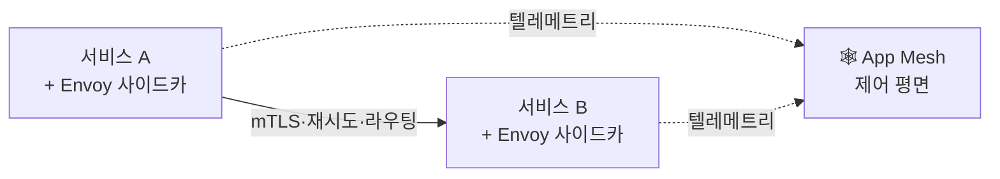

## 모놀리식 vs 마이크로서비스

<Compare>
<CompareCol title="🧱 모놀리식" subtitle="한 덩어리" color="sky">
- 하나의 앱·하나의 배포
- 초기 개발·운영 단순
- 부분만 확장 불가 (전체 스케일)
- 커지면 배포 부담·팀 충돌
</CompareCol>
<CompareCol title="🧩 마이크로서비스" subtitle="작은 서비스 다수" color="violet">
- 서비스별 **독립 배포·확장**
- 서비스별 DB·팀 자율
- 한 서비스 장애 격리 가능
- 분산 복잡도 (통신·일관성·추적) ⬆️
</CompareCol>
</Compare>

## 쪼개면 생기는 숙제

- 직접 호출이 **네트워크 호출**로 → 새 문제들:

| 숙제 | 내용 |
|------|------|
| **서비스 디스커버리** | 상대 주소를 어떻게 찾나 (Cloud Map) |
| **회복탄력성** | 타임아웃·재시도·**서킷 브레이커** |
| **분산 데이터** | 서비스마다 DB → 트랜잭션·일관성 (사가) |
| **관측성** | 흩어진 요청 추적 ([X-Ray](/devops/aws/monitoring/xray)) |
| **인증/암호화** | 서비스 간 mTLS |

## 서비스 메시 — 공통 관심사를 인프라로

- 위 숙제(재시도·mTLS·라우팅·관측)를 **앱 코드마다** 구현하면 중복·실수
- **서비스 메시**(App Mesh) → 각 서비스 옆 **사이드카(Envoy)** 가 대신 처리

<KeyPoint title="서비스 메시의 가치">
재시도·서킷브레이커·mTLS·트래픽 분할·관측을 **앱 코드가 아니라 사이드카 계층**에서 처리
→ 비즈니스 코드는 로직에만 집중 · 정책은 메시에서 일괄
</KeyPoint>

## AWS 구성

| 역할 | 서비스 |
|------|------|
| 실행 | [ECS](/devops/aws/compute/ecs) / EKS |
| 디스커버리 | Cloud Map |
| 트래픽·메시 | App Mesh (Envoy) |
| 진입 | [ALB](/devops/aws/networking/load-balancer) / API Gateway |
| 비동기 결합 | [SNS/SQS/EventBridge](/devops/aws/architecture/eda) |

<Note type="warning" title="무조건 쪼개지 말 것">
- 초기·소규모 → 모놀리식이 **더 빠르고 단순**
- 분산은 공짜 아님 → 네트워크 지연·디버깅·운영 비용
- "조직·도메인이 커져서 한 덩어리가 병목"일 때 점진적으로 분리
- 시작은 잘 모듈화된 모놀리식 → 필요한 부분만 떼어내기
</Note>
