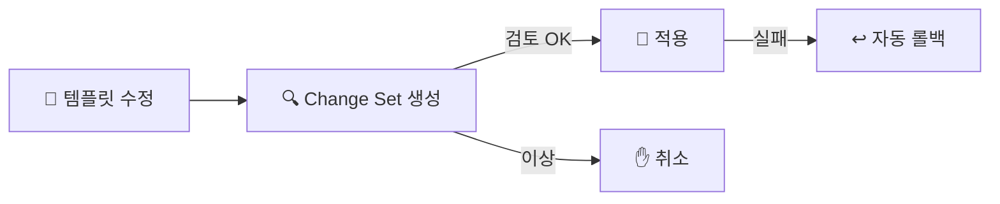

> **IaC(Infrastructure as Code)** → 인프라를 **코드로 정의**하고 버전 관리
>
> **CloudFormation** → AWS 네이티브 **선언형 템플릿**(YAML/JSON)
>
> **CDK** → TypeScript·Python 같은 **실제 언어로** 인프라 작성 → CloudFormation으로 변환

<KeyPoint title="IaC의 핵심">
"콘솔에서 클릭" ❌ → **코드로 인프라를 선언** · 같은 환경 **반복·재현**,
변경 **diff 검토**, git으로 이력 관리
</KeyPoint>

---

## 1. 수동 vs IaC

<ProsCons>
<Pros title="IaC (코드)">
- 동일 환경 반복 생성 (dev/prod 일관)
- 변경 전 diff 검토 (체인지셋)
- git 이력·코드 리뷰
- 재해 시 빠른 재구축
</Pros>
<Cons title="콘솔 수동">
- 사람마다 다르게 설정 (드리프트)
- 무엇을 바꿨는지 추적 어려움
- 재현 불가 → 장애 복구 느림
- 규모 커지면 관리 불가
</Cons>
</ProsCons>

---

## 2. CloudFormation — 선언형 템플릿

- **템플릿**(원하는 상태) → 배포하면 **스택**(실제 리소스 묶음) 생성
- 구성: Resources(필수) · Parameters(입력) · Outputs(결과) · Mappings/Conditions

S3 버킷 하나 만드는 템플릿 예 (YAML):

```yaml
AWSTemplateFormatVersion: "2010-09-09"
Parameters:
  BucketName:
    Type: String
Resources:
  LogBucket:
    Type: AWS::S3::Bucket
    Properties:
      BucketName: !Ref BucketName
      VersioningConfiguration:
        Status: Enabled
Outputs:
  BucketArn:
    Value: !GetAtt LogBucket.Arn
```

- `!Ref` → 파라미터/리소스 참조 · `!GetAtt` → 속성 가져오기

---

## 3. 스택 변경 — Change Set & Drift

- 템플릿 수정 → 바로 적용 말고 **Change Set**으로 "뭐가 바뀔지" 먼저 확인
- **Drift Detection** → 콘솔에서 수동으로 바꾼 부분(템플릿과 차이) 탐지
- 배포 실패 → **자동 롤백**(이전 상태로)



<Note type="warning" title="드리프트 주의">
- IaC로 만든 리소스를 **콘솔에서 손으로 수정** → 드리프트 발생 → 다음 배포 때 충돌
- 원칙: 한번 IaC로 관리하면 **변경은 코드로만**
</Note>

---

## 4. CDK — 코드로 인프라

- YAML 대신 **실제 언어**(TS·Python)로 작성 → 내부적으로 CloudFormation 템플릿 생성(synth)
- 반복·조건·추상화에 강함 (프로그래밍 언어니까)

같은 S3 버킷을 CDK(TypeScript)로:

```typescript
import { Stack, aws_s3 as s3 } from "aws-cdk-lib";

new s3.Bucket(this, "LogBucket", {
  versioned: true,
});
```

<Compare>
<CompareCol title="📄 CloudFormation" subtitle="선언형 YAML" color="sky">
- 순수 선언 · 외부 의존 없음
- 길고 반복 많음
- AWS 표준
</CompareCol>
<CompareCol title="💻 CDK" subtitle="코드" color="violet">
- 언어의 추상화·반복 활용
- 짧고 재사용 쉬움
- 결국 CloudFormation으로 synth
</CompareCol>
</Compare>

---

## 5. CloudFormation/CDK vs Terraform/Pulumi

<Note type="pink" title="실무 정리">
- AWS 전용 + 네이티브 통합 → CloudFormation/CDK
- 멀티 클라우드 → Terraform([다음 문서](/devops/aws/automation/terraform)) / Pulumi(실제 언어, CDK와 유사 철학)
- 변경은 항상 **Change Set/plan으로 diff 검토 후** 적용
- IaC로 만든 건 **콘솔 수동 변경 금지**(드리프트)
- 상태·시크릿은 코드에 직접 넣지 말고 파라미터·Secrets Manager로
</Note>
