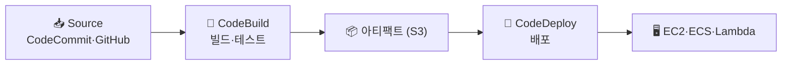

> AWS의 **CI/CD 도구 3종** → 코드 변경을 자동으로 빌드·테스트·배포
>
> **CodeBuild**(빌드) · **CodeDeploy**(배포) · **CodePipeline**(전체 흐름 오케스트레이션)
>
> 셋을 엮어 "푸시 → 자동 배포" 파이프라인 완성

---

## 한눈에 — 역할 분담

<Cards cols={3}>
<Card icon="📥" title="CodeCommit">
Git 저장소 (또는 GitHub 연동)
</Card>
<Card icon="🔨" title="CodeBuild">
빌드·테스트 실행 (CI)
</Card>
<Card icon="🚀" title="CodeDeploy">
EC2·ECS·Lambda에 배포 (CD)
</Card>
<Card icon="🔗" title="CodePipeline">
전체 단계 오케스트레이션
</Card>
<Card icon="📦" title="아티팩트">
단계 간 산출물 (S3 경유)
</Card>
<Card icon="🎯" title="배포 전략">
롤링·블루그린·카나리 연계
</Card>
</Cards>

---

## 1. 전체 흐름



- **CodePipeline**이 이 단계들을 순서대로 묶어 자동 실행
- 푸시 → Source 단계 트리거 → Build → Deploy 자동 진행

---

## 2. CodeBuild — 빌드 스펙

- `buildspec.yml`에 빌드 단계 정의

```yaml
version: 0.2
phases:
  install:
    runtime-versions:
      python: 3.12
  build:
    commands:
      - pip install -r requirements.txt
      - pytest
      - docker build -t $REPO_URI:$TAG .
      - docker push $REPO_URI:$TAG
artifacts:
  files:
    - imagedefinitions.json
```

- 테스트 통과 → 이미지 빌드 → ECR 푸시 → 다음 단계로 아티팩트 전달

---

## 3. CodeDeploy — 배포 전략 연계

- 빌드된 산출물을 대상에 배포 + **배포 전략** 적용
- [Deployment Strategies](/devops/aws/automation/deployment-strategies)의 롤링·블루그린·카나리와 연계

| 대상 | 배포 방식 |
|------|------|
| **EC2/온프레미스** | 인플레이스 / 블루그린 (Agent 기반) |
| **ECS** | 롤링 / 블루그린 (CodeDeploy + ALB) |
| **Lambda** | 카나리 / 선형(가중치 점진 이동) |

<Note type="success" title="자동 롤백">
- 배포 후 헬스체크·CloudWatch 알람 실패 → **자동 롤백**
- 안전한 무중단 배포의 핵심
</Note>

---

## 4. AWS CodePipeline vs GitHub Actions

<Compare>
<CompareCol title="🔗 CodePipeline" subtitle="AWS 네이티브" color="sky">
- AWS 서비스와 깊은 통합
- IAM 권한으로 안전한 배포
- AWS 안에서 완결
</CompareCol>
<CompareCol title="🐙 GitHub Actions" subtitle="범용 CI/CD" color="violet">
- 코드와 같은 곳(GitHub)
- 생태계·마켓플레이스 풍부
- OIDC로 AWS 키리스 배포
</CompareCol>
</Compare>

<Note type="pink" title="실무 정리">
- AWS 중심·규정 엄격 → CodePipeline
- GitHub 중심·범용 → GitHub Actions + [OIDC](/devops/aws/iam/sts)로 AWS 배포
- 공통: 테스트 통과 게이트 + 헬스체크 기반 **자동 롤백**
- 컨테이너 → 빌드→ECR→ECS 배포가 표준 ([ECS](/devops/aws/compute/ecs))
- 시크릿 → 코드에 ❌ → Secrets Manager/SSM Parameter Store
</Note>
