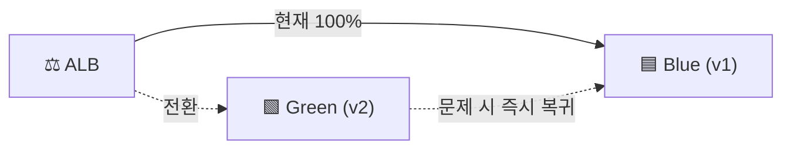
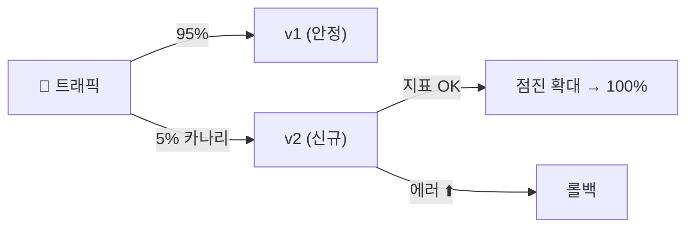

> 배포 전략 → **새 버전을 어떻게 내보내고, 문제 시 어떻게 되돌릴까**
>
> 목표 → **무중단** + **빠른 롤백** + **위험 최소화**
>
> 핵심 4가지 → 인플레이스 · 롤링 · 블루그린 · 카나리

---

## 1. 네 가지 전략 한눈에

| 전략 | 방식 | 다운타임 | 롤백 | 비용 |
|------|------|------|------|------|
| **인플레이스** | 그 자리에서 교체 | 있을 수 있음 | 느림(재배포) | 낮음 |
| **롤링** | 일부씩 순차 교체 | 무중단 | 중간 | 낮음 |
| **블루그린** | 새 환경 띄우고 전환 | 무중단 | **즉시** | 높음(2배 일시) |
| **카나리** | 소수에 먼저 → 점진 확대 | 무중단 | 빠름 | 중간 |

---

## 2. 블루그린 — 통째로 바꾸고 즉시 롤백

- **Blue**(현재) 옆에 **Green**(새 버전) 전체를 띄움 → 트래픽을 Green으로 **스위치**
- 문제 → 트래픽을 Blue로 **즉시 되돌림**

<ProsCons>
<Pros title="블루그린 장점">
- 무중단 + **즉시 롤백**(스위치만)
- 새 버전 사전 검증 가능
- 배포 중 버전 혼재 없음
</Pros>
<Cons title="블루그린 단점">
- 일시적으로 **인프라 2배** 비용
- DB 마이그레이션은 별도 고려
</Cons>
</ProsCons>

---

## 3. 카나리 — 소수에 먼저 흘려보기

- 새 버전에 트래픽 **소량(예 5%)** 먼저 → 지표 정상이면 점진 확대 → 100%
- 광부의 카나리처럼 "소수로 먼저 위험 감지"

<Note type="success" title="자동 판정">
- CloudWatch 알람·에러율로 카나리 단계마다 자동 진행/롤백
- Lambda는 **가중치 라우팅**으로 카나리(예: 10% → 50% → 100%)
</Note>

---

## 4. ECS / Lambda 적용

- **ECS 블루그린** → CodeDeploy + ALB 두 타깃 그룹(Blue/Green) 전환
- **Lambda 카나리** → 별칭(alias) 가중치로 점진 이동
- 공통 → 헬스체크/알람 실패 시 **자동 롤백** ([CodeDeploy](/devops/aws/automation/codepipeline))

<Note type="warning" title="DB 마이그레이션 주의">
- 코드는 블루그린으로 즉시 롤백돼도 **DB 스키마는 못 되돌림**
- → 하위 호환 마이그레이션(expand-contract) 패턴 필요
</Note>

<Note type="pink" title="실무 정리">
- 기본 무중단 → **롤링** / 즉시 롤백 중요 → **블루그린** / 위험 큰 변경 → **카나리**
- 항상 헬스체크·알람 기반 **자동 롤백** 구성
- 트래픽 전환은 ALB(ECS)·alias 가중치(Lambda)
- DB 변경은 **하위 호환**으로 (코드 롤백과 분리)
</Note>
