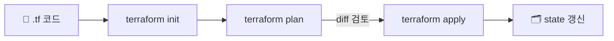

> **Terraform** → HashiCorp의 **멀티 클라우드 IaC** 도구 (HCL 언어)
>
> CloudFormation이 AWS 전용이라면, Terraform은 **AWS·GCP·Azure 등 통합**
>
> 핵심 메커니즘 → **state**(현재 인프라 상태 기록)와 **plan**(변경 미리보기)

<KeyPoint title="Terraform의 심장 = state">
Terraform은 **state 파일**에 "지금 뭐가 떠 있는지"를 기록해 두고,
코드(원하는 상태)와 state(현재 상태)를 **비교(diff)** 해서 변경분만 적용한다.
state 관리가 곧 Terraform 운영의 핵심.
</KeyPoint>

---

## 1. HCL — 선언형 문법

S3 버킷 예 (HCL):

```hcl
provider "aws" {
  region = "ap-northeast-2"
}

resource "aws_s3_bucket" "logs" {
  bucket = "my-prod-logs"
}

resource "aws_s3_bucket_versioning" "logs" {
  bucket = aws_s3_bucket.logs.id
  versioning_configuration {
    status = "Enabled"
  }
}
```

- `resource` 블록으로 리소스 선언 · `aws_s3_bucket.logs.id` 로 참조

---

## 2. 워크플로 — init → plan → apply



```bash
terraform init      # provider·모듈 다운로드
terraform plan      # 변경 미리보기 (무엇이 생성/수정/삭제될지)
terraform apply     # 실제 적용 → state 갱신
terraform destroy   # 전체 제거
```

<Note type="success" title="plan이 핵심">
- `plan` → `+ 생성` / `~ 수정` / `- 삭제` 를 미리 보여줌
- 적용 전 반드시 검토 → CloudFormation의 Change Set과 같은 역할
</Note>

---

## 3. State — 원격 백엔드 & 락

- **state 파일**(`terraform.tfstate`) → 현재 인프라 상태 기록
- 로컬에 두면 팀 협업 불가·유실 위험 → **원격 백엔드**(S3 + DynamoDB)

```hcl
terraform {
  backend "s3" {
    bucket         = "my-tf-state"
    key            = "prod/terraform.tfstate"
    region         = "ap-northeast-2"
    dynamodb_table = "tf-lock"   # 동시 apply 방지 락
  }
}
```

<Note type="danger" title="State 주의">
- state엔 **시크릿이 평문**으로 들어갈 수 있음 → S3 암호화·접근 제한 필수
- 동시 apply → state 손상 → **DynamoDB 락**으로 방지
- state 직접 수동 편집 ❌ (꼬임) → `terraform state` 명령으로만
</Note>

---

## 4. 모듈 — 재사용

- **모듈** → 리소스 묶음을 재사용 단위로 (VPC 모듈, EKS 모듈 등)

```hcl
module "vpc" {
  source = "terraform-aws-modules/vpc/aws"
  name   = "prod-vpc"
  cidr   = "10.0.0.0/16"
}
```

- 검증된 공개 모듈(Terraform Registry) 활용 → 바퀴 재발명 ⬇️

---

## 5. Terraform vs CloudFormation

| 기준 | Terraform | CloudFormation |
|------|-----------|----------------|
| 범위 | 멀티 클라우드 | AWS 전용 |
| 언어 | HCL | YAML/JSON |
| 상태 | **state 파일 직접 관리** | AWS가 내부 관리 |
| 변경 미리보기 | `plan` | Change Set |
| 생태계 | Registry 모듈 풍부 | AWS 네이티브 통합 |

<Note type="pink" title="실무 정리">
- 멀티 클라우드·풍부한 모듈 → Terraform
- AWS 전용·네이티브 → CloudFormation/CDK
- **원격 state(S3)+락(DynamoDB)** 은 팀 운영 필수
- 항상 `plan`으로 diff 검토 후 `apply`
- state·시크릿 보안 + 콘솔 수동 변경 금지(드리프트)
</Note>
