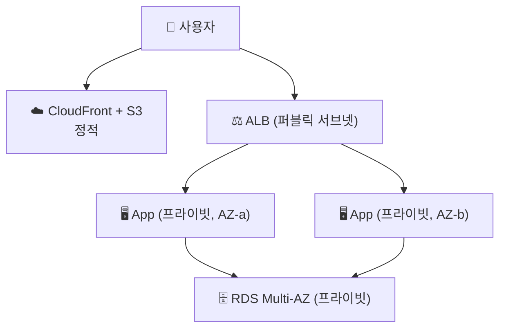

- 가장 기본이자 표준인 웹 아키텍처
- 앞선 [VPC](/devops/aws/networking/vpc)·[ALB](/devops/aws/networking/load-balancer)·[Auto Scaling](/devops/aws/compute/autoscaling)·[RDS](/devops/aws/storage/rds)·[HA](/devops/aws/architecture/ha) 개념을 한 그림으로 합친 캡스톤

## 세 계층

| 티어 | 역할 | 위치 | AWS |
|------|------|------|------|
| **Web (Presentation)** | 정적·요청 진입 | 퍼블릭 | CloudFront·ALB |
| **App (Logic)** | 비즈니스 로직 | 프라이빗 | ECS/EC2 + Auto Scaling |
| **Data** | 영속 데이터 | 프라이빗(격리) | RDS Multi-AZ |

## 전체 구성



- 웹 계층(ALB)만 퍼블릭 → 앱·DB는 **프라이빗 서브넷**(인터넷 직접 노출 ❌)
- 각 계층을 **여러 AZ**에 분산 → 단일 AZ 장애에도 생존

## 계층 간 보안 — 보안그룹 체이닝

- 각 계층 [보안그룹](/devops/aws/networking/security)이 **바로 위 계층만** 허용

```
ALB SG      → 인터넷 443 인바운드
App SG      → ALB SG 에서만 인바운드 (소스 = ALB SG)
RDS SG      → App SG 에서만 3306 인바운드
```

<KeyPoint title="핵심 설계 원칙">
**퍼블릭은 최소(ALB만)** · 앱·DB는 프라이빗 · 계층 간은 **보안그룹을 소스로 체이닝**
→ 외부 노출면 최소 + 계층 격리
</KeyPoint>

## HA & 확장

- App 계층 → Auto Scaling (트래픽 따라 증감, min ≥ 2, 다중 AZ)
- DB → RDS Multi-AZ (장애 시 standby 승격)
- 정적 → S3 + CloudFront (오리진 부하·지연 ⬇️)
- 프라이빗 서브넷 아웃바운드 → NAT 또는 [VPC 엔드포인트](/devops/aws/security-deepdive/vpc-patterns)

<Note type="success" title="이 구조의 의미">
- 대부분의 웹 서비스의 출발점 → 여기서 컨테이너화·마이크로서비스·서버리스로 진화
- 계층 분리 + 다중 AZ + 보안그룹 체이닝 = AWS 웹 아키텍처의 기본기
</Note>
