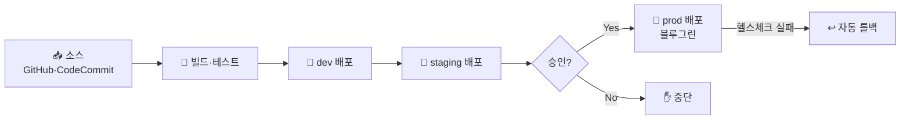

- 코드 푸시부터 프로덕션 배포까지 전 과정 자동화
- [CodePipeline](/devops/aws/automation/codepipeline)·[배포 전략](/devops/aws/automation/deployment-strategies)·[IaC](/devops/aws/automation/cloudformation)를 환경 분리·승인 게이트로 엮은 캡스톤

## 전체 파이프라인

## 환경 분리

- 같은 파이프라인이 **dev → staging → prod** 순으로 승격
- 환경별 분리 (가능하면 [별도 계정](/devops/aws/iam/organizations))

| 환경 | 목적 | 배포 |
|------|------|------|
| **dev** | 빠른 통합·확인 | 자동 |
| **staging** | 프로덕션 유사 검증 | 자동 |
| **prod** | 실제 서비스 | **수동 승인** 후 블루그린 |

## 게이트 — 안전장치

- **테스트 게이트** → 통과 못 하면 배포 중단
- **수동 승인** → prod 전 사람이 확인 (CodePipeline Approval)
- **헬스체크·알람** → 배포 후 실패 시 자동 롤백

<KeyPoint title="좋은 파이프라인의 조건">
- 모든 변경이 **같은 경로**(파이프라인)로만 배포 → 수동 배포 ❌
- 단계마다 **게이트**(테스트·승인·헬스체크)로 위험 차단
- 실패 시 **자동 롤백** → 사람이 새벽에 안 깨도 됨
</KeyPoint>

## IaC 통합

- 앱뿐 아니라 **인프라도 파이프라인으로** → CloudFormation/Terraform `plan` 검토 후 `apply`
- 앱 배포 + 인프라 변경을 같은 흐름에서 추적

<Note type="pink" title="실무 포인트">
- 시크릿 → Secrets Manager/[SSM](/devops/aws/automation/ssm) (코드·파이프라인 변수에 평문 ❌)
- GitHub 중심 → Actions + [OIDC](/devops/aws/iam/sts) 키리스 배포
- prod 직배포 금지 → staging 검증 + 승인 게이트
- 배포 단위 작게·자주 → 롤백 쉽고 위험 ⬇️
- 컨테이너 → [ECS 플랫폼](/devops/aws/cases/container-platform)·블루그린과 결합
</Note>
