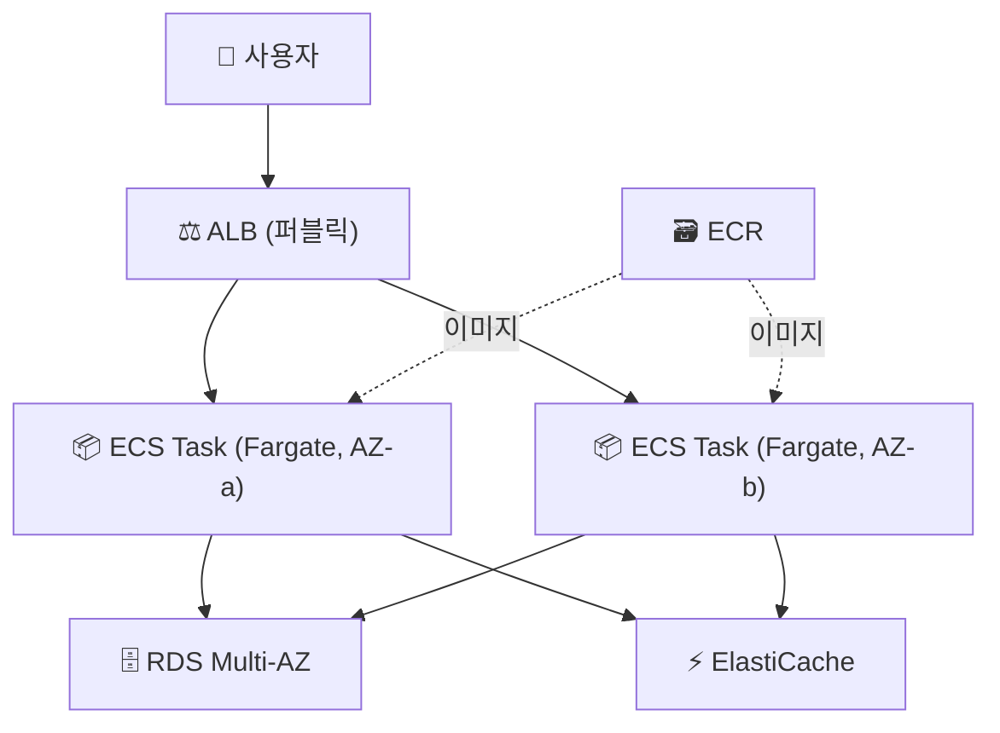

- 컨테이너로 서비스를 운영하는 표준 플랫폼
- [ECS](/devops/aws/compute/ecs)·[ALB](/devops/aws/networking/load-balancer)·[CI/CD](/devops/aws/automation/codepipeline)·[배포 전략](/devops/aws/automation/deployment-strategies)을 합친 캡스톤

## 전체 구성

- ALB → 여러 AZ의 ECS Task로 분산
- ECS Service → Task 수 유지 + **Service Auto Scaling**
- 이미지 → ECR / 상태 → RDS·ElastiCache(컨테이너 밖)

## 배포 파이프라인

- 푸시 → 빌드 → ECR → ECS 배포 (롤링 또는 블루그린)
- ALB 두 타깃 그룹으로 [블루그린](/devops/aws/automation/deployment-strategies) → 무중단·즉시 롤백

## 핵심 설계

| 항목 | 선택 |
|------|------|
| 실행 | Fargate (서버 관리 0) |
| 스케일 | Service Auto Scaling (CPU·요청 기반) |
| 상태 | 컨테이너 밖 (RDS·ElastiCache·S3) |
| 무중단 배포 | 블루그린 + 자동 롤백 |
| 가용성 | 다중 AZ Task 분산 |

<KeyPoint title="컨테이너 플랫폼의 값">
서버리스보다 **제어·이식성** ⬆️ (롱잡·고부하 OK) · 모놀리식보다 **배포·확장 독립성** ⬆️
→ 서버리스와 EC2 직접 운영 사이의 실용적 균형
</KeyPoint>

<Note type="success" title="진화 경로">
- 시작 [3-Tier](/devops/aws/cases/3tier) → 앱 계층을 컨테이너화 → ECS 플랫폼
- 더 복잡한 오케스트레이션·k8s 생태계 필요 → EKS로
- 무상태·간헐 워크로드 일부 → [서버리스](/devops/aws/cases/serverless)와 혼합
</Note>
