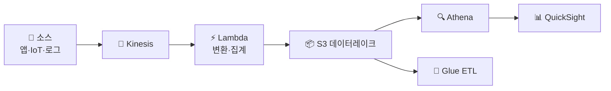

- 대량 데이터를 실시간으로 받아 저장·분석하는 구조
- [Kinesis](/devops/aws/architecture/messaging)·[Lambda](/devops/aws/compute/lambda)·[S3](/devops/aws/storage/s3)·[로깅 아키텍처](/devops/aws/monitoring/logging-arch)를 합친 캡스톤

## 단계 — 수집 → 처리 → 저장 → 분석

<Timeline>
<TimelineItem title="1. 수집 (Ingest)">
Kinesis Data Streams/Firehose로 이벤트·로그·클릭스트림 실시간 수집
</TimelineItem>
<TimelineItem title="2. 처리 (Process)">
Lambda·Kinesis Analytics로 변환·필터·집계 (스트리밍)
</TimelineItem>
<TimelineItem title="3. 저장 (Store)">
S3 데이터 레이크에 적재 (원본 + 가공) · 파티셔닝
</TimelineItem>
<TimelineItem title="4. 분석 (Analyze)">
Athena(S3 직접 SQL)·Glue(ETL·카탈로그) → QuickSight 시각화
</TimelineItem>
</Timeline>

## 전체 구성

## 스트리밍 vs 배치

<Compare>
<CompareCol title="🌊 스트리밍" subtitle="실시간" color="sky">
- Kinesis → Lambda 즉시 처리
- 실시간 대시보드·이상 감지
- 지연 초 단위
</CompareCol>
<CompareCol title="📦 배치" subtitle="모아서" color="violet">
- S3에 쌓고 주기적 Glue/EMR 처리
- 대용량·복잡 변환
- 비용 효율·지연 큼
</CompareCol>
</Compare>

<KeyPoint title="데이터 레이크의 핵심">
**S3가 중심** → 원본을 싸게 영구 보관하고, 필요할 때 Athena/Glue로 처리 ·
스키마를 미리 안 정해도 됨(schema-on-read) → 나중에 분석 목적이 바뀌어도 원본 재활용
</KeyPoint>

<Note type="pink" title="실무 포인트">
- S3 파티셔닝(`year/month/day`) → Athena 쿼리 비용·속도 ⬆️
- 포맷은 Parquet(컬럼형) → 스캔량·비용 ⬇️
- 실시간 필요 → Kinesis 스트리밍 / 대용량 정기 → 배치(Glue·EMR)
- 수집~분석 전 구간 [로깅 아키텍처](/devops/aws/monitoring/logging-arch)와 같은 철학(저장 싸게·처리 따로)
</Note>
