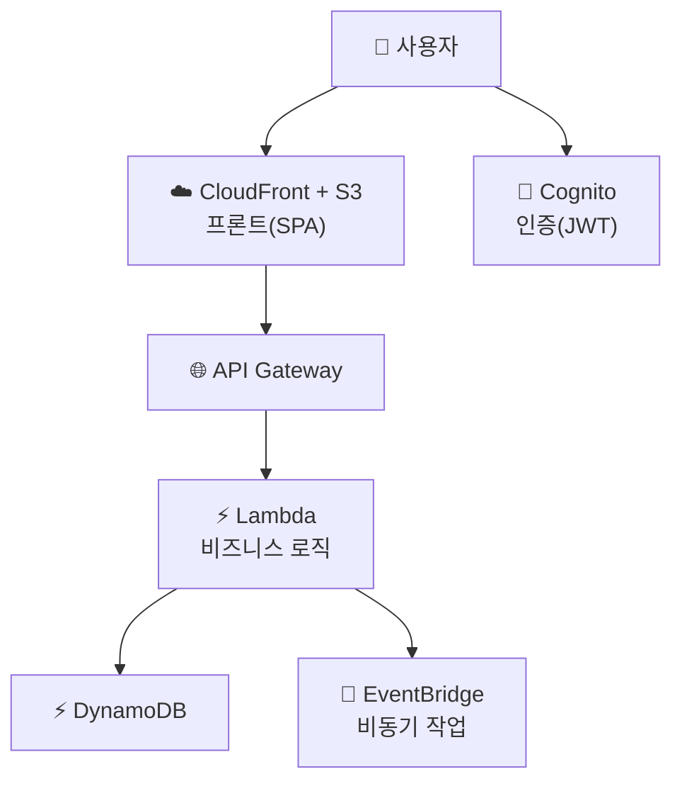

- 서버 한 대도 안 띄우고 SaaS 운영
- [Lambda](/devops/aws/compute/lambda)·[DynamoDB](/devops/aws/storage/dynamodb)·[Cognito](/devops/aws/iam/cognito)·[EDA](/devops/aws/architecture/eda)를 합친 캡스톤

## 전체 구성

- 프론트 → S3 + CloudFront (정적 호스팅)
- 인증 → Cognito (JWT)
- API → API Gateway + Lambda (요청당 실행)
- 데이터 → DynamoDB (서버리스 NoSQL)
- 비동기 → EventBridge/SQS + Lambda

## 서버 기반 vs 서버리스 SaaS

<ProsCons>
<Pros title="서버리스 장점">
- 서버 운영·패치·스케일 **0**
- 사용량 과금 → 트래픽 없으면 거의 0원
- 자동 무한 확장
- 출시 속도 빠름
</Pros>
<Cons title="서버리스 한계">
- 콜드 스타트·15분 제한
- 벤더 락인 ⬆️
- 복잡 트랜잭션·롱잡 부적합
- 비용 예측이 트래픽에 민감
</Cons>
</ProsCons>

## 멀티테넌시 — SaaS의 핵심

- 여러 고객(테넌트)을 한 시스템에서 → **격리 모델** 선택

| 모델 | 방식 | 격리 | 비용 |
|------|------|------|------|
| **Pool** | 자원 공유 + 테넌트 ID로 분리 | 논리적 | 저렴 |
| **Silo** | 테넌트마다 별도 자원 | 물리적 | 비쌈 |
| **Bridge** | 혼합 (민감 부분만 분리) | 중간 | 중간 |

<KeyPoint title="멀티테넌시 핵심">
DynamoDB 파티션 키에 **tenantId** 포함 → 데이터 논리 격리 (Pool) ·
IAM·정책으로 테넌트 간 접근 차단 · 큰 고객은 Silo로 분리하는 하이브리드도 흔함
</KeyPoint>

<Note type="pink" title="언제 서버리스 SaaS">
- 트래픽 변동 큼·빠른 출시·운영 인력 최소 → 서버리스
- 일정한 고부하·롱잡·세밀한 제어 → 컨테이너([ECS/EKS](/devops/aws/compute/ecs)) 기반이 나을 수 있음
- 시작은 서버리스로 빠르게 → 병목 생기면 일부만 컨테이너로
</Note>
